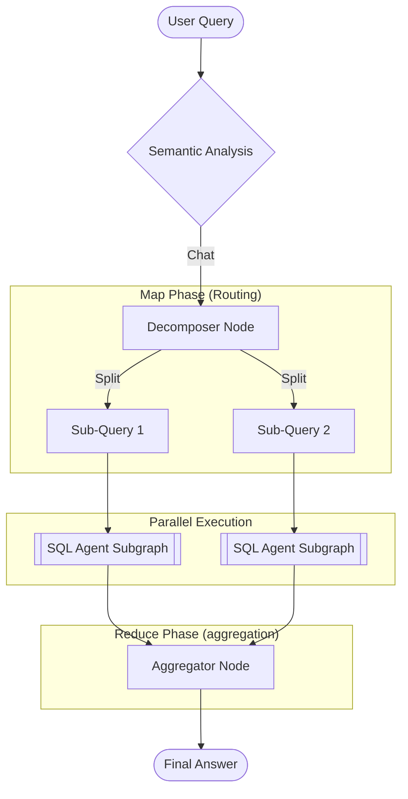

# The Orchestrator Graph

The **Orchestrator** is the top-level control plane of the NL2SQL Platform. While the [SQL Agent](sql_agent.md) focuses on *solving* a query for a single database, the Orchestrator focuses on *routing* and *managing* the lifecycle of a request across the entire system.

## The "Outer Loop" Architecture

The Orchestrator implements a **Map-Reduce** pattern to handle complexity and scale.



## Core Components

### 1. Semantic Analysis

**Role**: Gatekeeper.

* Determines if the user input is a SQL question or general chit-chat.
* Canonicalizes input (spelling, capitalization).

### 2. Decomposer (The Mapper)

**Role**: Complexity Manager.

* **Retrieval**: Fetches relevant schemas from the Vector Store using Partitioned MMR.
* **Logic**: Analyzes if the query requires data from multiple datasources.
* **Output**: A list of `SubQuery` objects, each targeted at a specific `datasource_id`.

### 3. Parallel Execution Branches

**Role**: Scalability.

* Each `SubQuery` triggers an independent instance of the [SQL Agent Subgraph](sql_agent.md).
* These run in parallel using LangGraph's `Send` API.
* *Note: Each branch has its own isolated memory and validation loop.*

### 4. Aggregator (The Reducer)

**Role**: Synthesis.

* Collects results (Dataframes or Errors) from all branches.
* **Fast Path**: If there is a single valid result, passes it through directly.
* **Slow Path**: If multiple results exist (or errors occurred), uses an LLM to summarize the data into a cohesive natural language response.

## Global State

The Orchestrator manages the `GraphState`, which acts as the shared memory for the request. It is passed to every node in the graph.

```python
class GraphState(BaseModel):
    """Represents the shared state of the NL2SQL pipeline execution graph."""
    model_config = ConfigDict(extra="ignore", arbitrary_types_allowed=True)

    # --- Input ---
    user_query: str = Field(description="Canonical user query.")
    user_context: Optional[Dict[str, Any]] = Field(default_factory=dict, description="User identity and permissions.")
    
    # --- Classification ---
    complexity: Literal["simple", "complex"] = Field(default="complex")
    output_mode: Literal["data", "synthesis"] = Field(default="synthesis")
    confidence: Optional[float] = Field(default=None, description="Confidence score from Decomposer.")

    # --- Map Phase (Routing) ---
    sub_queries: Optional[List[SubQuery]] = Field(default=None, description="Decomposed sub-queries.")
    selected_datasource_id: Optional[str] = Field(default=None)

    # --- Execution Phase (SQL Agent) ---
    plan: Optional[PlanModel] = Field(default=None, description="Structured SQL Plan.")
    sql_draft: Optional[str] = Field(default=None)
    relevant_tables: Optional[List[Table]] = Field(default=None)
    execution: Optional[ExecutionModel] = Field(default=None, description="Database results.")
    
    # --- Parallelism & History ---
    intermediate_results: List[Any] = Field(default_factory=list, description="Results from sub-query branches.")
    query_history: List[Dict[str, Any]] = Field(default_factory=list)
    system_events: List[str] = Field(default_factory=list)

    # --- Validation & Safety ---
    validation: Dict[str, Any] = Field(default_factory=dict)
    errors: List[PipelineError] = Field(default_factory=list)
    retry_count: int = Field(default=0)
    reasoning: List[Dict[str, Any]] = Field(default_factory=list)

    # --- Output ---
    final_answer: Optional[str] = Field(default=None, description="Synthesized natural language response.")
```

## The Reasoning Trace

The `reasoning` field is the **Short-Term Memory** of the Agent. Unlike execution logs (which are for debugging), the Reasoning Trace is part of the problem-solving context.

### Purpose

1. **Explainability**: It allows the system to justify *why* it chose a certain table or strategy.
2. **Self-Correction**: If a step fails, the `RefinerNode` reads the reasoning history to understand *what went wrong* in the thought process, not just the code.
3. **Synthesis**: The `AggregatorNode` uses these reasoning steps to explain the answer to the user (e.g., "I checked the `sales` table but found no records...").

### Structure

It is a list of structured dictionary entries:

```python
{
    "node": "planner",
    "content": [
        "Identified 'revenue' as ambiguous. Interpreting as 'total_sales_amount'.",
        "Selected tables: 'orders', 'order_items' based on vector similarity."
    ]
}
```
