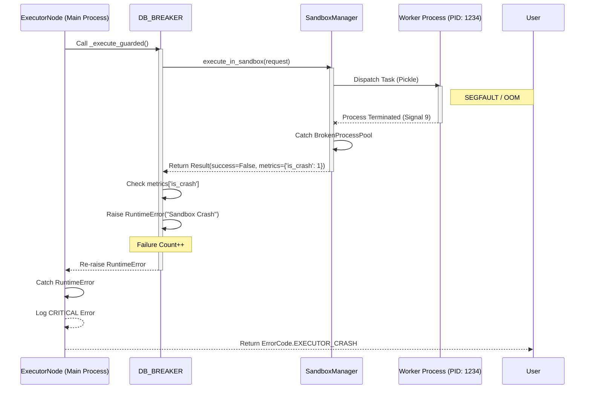

# Reliability & Fault Tolerance

The NL2SQL Platform is designed to be **Resilient-by-Default**. We assume that downstream services (LLMs, Databases, Vector Stores) will fail, and the system must handle these failures gracefully without crashing or hanging.

We employ a **Defense in Depth** strategy with three layers of protection:

1. **Retries**: Handling transient network blips.
2. **Circuit Breakers**: Handling sustained outages to "Fail Fast".
3. **Sandboxing**: Handling internal crashes (Segfaults/OOMs).

---

## 1. Circuit Breakers ("Fail Fast")

When a downstream service is down or unresponsive, retrying endlessly can deplete resources and hang the application. We use **Circuit Breakers** to detect these outages and stop sending requests immediately.

### Architecture

We use the [pybreaker](https://github.com/danielfm/pybreaker) library to manage the state of our dependencies.

| Breaker | Protected Service | Failure Threshold | Recovery |
| :--- | :--- | :--- | :--- |
| **`LLM_BREAKER`** | OpenAI / LLM Providers | 5 Consecutive Failures | 60s Reset Timeout |
| **`VECTOR_BREAKER`** | ChromaDB / Vector Store | 5 Consecutive Failures | 30s Reset Timeout |
| **`DB_BREAKER`** | SQL Databases (User Data) | 5 Consecutive Failures | 30s Reset Timeout |

### Behavior

* **Closed (Normal)**: Requests pass through. Failures are counted.
* **Open (Tripped)**: Requests are **rejected immediately** with `SERVICE_UNAVAILABLE` error. No connection is attempted.
* **Half-Open (Probe)**: After the timeout, one request is allowed through. If it succeeds, the breaker closes; otherwise, it re-opens.

> [!NOTE]
> **Smart Exclusions**: The `LLM_BREAKER` specifically ignores `RateLimitError` (429). We handle rate limits via backoff/retries, not by tripping the breaker, as they are a sign of load, not outage.

---

## 2. Sandboxing (Crash Isolation)

Executing arbitrary SQL or parsing large schemas can be dangerous. A "bad" database driver or a malformed result can cause a Segmentation Fault (Segfault) or Out-Of-Memory (OOM) error, which would normally crash the entire web server.

To prevent this, we execute these risky operations in isolated **Process Pools**.

### The "Two-Pool" Strategy

We maintain two distinct pools to prevent resource starvation:

1. **Execution Pool**:
    * **Purpose**: Running user SQL queries and `dry_run` validations.
    * **Priority**: High (User-facing latency).
    * **Isolation**: If a worker crashes, the main process catches `BrokenProcessPool` and returns an `EXECUTOR_CRASH` error, while the system remains stable.

2. **Indexing Pool**:
    * **Purpose**: Fetching and parsing database schemas during `refresh_schema`.
    * **Priority**: Low (Background tasks).
    * **Isolation**: Isolates heavy CPU/Memory usage (JSON parsing) from the request/response loop.

---

## 3. Retries & Backoff

For transient errors (network glitches, 503s), we implement **Exponential Backoff** at the Agent level.

* **Retryable Errors**: `RateLimitError`, `TimeoutError`, `ServiceUnavailable`.
* **Non-Retryable Errors**: `SyntaxError`, `SecurityViolation`, `ContextWindowExceeded`.

The **Retry Node** in the graph manages the loop, ensuring we don't spiral into an infinite retry storm.

---

## 4. Operational Scenarios (Runbook)

Strategies for common failure modes:

| Scenario | System Behavior | Error Code | Recovery |
| :--- | :--- | :--- | :--- |
| **Worker Crash (Segfault)** | Request fails immediately. Worker replaced. | `EXECUTOR_CRASH` | Automatic (Next request uses new worker) |
| **DB Timeout (>30s)** | Request cancelled. | `EXECUTION_TIMEOUT` | Retryable (if configured) |
| **DB Outage (5+ fails)** | **Circuit Breaker Trips**. All DB calls rejected fast. | `SERVICE_UNAVAILABLE` | Auto-reset after 30s |
| **LLM Rate Limit (429)** | **Backoff & Retry**. Does NOT trip breaker. | `None` (Handled internally) | Exponential Backoff |
| **LLM Outage (503)** | **Circuit Breaker Trips**. Fails fast. | `SERVICE_UNAVAILABLE` | Auto-reset after 60s |

### Deep Dive: Worker Crash Recovery

The following diagram illustrates exactly how the system handles a "Hard Crash" (Segfault/OOM) in the worker process:

