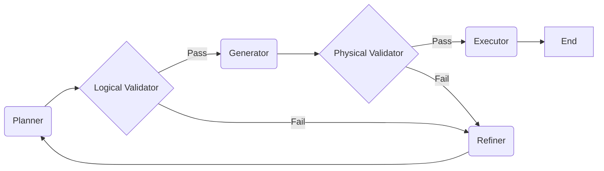

# Agents & Subgraphs

While Nodes are the building blocks, **Subgraphs** define the control flow and agentic behaviors.

## The SQL Agent (ReAct Loop)

The core "thinking" engine for a single datasource is encapsulated in the **SQL Agent Subgraph**. It implements a **ReAct (Reasoning + Acting)** loop pattern.

### Flow Diagram

### Self-Correction Mechanism

The `RefinerNode` acts as the feedback mechanism. It is only invoked when a validation or execution step fails.

1. **Error Accumulation**: Failures in the pipeline are not immediately fatal. They are appended to the `state.errors` list.
2. **Retry Handler**: If `retry_count < 3`, the flow is routed to the `RefinerNode` instead of terminating.
3. **Refinement Analysis**:
    * The Refiner reads the **History**: `state.plan` (What it tried) + `state.reasoning` (Why it tried it).
    * It reads the **Errors**: The stack traces or validation messages.
    * It produces **Feedback**: A structured instruction (e.g., "Table users does not have column 'id', use 'user_id'").
4. **Re-Planning**: The **Planner** receives this feedback directly in its prompt (`[FEEDBACK]` section) and generates `plan_v2` that attempts to satisfy the original request while avoiding the previous error.

### Execution Subgraph

The `SQL Agent` is wrapped inside an **Execution Subgraph**, which handles:

1. **Initialization**: Loading vector stores and adapters.
2. **Formatting**: Converting raw execution results into a standardized dictionary for the Aggregator.
