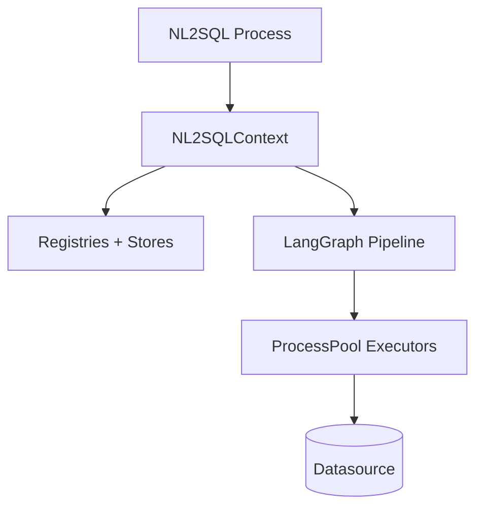

# Deployment Architecture

NL2SQL is a Python application composed of the core engine, optional adapter packages, and configuration files. Deployment is typically a single process that loads configuration, initializes `NL2SQLContext`, and executes the pipeline per request.

## Runtime process layout

## Deployment inputs

- Environment variables for `Settings` (paths and runtime parameters)
- Configuration files under `configs/`
- Adapter packages installed in the runtime environment

## Scaling and isolation

- Orchestration is in-process.
- Execution and indexing are offloaded to process pools (`SandboxManager`), limiting the blast radius of driver crashes.

## Source references

- Context initialization: `packages/core/src/nl2sql/context.py`
- Sandbox pools: `packages/core/src/nl2sql/common/sandbox.py`
