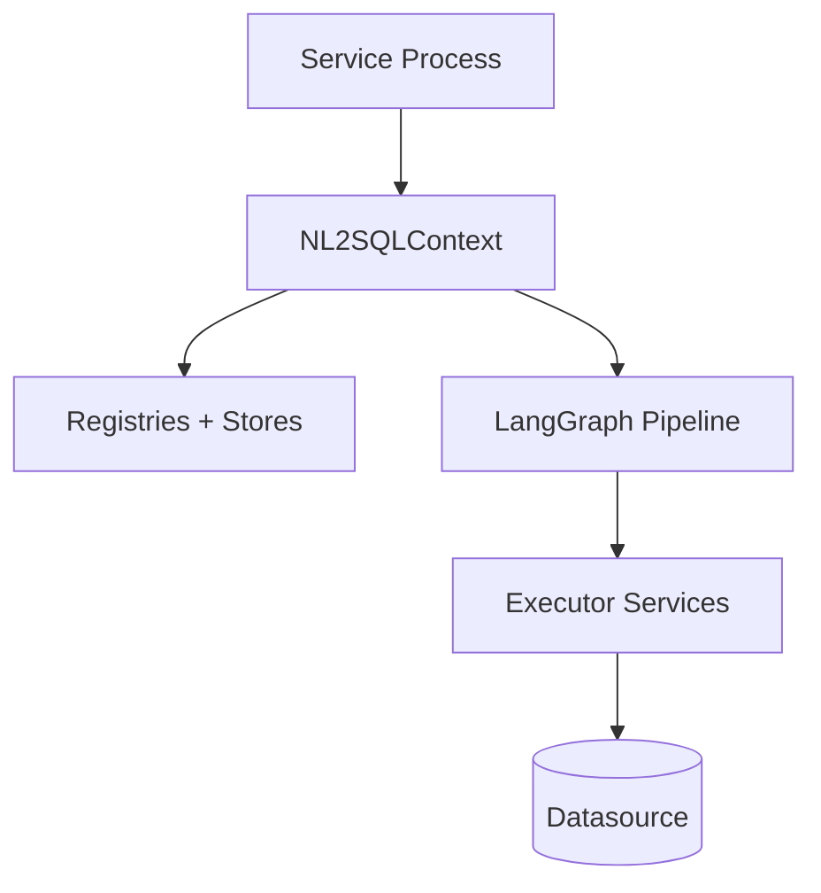

# Deployment Architecture

NL2SQL is a Python engine that you embed in a service of your choice. The runtime is a single process that initializes `NL2SQLContext`, loads configuration, and invokes the pipeline per request.

## Runtime process layout

## Deployment inputs

- Environment variables for `Settings` (paths and runtime parameters).
- Configuration files under `configs/`.
- Adapter packages installed in the runtime environment.
- Optional persistence volumes for vector store, schema store, and artifacts.

## Runtime modes

- **Local dev**: local vector store + SQLite schema store + local artifact store.
- **Production**: persistent volumes or external stores, stable secret providers, observability exporter enabled.

## Scaling and isolation

- Orchestration runs in-process and can scale horizontally with your service.
- Sandbox process pools are available for isolation but are not enforced by default in the SQL executor.

## Source references

- Context initialization: `packages/core/src/nl2sql/context.py`
- Settings: `packages/core/src/nl2sql/common/settings.py`
