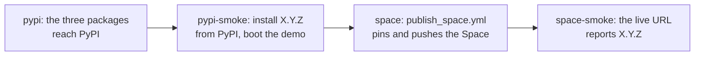
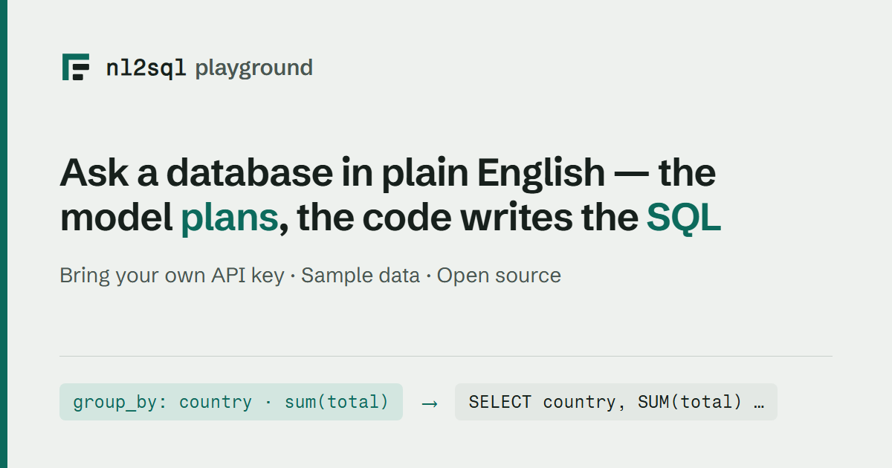

# Hosted demo

`nl2sql demo --hosted` serves the playground as a **public demo of the sample
databases**, where the server holds no API key and every visitor brings their
own.

It is a third state, not a loosened `--allow-settings`. Locally, `nl2sql demo`
saves your key to the demo project's `.env.demo` and spends it on your
questions; that is right on your own machine and wrong on a shared address.
Hosted mode removes the key from the server entirely instead of relaxing the
gate that protects it.

| | local (`nl2sql demo`) | hosted (`nl2sql demo --hosted`) |
| --- | --- | --- |
| the API keys | saved to `.env.demo`, used by the process | one per provider, held by the browser tab, sent per request, used in memory, dropped |
| a model per step | written to `configs/llm.demo.yaml` | chosen in the browser tab, sent per request, saved nowhere |
| Settings | writes `.env.demo` and `configs/llm.demo.yaml` | writes nothing; the page keeps the keys and the choices |
| Rebuild | on (loopback, or `--allow-settings`) | refused |
| Answer ratings | on (loopback, or `--allow-settings`) | off |
| Retrieval inspector | on (loopback, or `--allow-settings`) | on, read only, at the hosted rate |
| Pipeline page | on | on, read only: it names the steps and their models, never a key |
| `--record` | supported | refused before the server starts |
| a visitor with no key | replay mode, if no key is configured | the guided questions replay recorded runs; anything else asks for a key |
| the sample databases | read-only | read-only |
| limits | none | a rate limit per visitor and a cap per session |

```bash
nl2sql demo --hosted --host 0.0.0.0 --port 7860
```

`NL2SQL_DEMO_HOSTED=1` does the same thing without a command line, which is how
a container turns it on.

## Recorded answers without a key

A visitor does not need a key to see the demo work. The guided questions are
answered from **recordings of real runs**: every model step's actual reply to
each guided question, captured once from a Claude model and shipped in the wheel
at `nl2sql/cli/demo/recordings/chinook.json` (none ship until the first
recording run below has been made and merged). At start-up the hosted server loads
them into a replay server on loopback (the same `FakeLLMServer` local replay
mode uses) and, for a question that carries no key:

- **a guided question with a recording** runs the whole pipeline -- retrieval,
  the checks, SQL generation and the query against the sample database are all
  real and run now -- with each model step answered from the recording. The
  response carries `"recorded": true`, and the page puts a **Recorded run**
  badge beside the question, so nobody mistakes it for a live run. It is paced
  by the per-minute limit but not counted against the session cap, since it
  spends nothing.
- **anything else** never runs. It answers `200` with `"replay_miss": true` and
  the sentence "No recorded answer for this question. Add an API key to ask it
  live."; the page shows that with an **Add a key in Settings** button.

With a key, every question -- guided or not -- runs live on that key, exactly as
before. `/api/meta` lists the questions that replay as `recorded`, and the page
marks those chips with a dot.

**If no recordings ship** (the file is missing or covers no guided question),
the keyless path still works: the chips and the question box stay open and
every question answers with the key prompt. The console line at start-up says
which: "N guided questions answer from recordings without a key", or "No
recordings ship with this install".

### Making the recordings

The recordings are made with a real Claude model, which costs money, so it is a
deliberate act, never part of CI. Either:

- **Locally**, from the repository root:

  ```bash
  python scripts/record_demo_answers.py
  ```

  It reads `ANTHROPIC_API_KEY` from the environment or, failing that, from the
  repository root's `.env` (python-dotenv, the loader the engine uses; nothing
  prints the key), sets any OpenAI or OpenRouter key aside for the run, builds
  a fresh demo project, runs `nl2sql demo --record` through the recording proxy
  on Anthropic's own wire with the Anthropic preset's default model, and writes
  `packages/nl2sql/src/nl2sql/cli/demo/recordings/chinook.json`. It exits `0`
  when every guided question was recorded, `1` when some were not, `2` with no
  key. Review the diff and commit it.
- **In CI**, Actions → **Record demo answers** → *Run workflow*
  (`.github/workflows/record_demo.yml`). It runs the same script with the
  repository secret **`ANTHROPIC_API_KEY`** and opens a pull request with the new
  recordings. It only ever runs by hand. The same workflow with `record: clips`
  re-records the playground home page's clips, which needs no key: Ask's clip is
  made from these recordings, so record the answers first.

`tests/e2e/test_record_demo_answers_fake_llm.py` runs the whole chain -- the
script, the proxy on the Anthropic wire, a keyless hosted visitor replaying the
result -- against a stand-in provider, so it is tested with no key and nothing
spent.

## What the visitor's key does, and does not do

A visitor without a key is told what they can do before they ask. The **Ask**
page opens with the pitch and, when recordings ship, the guided questions
straight under it, the recorded ones marked; the key form (a provider choice,
the key and **Use this key**, under three facts -- **Stored** in this browser
tab only, **Sent** with each question in a request header, **Never** written to
disk, logs or traces) is folded under **Use your own key**, and open from the
start when nothing is recorded. Nothing is disabled: a question nobody recorded
comes back with the way to add a key. The moment a key is saved the block
clears, with no reload. The status pill in the top bar reads **Hosted demo ·
Recorded runs** (or **Hosted demo · No key yet** with nothing recorded), and
once there is a key it names whose key answers (**Hosted demo · OpenAI key in
this tab**), with the limits in its tooltip. None of this appears in local
mode.

The visitor pastes a key on the **Settings** page, one per provider. From there:

1. **The browser keeps it**, in that tab's `sessionStorage`, under that
   provider's own name. Closing the tab clears it. Nothing else in the page
   reads it.
2. **It travels as a request header of its own**, `X-NL2SQL-Api-Key-<provider>`
   (`X-NL2SQL-Api-Key-anthropic`), on `POST /api/ask` and nowhere else. A
   header rather than the body, because a body is what request logs and
   validation errors quote back; one header per provider, so a key never shares
   a header with anything else and nothing that parses or quotes a header can
   expose two at once. With exactly one key the older `X-NL2SQL-Api-Key` is
   sent as well, and on its own it still means what it always did. The
   playground is served over plain HTTP locally and over the host's TLS when it
   is published, so deploy it behind HTTPS.
3. **The server uses it for that one request.** It is bound to the request with
   [`nl2sql.llm.request_key`][key-module] and the LLM registry builds each
   step's client from it while the pipeline graph is constructed. The client is
   cached nowhere, so no later request and no other visitor can be handed it.
4. **Then it is gone.** It is never written to a file, never put in an
   environment variable, never held in a module-level cache, and never included
   in a response.

A key sent without naming a provider has its provider read from its shape,
exactly as `--api-key` does: `sk-ant-` is Anthropic, `sk-or-` is OpenRouter,
anything else is OpenAI. Such a key also moves the model to that provider's
default when it differs from the server's configured one, since a `gpt-` model
means nothing to Anthropic.

## A model for each step

Choosing a model asks the server to remember nothing, so hosted mode keeps it.
Under **Model for each step** on the Settings page (open beside the key card on a wide window, collapsed on a narrow one), the
visitor can put each of the five model-using steps on a provider and model of
their own. The choice lives in the same tab's `sessionStorage` and travels with
each question in one more header:

```
X-NL2SQL-Models: {"astplanner":"anthropic:claude-opus-5"}
```

A compact JSON object, agent name to `provider:model`, and nothing else; it
carries no secret, which is why it is the one header the server parses and the
one thing a refusal repeats. A step with no entry runs on the configured
default, so the simple path stays one key, the defaults, and a question.

The server checks every name against what the engine knows -- the pipeline's
own steps, and the verified model lists in `nl2sql/llm/providers.py` -- before
anything reaches a client. Each step is then built from the key for the
provider it names: the planner can be on Claude while the answer writer stays
on OpenAI, each calling its own endpoint with its own key.

**A step whose chosen provider has no key is refused before the question
runs**, with `400` and a sentence naming both, for example *"The Query planner
step is set to run on Anthropic, but no Anthropic key was supplied. Add one
under Settings, or put that step back on a provider you have a key for."*
Nothing is spent on the keys that were supplied. A step nobody chose a provider
for is never refused this way: it takes the key for the provider it is
configured on, or, failing that, the first key the request brought, exactly as
a single key has always worked.

What it does **not** do:

- It is not stored, so it cannot be reused for anyone else's question, and there
  is nothing to leak if the container is compromised later.
- It does not reach a trace. Run traces are written as usual (that is what the
  playground's **Debug** drill-down reads), and the trace redactor is told about
  the request's key along with every other credential, so it is masked if it ever
  reaches a prompt or an error. The demo project ships `TRACE_MODE=always`, so
  every question leaves a file on the container's own disk; `TRACE_MODE=on_failure`
  keeps only the runs that went wrong.
- It does not reach the log. Nothing logs the header, and errors about a key
  report its type, never its value.
- It does not reach your data. The hosted demo answers only from the three
  sample databases shipped with the engine.

A question with no key at all is never a `401`: it replays, or it is a replay
miss that asks for a key (see [above](#recorded-answers-without-a-key)). A
malformed key answers `400` without quoting what was sent, and no refusal
ever repeats something shaped like a key, not even when one was pasted into the
model header by hand.

## Limits

Both live in this one process's memory. There are no accounts, no analytics and
no storage.

| Limit | Default | Environment variable | Keyed by |
| --- | --- | --- | --- |
| Questions per minute | 6 | `NL2SQL_DEMO_QUESTIONS_PER_MINUTE` | client address (a token bucket) |
| Questions per session | 30 | `NL2SQL_DEMO_QUESTIONS_PER_SESSION` | a random session cookie |
| Query timeout | 300s | `GLOBAL_TIMEOUT_SEC` | the run |
| Rows returned | 1000 | the datasource's `row_limit` option | the query |

Hitting one is a `429` with a sentence, never a stack trace: the rate limit says
to wait a moment, the session cap says to run the demo locally for no limit at
all. The retrieval inspector spends from the same rate bucket (it costs no
tokens, but it does embed text) and does not count against the session's
questions.

A question is charged when it arrives, before it runs, so one the visitor
stops still counts toward both limits. Stopping does end the work: the page
aborts its request, the server sees the connection close and cancels the run
before its next step or model call (the call already in flight finishes).

The session cookie is a random token this process made up. It names no visitor,
carries no key, and exists only so the session cap has something to count. A
visitor who clears their cookies starts a new session; the rate limit, which is
keyed by address, is what holds the pace down in the meantime.

## What is off, and what is on

**Off:** Settings *persistence* (choosing a model is on; it is only the saving
that is off), Rebuild, answer ratings, and `--record` (refused
before the server starts). `--api-key` is refused too: a server-side key is the
one thing hosted mode is built to avoid, and any provider key exported into the
process is cleared at start-up so nothing can fall back to it.

Rebuild being off is said on the page rather than left as a gap: the index
panel reports that the index was built before the demo started and which
databases it covers, and where the button would be it prints the server's own
reason -- rebuilding writes to disk and the sample data never changes.

**On:** the guided questions without a key, from recorded runs; asking them or
any other question live with a key; a key per
provider and a model per step (both kept by the browser), the schema view of
any of the three databases (the rail's **Showing** switcher), which database
answered a run, the per-node **Debug** drill-down with its traces, and the
retrieval inspector read-only.

## Read-only sample data

The demo's three SQLite databases are configured with `read_only: true` under
their connection options, which opens them through SQLite's own URI form with
`mode=ro`. The driver refuses a write before any SQL is parsed, under the RBAC
policy and the validator rather than instead of them. This is not specific to
hosted mode: nothing in the engine writes to a demo database, so they are opened
read-only everywhere.

## The container

`deploy/huggingface/Dockerfile` builds the playground as a hosted demo. It is a
Space root rather than a repository build: it needs no build context, so the
whole deploy is that one folder, copied to the Space's root.

It installs whatever the one build argument `NL2SQL_SPEC` names. On the Space
that is always **a released version from PyPI**,
`nl2sql-engine[demo]==X.Y.Z`, written into the copy of the `Dockerfile` the
release pushes. The checked-in default is a GitHub archive of the tip of
`main`, which is only what a local `docker build` gets; pass
`--build-arg NL2SQL_SPEC="nl2sql-engine[demo]==X.Y.Z"` to build a release
locally. Then it runs `nl2sql setup --demo` **at build time**. That bakes three
things into the image so the container reaches nothing but the model at run
time and the first question is answered at once:

- the three sample databases and their configs,
- their vector index, built with the local embedder,
- the local embedding model itself, roughly 79 MB of ONNX `all-MiniLM-L6-v2`
  that chromadb would otherwise download on the first question. The 83 MB
  archive it was extracted from is deleted; chroma reaches for it only when the
  extracted files are missing.

The container runs as uid 1000 (not root), listens on `$PORT` (7860 by
default, which is what a Space routes to), and carries a healthcheck that polls
`/api/health`. That route reads nothing but process state and answers
`{"status": "ok", "version": "X.Y.Z"}`, the installed `nl2sql-engine`
version, in every mode; the release pipeline polls it on the live Space to
know the new version is the one being served. `NL2SQL_DEMO_HOSTED=1` is set in
the image, so hosted mode holds even if the command is overridden.

```bash
cd deploy/huggingface
docker build -t nl2sql-demo .
docker run --rm -p 7860:7860 nl2sql-demo
```

`docker compose up --build` in the same folder does it through
`docker-compose.yml`, which builds the same image with the same settings.

Measured on a build of this Dockerfile: **1175 MB** on the container's own
filesystem (`docker image ls` reports 1.65 GB, which includes the build
attestations). Most of it is chromadb's transitive dependencies (polars,
pyarrow, kubernetes, onnxruntime), which the vector store needs. Boot is
**about 5 seconds** from `docker run` to the first answered request, and a
guided question through a stand-in provider answered in **1.2 seconds**.

## Deploying it as a Hugging Face Space

The Space is `nadeem4nk/nl2sql-demo`: public, Docker SDK, CPU basic. The full
steps, and what each Space setting does, are in
[`deploy/huggingface/README.md`][space-readme] -- that file is also the Space's
own front page, since a Docker Space reads its configuration from the
front-matter of the `README.md` at its root.

The Space serves at <https://nadeem4nk-nl2sql-demo.hf.space>.

**Never give the Space an API key**, as a secret or otherwise. Hosted mode
clears any provider key it finds in its environment at start-up rather than use
it, because a key there would be spent by every visitor.

### Deployed by the release

The public Space runs **released versions only**, and a release deploys it
with nothing to do by hand. Merging the release pull request tags `vX.Y.Z`, and
[`publish_pypi.yaml`][publish] then runs, in order:



1. **`pypi-smoke`** installs `nl2sql-engine[demo]==X.Y.Z` from PyPI into an
   empty virtualenv on a fresh runner, boots this same `nl2sql demo --hosted`
   with no key and checks it serves. The Space is never built on a version
   that does not install from PyPI.
2. **`space`** calls [`publish_space.yml`][workflow] with the tag. It mirrors
   `deploy/huggingface/` onto the Space's root, pins the image to the release,
   pushes, and waits for the Hub to build it.
3. **`space-smoke`** polls `https://nadeem4nk-nl2sql-demo.hf.space/api/health`
   until it reports `X.Y.Z`, then checks the page and `/api/meta`. A Space goes
   on serving its previous image while the new one builds, so a build that
   finished is not yet proof that visitors see it.

The whole release flow is in [Releasing](../development/releasing.md).

**A push to `main` does not deploy the Space.** It used to: every merge that
touched the engine, the playground or this folder rebuilt the public demo from
that commit, so the demo ran code no release contained, and a broken merge
reached visitors before anyone had decided to ship it. Now a merge reaches the
Space with the next release. Nothing is lost by waiting: the `fresh-install`
job on every pull request builds the wheels, installs them as a user would and
boots this exact command, so a change that would break the Space fails its PR.
To see a change running on a Space before it is released, deploy it to a
scratch Space of your own (below), never to the public one.

**What a deploy puts at the Space root.** The four files of
`deploy/huggingface/` -- `Dockerfile`, `README.md` (the Space's configuration
and front page), `docker-compose.yml`, and `SOURCE_SHA` -- with two of them
rewritten:

| At the Space root | What the deploy writes |
| --- | --- |
| `Dockerfile` | its `ARG NL2SQL_SPEC=` line: `nl2sql-engine[demo]==X.Y.Z` for a release, or a GitHub archive of the commit for a tagless run by hand |
| `SOURCE_SHA` | the full sha of the repository commit the deploy came from -- the tagged commit, on a release |

The `Dockerfile` rewrite is what makes the Space **run the release**: the same
bytes a user gets from `pip install`, not whatever `main` was at build time.
Because the text of the `ARG` line changes with every release, the Hub always
has a new commit to rebuild on and the layer cache below it is busted, so the
engine is genuinely reinstalled. The workflow rewrites the default rather than
passing `--build-arg`, because a Space build takes no build arguments from us;
a `grep` right after the rewrite fails the deploy if that line is ever
renamed, instead of quietly shipping a Space that builds something else.

**The one secret.** A Hugging Face access token with **write** permission
(<https://huggingface.co/settings/tokens>), added as the repository secret
**`HF_TOKEN`** at
<https://github.com/nadeem4/nl2sql/settings/secrets/actions>. That is the only
credential the workflow uses. `release_please.yml` and `publish_pypi.yaml` hand
it down with `secrets: inherit`, since a called workflow sees no secret it is
not given. Without it -- on a fork, or before it is added -- the deploy logs a
line saying so and finishes green, `space-smoke` is skipped, and the rest of
the release is unaffected; it never fails for a missing secret.

The token is read into the job's environment and used in exactly two places: by
`huggingface_hub`, which picks `HF_TOKEN` up from the environment on its own,
and as the password in the `git push` URL. It is never echoed, never traced (no
`set -x`), and never written to a file: the Space remote is passed to each git
command rather than saved into `.git/config`.

**What it reports.** The job never calls a build that did not happen a success.
If the push produced a commit, the workflow checks the Space's head is that
commit, then waits for a build to actually start and finish; a Space that never
starts one within five minutes fails the job rather than reporting the previous
build's `RUNNING`. If there was nothing to push -- the same release deployed
twice -- the job says so plainly and the summary reads **"No rebuild"**, with
the Space left on its previous image. One deploy runs at a time; a run
overtaken by a newer one is cancelled.

**By hand.** Actions → **Publish Space** → *Run workflow*, or:

```console
$ gh workflow run publish_space.yml -f tag=v0.2.0
```

Three optional inputs: `tag`, the release to deploy; `space_id`, which defaults
to `nadeem4nk/nl2sql-demo`; and `token_secret`, the name of the secret holding
the token, which defaults to `HF_TOKEN`. With a tag it does exactly what a
release does. With **no** tag it deploys the commit of the branch it was run
from, installed from a GitHub archive of that commit -- which is how to try an
unreleased change on a Space: point `space_id` at a scratch Space of your own.
Do not run it tagless against the public demo; that is the "unreleased code in
public" this design exists to prevent.

**What the first run does.** The Space does not have to exist. The workflow
calls `create_repo(repo_type="space", space_sdk="docker", private=False,
exist_ok=True)`, which makes a public Docker Space on CPU basic, then pushes the
folder into it. On every later run `exist_ok` makes that call a no-op: the Hub
ignores visibility, SDK and hardware for a Space that already exists, so a
hardware upgrade or a visibility change made in the Space's own settings
survives a deploy.

**Rolling back.** Run it by hand with the earlier tag,
`gh workflow run publish_space.yml -f tag=v0.1.9`. It checks that tag out,
pins the image to that version on PyPI and rebuilds, so the engine and the
playground both go back. PyPI keeps every version, so any earlier release can
be redeployed this way.

The workflow adds a commit on top of whatever the Space's `main` already is, so
the Space's history is never rewritten and never lost -- including commits made
in the Hub's own web editor. If a concurrent push lands between the workflow's
fetch and its push, the push is refused and the job fails; re-running it picks
up the new head and reapplies the folder. Nothing in the workflow force-pushes.

### By hand, as a fallback

If the workflow is unavailable, the owner can do the same thing from a clone:

1. Create the Space at <https://huggingface.co/new-space> under `nadeem4nk`,
   named `nl2sql-demo`, SDK **Docker** (blank), CPU basic, public.
2. Add it as a git remote:
   `git remote add space https://huggingface.co/spaces/nadeem4nk/nl2sql-demo`
   (pushing needs a write token from
   <https://huggingface.co/settings/tokens>).
3. Push the folder as the Space root:
   `git subtree push --prefix deploy/huggingface space main`.

If step 3 is refused because the Space has commits of its own,
`git push space $(git subtree split --prefix deploy/huggingface main):main --force`
replaces the Space's history with this folder's. The workflow above never needs
that, which is why it exists.

## The link preview

Two different links go around, and each unfurls from a different place:

| Pasted link | The card comes from |
| --- | --- |
| <https://nadeem4nk-nl2sql-demo.hf.space> | the Open Graph and Twitter tags in the page the app serves |
| <https://huggingface.co/spaces/nadeem4nk/nl2sql-demo> | `short_description` and `thumbnail` in `deploy/huggingface/README.md`'s front-matter |

Both show the same 1200x630 card:



**The app's tags** are added to the built page's `<head>` by
[`preview.py`][preview] as each request goes out, not baked into the bundle. A
crawler runs no JavaScript, so a tag React adds on mount is a tag nobody sees;
and `og:image` and `og:url` have to be absolute, while the same page is the
Space, a container and `http://127.0.0.1:8000`. So the host comes off the
request: `X-Forwarded-Proto` and `X-Forwarded-Host` when a proxy set them
(which is what the Space does), the `Host` header otherwise, and the URL the
app itself saw if neither is a host. The card is served by the app at
`/social-card.png` and ships in the wheel, so a `pip install` serves it too.

**The Space's card** reads `thumbnail` over raw GitHub rather than from the
Space, so it works before the Space has built and while it is asleep.

### Regenerating the card

The card is rendered from `scripts/social_card.html`, which uses the
playground's own colours and both of its typefaces. Edit that file, then:

```bash
cd web/playground && npm ci && cd ../..   # the fonts the card borrows
python scripts/render_social_card.py
```

Headless Chrome shoots it at 1200x630 and the script writes the same bytes to
both places that need them: `docs/assets/social-card.png`, which the Space's
`thumbnail` reads, and
`packages/nl2sql/src/nl2sql/cli/demo/playground/assets/social-card.png`, which
the app serves. A test holds the two byte-identical, so regenerating into only
one of them fails rather than going out half-changed.

A card validator needs a public URL, so the check that the card really unfurls
can only be run against the deployed Space, with X's card validator or
<https://opengraph.dev>. What the tests check is everything up to that: the
tags are in the served HTML, their URLs are absolute, and the image is served
as `image/png`.

### The mark

The wordmark's icon on the card is the playground's favicon, the plan spine: a
root bar and stem with two indented steps, the typed plan the model writes, in
outline. Its one copy is `docs/assets/favicon.svg`; the playground inlines it,
this site uses it as its favicon, and the card redraws it in the light colours.
See [the playground README][playground-readme] for where each copy lives.

[playground-readme]: https://github.com/nadeem4/nl2sql/blob/main/web/playground/README.md#the-mark

## Running it locally instead

Hosted mode exists to show the engine on our sample data. To ask questions of
your own data, with no limits and a key that never leaves your machine:

```bash
pip install "nl2sql-engine[demo]"
nl2sql demo
```

See [Demo](../getting_started/demo.md).

[key-module]: https://github.com/nadeem4/nl2sql/blob/main/packages/nl2sql/src/nl2sql/llm/request_key.py
[preview]: https://github.com/nadeem4/nl2sql/blob/main/packages/nl2sql/src/nl2sql/cli/demo/playground/preview.py
[space-readme]: https://github.com/nadeem4/nl2sql/blob/main/deploy/huggingface/README.md
[workflow]: https://github.com/nadeem4/nl2sql/blob/main/.github/workflows/publish_space.yml
[publish]: https://github.com/nadeem4/nl2sql/blob/main/.github/workflows/publish_pypi.yaml
