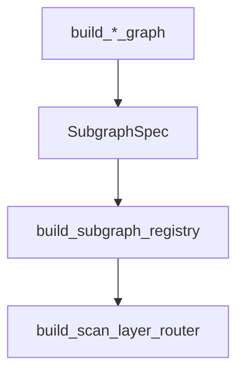

# Development Guide

This guide focuses on **extension points**: adapters, executors, subgraphs, chunking, and planner logic.

## Extension guides

- `extensions/add-adapter.md` for new datasource adapters.
- `extensions/add-chunk-types.md` for new schema chunk types.
- `extensions/extend-planner.md` for planner/AST updates.
- `extensions/add-execution-backend.md` for new executor services.

## Subgraph extension overview

1. Implement a `build_*_graph(ctx)` function that returns a LangGraph runnable.
2. Register it in `build_subgraph_registry()` with required capabilities.

## Source references

- Subgraph registry: `packages/core/src/nl2sql/pipeline/subgraphs/registry.py`
- Adapter protocol: `packages/adapter-sdk/src/nl2sql_adapter_sdk/protocols.py`
- Executor registry: `packages/core/src/nl2sql/execution/executor/registry.py`
