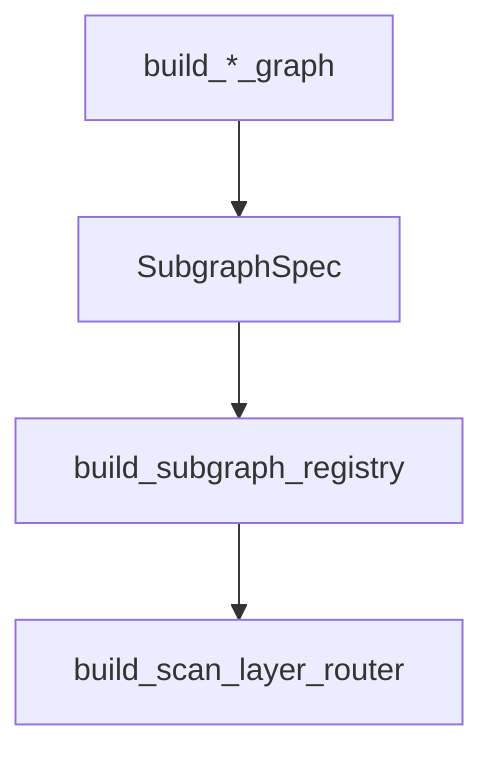

# Development Guide

This guide focuses on extension points: adapters, executors, and subgraphs.

## Add a new adapter

1. Implement `DatasourceAdapterProtocol`.
2. Expose the adapter via the `nl2sql.adapters` entry point.
3. Add datasource configuration in `configs/datasources.yaml`.

## Add a new executor

1. Implement `ExecutorService`.
2. Register it in `ExecutorRegistry.register()` with a capability key.

## Add a new subgraph

1. Implement a `build_*_graph(ctx)` function that returns a LangGraph runnable.
2. Register it in `build_subgraph_registry()` with required capabilities.

## Source references

- Subgraph registry: `packages/core/src/nl2sql/pipeline/subgraphs/registry.py`
- Adapter protocol: `packages/adapter-sdk/src/nl2sql_adapter_sdk/protocols.py`
- Executor registry: `packages/core/src/nl2sql/execution/executor/registry.py`
