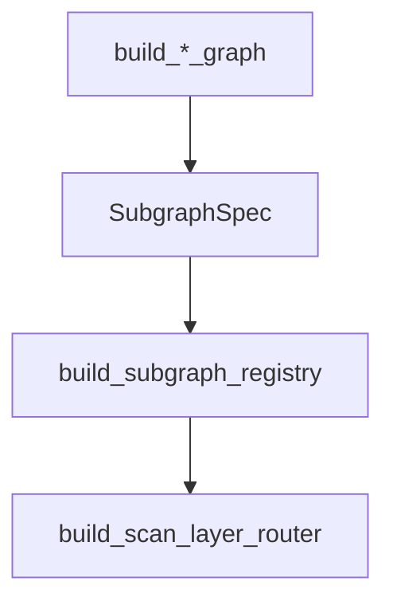

# Development Guide

This guide focuses on **extension points**: adapters, executors, subgraphs, chunking, and planner logic.

## Extension guides

- `extensions/add-adapter.md` for new datasource adapters.
- `extensions/add-chunk-types.md` for new schema chunk types.
- `extensions/extend-planner.md` for planner/AST updates.
- `extensions/add-execution-backend.md` for new executor services.

## Subgraph extension overview

1. Implement a `build_*_graph(ctx)` function that returns a LangGraph runnable.
2. Register it in `build_subgraph_registry()` with required capabilities.

```mermaid
flowchart TD
    Subgraph[build_*_graph] --> Spec[SubgraphSpec]
    Spec --> Registry[build_subgraph_registry]
    Registry --> Router[build_scan_layer_router]
```

## CLI console output

`rich` parses every string handed to `Console.print`, a `Panel` body, a `Tree`
label or a table cell as console markup. Text the CLI did not author — exception
messages, tracebacks, generated SQL, database errors, filesystem paths, LLM
output, query result rows — must therefore never reach those APIs unescaped:

- A closing-tag-shaped sequence (`[/{style}]`, which appears in rich's own
  source and so in tracebacks through it) raises `MarkupError` and hides the
  real error.
- A lowercase opening tag is consumed silently. T-SQL bracket-quoted
  identifiers are the common case: `SELECT * FROM [dbo].[orders]` renders as
  `SELECT * FROM .` unless the SQL is escaped.

Two conventions cover this:

- Interpolating external text into a markup string: wrap it in
  `rich.markup.escape`, so the CLI's own styling still applies.
- Passing external text as a whole cell, label or panel body: wrap it in
  `rich.text.Text`, which is never parsed as markup. `ConsolePresenter.print_sql`
  does this for plain strings; callers wanting styling pass a `Text` themselves.

Tracebacks are printed with `console.print(..., markup=False)`.

## Source references

- Subgraph registry: `packages/core/src/nl2sql/pipeline/subgraphs/registry.py`
- Adapter protocol: `packages/adapter-sdk/src/nl2sql_adapter_sdk/protocols.py`
- Executor registry: `packages/core/src/nl2sql/execution/executor/registry.py`
