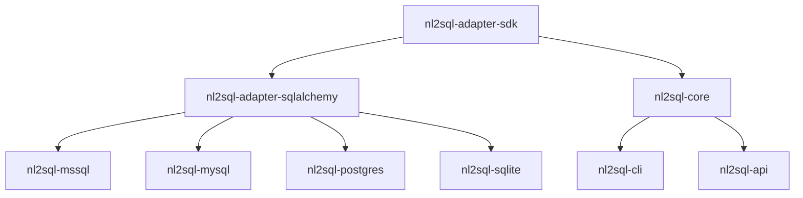

# Releasing

The monorepo publishes nine distributions to PyPI under **unified versioning**:
they all carry the same version and are released together. Internal
dependencies use compatible-release constraints (`~=0.1`), so a release only
resolves for users if every package declares the same version.

## Checklist

1. **Bump the version.** Set the same `version` in all nine package manifests:

    ```text
    packages/adapter-sdk/pyproject.toml
    packages/adapter-sqlalchemy/pyproject.toml
    packages/core/pyproject.toml
    packages/cli/pyproject.toml
    packages/api/pyproject.toml
    packages/adapters/mssql/pyproject.toml
    packages/adapters/mysql/pyproject.toml
    packages/adapters/postgres/pyproject.toml
    packages/adapters/sqlite/pyproject.toml
    ```

    Widen the `~=` constraints only when the major version changes; a patch or
    minor bump needs no dependency edits.

2. **Check for drift.** Needs Python 3.11+ (`tomllib`):

    ```bash
    python scripts/check_versions.py
    ```

    It exits non-zero and names the offending files if the versions disagree.
    CI runs the same check in the `build` job of `test.yml`, so a drifted PR
    fails before anything is built.

3. **Merge to `main`** and let CI go green (tests, key-free integration
    subset, and the build job, which also smoke-tests the wheels).

4. **Publish a GitHub release.** Tag the release commit with the version
    (e.g. `v0.2.0`), then publish the release on GitHub.

## What publishing does

`.github/workflows/publish_pypi.yaml` triggers on `release: [published]` —
creating a draft release does nothing; the workflow only fires when the release
is actually published. It then:

1. builds sdists and wheels for all nine packages into `dist/`, and
2. uploads the whole directory to PyPI with `pypa/gh-action-pypi-publish`.

Authentication is PyPI **trusted publishing** (OIDC, `id-token: write`), so
there is no API token to rotate. Pushing a tag alone does not publish.

## Package order

The single upload step sends all nine distributions together, so ordering is
usually not something you manage. It matters when an upload partially fails and
you re-publish by hand: release in dependency order so no package is ever on
PyPI referencing a version of its dependency that is not.



1. `nl2sql-adapter-sdk` — no internal dependencies.
2. `nl2sql-adapter-sqlalchemy` — needs the SDK.
3. `nl2sql-mssql`, `nl2sql-mysql`, `nl2sql-postgres`, `nl2sql-sqlite` — need
   the SQLAlchemy base.
4. `nl2sql-core` — needs the SDK. Its extras (`nl2sql-core[postgres]` and
   friends) point at the adapters, so publish it after them or those extras
   will not resolve.
5. `nl2sql-cli`, `nl2sql-api` — need core.

PyPI never lets a version be re-uploaded. If a release goes out broken, yank it
and ship the next patch version; do not try to replace it.

!!! note
    The repo-root `pyproject.toml` (`nl2sql-monorepo`) also carries a version.
    It is a workspace placeholder that is never built or published, and the
    drift check ignores it.
