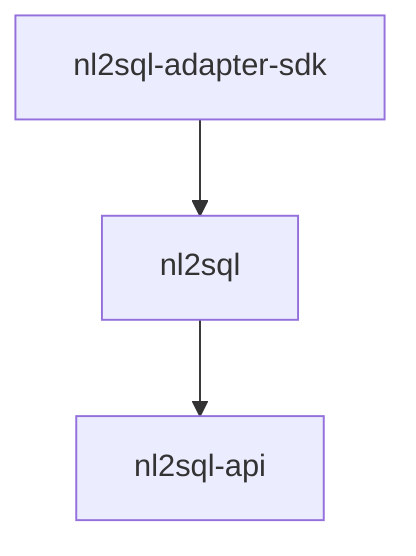

# Releasing

The monorepo publishes three distributions to PyPI under **unified versioning**:
they all carry the same version and are released together. Internal
dependencies use compatible-release constraints (`~=0.1`), so a release only
resolves for users if every package declares the same version.

## Checklist

1. **Bump the version.** Set the same `version` in all three package manifests:

    ```text
    packages/adapter-sdk/pyproject.toml
    packages/nl2sql/pyproject.toml
    packages/api/pyproject.toml
    ```

    Widen the `~=` constraints only when the major version changes; a patch or
    minor bump needs no dependency edits. The extras in
    `[project.optional-dependencies]` now name third-party database drivers
    rather than internal packages, so they need no version edits at all.

2. **Merge to `main`** and let CI go green (tests, key-free integration
    subset, and the build job, which also smoke-tests the wheels).

3. **Publish a GitHub release.** Tag the release commit with the version
    (e.g. `v0.2.0`), then publish the release on GitHub.

## What publishing does

`.github/workflows/publish_pypi.yaml` triggers on `release: [published]` —
creating a draft release does nothing; the workflow only fires when the release
is actually published. It then:

1. builds sdists and wheels for all three packages into `dist/`, and
2. uploads the whole directory to PyPI with `pypa/gh-action-pypi-publish`.

Authentication is PyPI **trusted publishing** (OIDC, `id-token: write`), so
there is no API token to rotate. Pushing a tag alone does not publish.

## Package order

The single upload step sends all three distributions together, so ordering is
usually not something you manage. It matters when an upload partially fails and
you re-publish by hand: release in dependency order so no package is ever on
PyPI referencing a version of its dependency that is not.



1. `nl2sql-adapter-sdk` — no internal dependencies.
2. `nl2sql` — needs the SDK. Carries the engine, the CLI and all four dialect
   adapters, so its extras (`nl2sql[postgres]` and friends) add only database
   drivers from PyPI and cannot be broken by publish order.
3. `nl2sql-api` — needs `nl2sql`.

PyPI never lets a version be re-uploaded. If a release goes out broken, yank it
and ship the next patch version; do not try to replace it.

!!! note
    The repo-root `pyproject.toml` (`nl2sql-monorepo`) also carries a version.
    It is a workspace placeholder that is never built or published.
