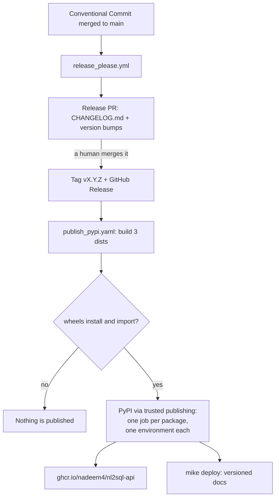
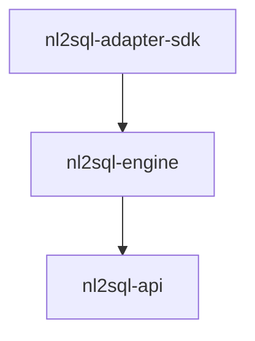

# Releasing

The monorepo publishes three distributions to PyPI under **unified versioning**:
they all carry the same version and are released together. Internal
dependencies use compatible-release constraints (`~=0.1`), so a release only
resolves for users if every package declares the same version.

Releases are automated. Nobody edits a version number and nobody edits
`CHANGELOG.md` by hand — [release-please](https://github.com/googleapis/release-please)
owns both. The one manual step is **merging the release pull request**.

## The automated flow



### 1. Commit messages decide the version

The bump comes from [Conventional Commits](https://www.conventionalcommits.org/)
on `main`, so the commit subject is the release input:

| Commit prefix | Effect on the next version |
| --- | --- |
| `fix:` | patch |
| `feat:` | minor |
| any type with `!` or a `BREAKING CHANGE:` footer | major |
| `docs:`, `perf:`, `deps:`, `revert:` | patch, and shown in the changelog |
| `chore:`, `ci:`, `test:`, `build:`, `refactor:`, `style:` | no release on their own |

### 2. `release_please.yml` maintains a release PR

Every push to `main` runs `googleapis/release-please-action@v4`. It keeps a
single open pull request (`separate-pull-requests: false`, one manifest entry
for the whole repo) that contains the accumulated `CHANGELOG.md` entry and the
version bump applied everywhere it appears:

| File | Updated by |
| --- | --- |
| `CHANGELOG.md` | the `python` release strategy |
| `pyproject.toml` (repo root) | the `python` release strategy |
| `packages/adapter-sdk/pyproject.toml` | an `extra-files` `generic` updater |
| `packages/nl2sql/pyproject.toml` | an `extra-files` `generic` updater |
| `packages/api/pyproject.toml` | an `extra-files` `generic` updater |
| `.release-please-manifest.json` | release-please |

The three package manifests carry a marker comment on their version line:

```toml
version = "0.1.0" # x-release-please-version
```

The `generic` updater replaces the semver-looking value on any line carrying
that annotation. The `type: "generic"` entry in `release-please-config.json`
is required: without it a `.toml` path gets the TOML updater, which addresses a
field by `jsonpath` and ignores the marker entirely. The comment is a plain
TOML comment and has no effect on the build.

Because `include-component-in-tag` is `false`, the tag is `vX.Y.Z` rather than
`nl2sql-vX.Y.Z`.

### 3. Merging the release PR is the gate

**This is the only manual step in a release.** Merging the pull request makes
release-please create the `vX.Y.Z` tag and publish the GitHub Release. Until
someone merges it, nothing is tagged and nothing is published. Reviewing the
changelog and the version it proposes is the release decision.

### 4. The tag publishes everything

`publish_pypi.yaml` triggers on `push: tags: ["v*"]` and runs four jobs:

1. **`build`** — builds sdists and wheels for all three packages, then
   smoke-installs them into a clean virtualenv and runs `import nl2sql` and
   `nl2sql --help`. These are the same commands as the `build` job in
   `test.yml`.
2. **`pypi`** — `needs: build`, so a wheel that does not install or import
   fails the gate and this never runs. It is a matrix job with one leg per
   package: each leg runs in its own GitHub Environment
   (`pypi-nl2sql-engine`, `pypi-nl2sql-api`, `pypi-nl2sql-adapter-sdk`),
   stages only that package's sdist and wheel into an `upload/` directory and
   points `pypa/gh-action-pypi-publish` at it. One environment per package is
   what makes each PyPI trusted-publisher registration unique — see
   [PyPI pending publishers](#pypi-pending-publishers).
3. **`ghcr`** — `needs: pypi`, which waits for every leg of the matrix. Builds
   `packages/api/Dockerfile` and pushes `ghcr.io/nadeem4/nl2sql-api` at both the
   tag and `latest`. It has to follow the PyPI upload because that Dockerfile
   installs `nl2sql-engine` and `nl2sql-api` from PyPI.
4. **`docs`** — `needs: pypi`, likewise after all three uploads.
   `mike deploy --push --update-aliases $TAG latest` adds a versioned copy of
   the docs to `gh-pages` and moves the `latest` alias onto it.

Authentication is PyPI **trusted publishing** (OIDC, `id-token: write`). There
is no API token anywhere in the workflow and no secret to rotate.

## Documentation versions

`gh-pages` is managed by `mike`, which keeps one built site per version:

| Version | Deployed by | When |
| --- | --- | --- |
| `dev` | `publish_docs.yml` | every push to `main` |
| `X.Y.Z` + the `latest` alias | `publish_pypi.yaml` | on a release tag |

`publish_docs.yml` previously ran `mkdocs gh-deploy --force`, which replaces the
entire `gh-pages` root and would have wiped every released version on the next
push to `main`. It now deploys to the `dev` version instead, so the two
workflows write different directories. Both declare `concurrency: group:
gh-pages` so they never push to that branch at the same time. Only the release
workflow moves `latest` and sets the site default.

## One-time human setup

Three things must be configured by hand before the first release. None of
them involves a token secret.

### PyPI pending publishers

Trusted publishing has to be told, once per project name, which repository and
workflow it will accept uploads from. For a project that does not exist on PyPI
yet this is a **pending publisher**, created at
[pypi.org/manage/account/publishing](https://pypi.org/manage/account/publishing/).

Add one for each of the three names — `nl2sql-engine`, `nl2sql-api` and
`nl2sql-adapter-sdk`. The engine publishes as `nl2sql-engine` because the
`nl2sql` name on PyPI is already taken by an unrelated project; the import
package is still `nl2sql`.

!!! warning "The environment name is required and differs per package"
    PyPI keys a pending publisher on the tuple **(owner, repository, workflow,
    environment)** and requires that tuple to be unique. All three of our
    projects publish from the same owner, the same repository and the same
    workflow file, so with the environment left blank all three tuples are
    identical: the first registration succeeds and the next two are rejected
    with *"A pending trusted publisher matching this configuration has already
    been registered for a different project name."*

    The environment is therefore the only field that can distinguish them, and
    `publish_pypi.yaml` gives each package its own. **Fill it in exactly as
    below** — these strings are the contract between the workflow and PyPI, and
    a mismatch fails the upload with an OIDC error rather than a helpful one.

Owner `nadeem4`, repository `nl2sql` and workflow `publish_pypi.yaml` are the
same on all three entries. Only the project name and the environment differ:

| PyPI Project Name | Environment name |
| --- | --- |
| `nl2sql-engine` | `pypi-nl2sql-engine` |
| `nl2sql-api` | `pypi-nl2sql-api` |
| `nl2sql-adapter-sdk` | `pypi-nl2sql-adapter-sdk` |

| Field | Value |
| --- | --- |
| Owner | `nadeem4` |
| Repository name | `nl2sql` |
| Workflow name | `publish_pypi.yaml` |
| Environment name | per the table above — **never blank** |

The environments do not need to be created by hand. Referencing them in
`publish_pypi.yaml` is enough for GitHub to create them on the first run, after
which they appear under **Settings → Environments** and can be given reviewers
or branch rules if the release should be gated further.

Once a name has published for the first time, its pending publisher becomes an
ordinary trusted publisher on the project. **Do not create an API token and do
not add a `password` to the publish step** — the workflow authenticates with
OIDC and adding a token secret would only widen the blast radius.

Renaming `publish_pypi.yaml`, or renaming an environment in it, breaks
publishing until the publisher entries are updated to match.

### GHCR package visibility

The first push creates `ghcr.io/nadeem4/nl2sql-api` as a **private** package.
Make it public under the repository's *Packages* settings if the image is meant
to be pullable anonymously. The workflow itself needs no setup: it authenticates
with the built-in `GITHUB_TOKEN` and `permissions: packages: write`.

### Actions permission to open pull requests

Settings → Actions → General → Workflow permissions → tick **"Allow GitHub
Actions to create and approve pull requests"**.

Without it `release_please.yml` creates its release branch and commit and then
fails with `GitHub Actions is not permitted to create or approve pull
requests`, so the release pull request never appears and nothing can be merged
or tagged.

## Package order

The three matrix legs run in parallel, so ordering is not something the
workflow manages. It matters when one leg fails and you re-publish by hand:
release in dependency order so no package is ever on PyPI referencing a version
of its dependency that is not.



1. `nl2sql-adapter-sdk` — no internal dependencies.
2. `nl2sql-engine` — needs the SDK. Carries the engine, the CLI and all four dialect
   adapters, so its extras (`nl2sql-engine[postgres]` and friends) add only database
   drivers from PyPI and cannot be broken by publish order.
3. `nl2sql-api` — needs `nl2sql-engine`.

PyPI never lets a version be re-uploaded. If a release goes out broken, yank it
and ship the next patch version; do not try to replace it.

!!! note
    The repo-root `pyproject.toml` (`nl2sql-monorepo`) also carries a version.
    It is a workspace placeholder that is never built or published, but
    release-please keeps it in step with the rest so there is only ever one
    version in the repository.
