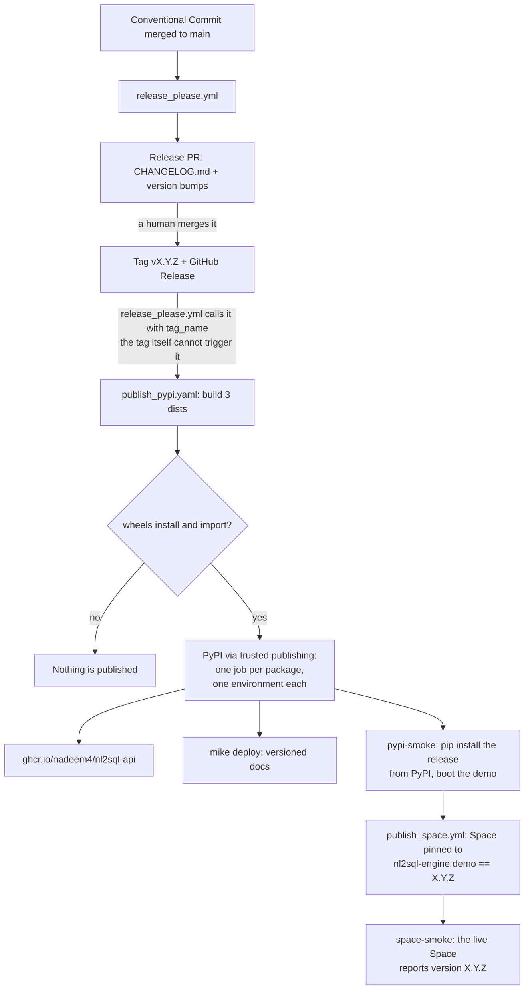
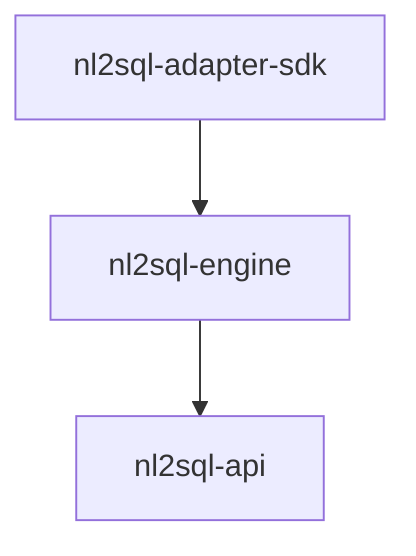

# Releasing

The monorepo publishes three distributions to PyPI under **unified versioning**:
they all carry the same version and are released together. Internal
dependencies use compatible-release constraints (`~=0.1`), so a release only
resolves for users if every package declares the same version.

Releases are automated. Nobody edits a version number and nobody edits
`CHANGELOG.md` by hand — [release-please](https://github.com/googleapis/release-please)
owns both. The one manual step is **merging the release pull request**.
Everything after that runs on its own: the three packages go to PyPI, the API
image to GHCR, the versioned docs to `gh-pages`, and the hosted demo on Hugging
Face is rebuilt on the version just published. Each of those is checked from
the outside before the release counts as done.

## The automated flow


```mermaid
flowchart TD
    C[Conventional Commit merged to main] --> RP[release_please.yml]
    RP --> PR[Release PR: CHANGELOG.md + version bumps]
    PR -->|a human merges it| TAG[Tag vX.Y.Z + GitHub Release]
    TAG -->|release_please.yml calls it with tag_name<br/>the tag itself cannot trigger it| B[publish_pypi.yaml: build 3 dists]
    B --> S{wheels install and import?}
    S -->|no| STOP[Nothing is published]
    S -->|yes| PY[PyPI via trusted publishing:<br/>one job per package,<br/>one environment each]
    PY --> GH[ghcr.io/nadeem4/nl2sql-api]
    PY --> D[mike deploy: versioned docs]
    PY --> PS[pypi-smoke: pip install the release<br/>from PyPI, boot the demo]
    PS --> SP[publish_space.yml: Space pinned to<br/>nl2sql-engine demo == X.Y.Z]
    SP --> SS[space-smoke: the live Space<br/>reports version X.Y.Z]
```

The same chain runs on every pull request up to the point of publishing: the
`build` and `fresh-install` jobs in `test.yml` build the wheels, install them
the way a user does and boot the demo, and the `api-image` job builds the GHCR
image from `packages/api/Dockerfile` (without pushing it), so a release does
not meet these checks for the first time.

### 1. Commit messages decide the version

The bump comes from [Conventional Commits](https://www.conventionalcommits.org/)
on `main`, so the commit subject is the release input:

| Commit prefix | Effect on the next version |
| --- | --- |
| `fix:` | patch |
| `feat:` | minor |
| any type with `!` or a `BREAKING CHANGE:` footer | major |
| `docs:`, `perf:`, `deps:`, `revert:` | patch, and shown in the changelog |
| `chore:`, `ci:`, `test:`, `build:`, `refactor:`, `style:` | no release on their own |

!!! warning "The project is pre-1.0: a breaking change bumps the *minor*"
    `release-please-config.json` sets top-level `bump-minor-pre-major: true`,
    which the schema describes as *"Breaking changes only bump semver minor if
    version < 1.0.0"*. While the version is below `1.0.0`, a `feat!:` or a
    `BREAKING CHANGE:` footer therefore moves `0.1.0` to `0.2.0` rather than to
    `1.0.0` — semver's rule for an unstable public API.

    Without this setting the *first* breaking commit silently declares the
    project stable. That is exactly what happened before it was added: the
    `refactor!:` that collapsed the distributions made release-please propose
    `1.0.0`.

    Going to `1.0.0` is then a deliberate act: set the version explicitly with a
    `Release-As: 1.0.0` commit (below). The flag stays `true` afterwards and
    becomes a no-op once the version is `>= 1.0.0`.

### 2. `release_please.yml` maintains a release PR

Every push to `main` runs `googleapis/release-please-action@v4`. It keeps a
single open pull request (`separate-pull-requests: false`, one manifest entry
for the whole repo) that contains the accumulated `CHANGELOG.md` entry and the
version bump applied everywhere it appears:

| File | Updated by |
| --- | --- |
| `CHANGELOG.md` | the `python` release strategy |
| `pyproject.toml` (repo root) | the `python` release strategy |
| `packages/adapter-sdk/pyproject.toml` | an `extra-files` `generic` updater |
| `packages/nl2sql/pyproject.toml` | an `extra-files` `generic` updater |
| `packages/api/pyproject.toml` | an `extra-files` `generic` updater |
| `.release-please-manifest.json` | release-please |

The three package manifests carry a marker comment on their version line:

```toml
version = "0.1.0" # x-release-please-version
```

The `generic` updater replaces the semver-looking value on any line carrying
that annotation. The `type: "generic"` entry in `release-please-config.json`
is required: without it a `.toml` path gets the TOML updater, which addresses a
field by `jsonpath` and ignores the marker entirely. The comment is a plain
TOML comment and has no effect on the build.

Because `include-component-in-tag` is `false`, the tag is `vX.Y.Z` rather than
`nl2sql-vX.Y.Z`.

### 3. Merging the release PR is the gate

**This is the only manual step in a release.** Merging the pull request makes
release-please create the `vX.Y.Z` tag and publish the GitHub Release. Until
someone merges it, nothing is tagged and nothing is published. Reviewing the
changelog and the version it proposes is the release decision.

### 4. The release publishes everything

`publish_pypi.yaml` runs seven jobs:

1. **`build`** — builds sdists and wheels for all three packages, then
   smoke-installs them into a clean virtualenv and runs `import nl2sql` and
   `nl2sql --help`. These are the same commands as the `build` job in
   `test.yml`. The `nl2sql-engine` wheel carries `LICENSE` and
   `THIRD_PARTY_NOTICES.md` under `dist-info/licenses/`, from copies in
   `packages/nl2sql/` (setuptools packs license files only from inside the
   project directory). Edit the root files and copy them over;
   `tests/unit/test_packaging_metadata.py` fails while the copies differ.
2. **`pypi`** — `needs: build`, so a wheel that does not install or import
   fails the gate and this never runs. It is a matrix job with one leg per
   package: each leg runs in its own GitHub Environment
   (`pypi-nl2sql-engine`, `pypi-nl2sql-api`, `pypi-nl2sql-adapter-sdk`),
   stages only that package's sdist and wheel into an `upload/` directory and
   points `pypa/gh-action-pypi-publish` at it. One environment per package is
   what makes each PyPI trusted-publisher registration unique — see
   [PyPI pending publishers](#pypi-pending-publishers).
3. **`ghcr`** — `needs: pypi`, which waits for every leg of the matrix. Builds
   `packages/api/Dockerfile` and pushes `ghcr.io/nadeem4/nl2sql-api` at both the
   tag and `latest`. The build context is the **repository root** (`context: .`)
   with the Dockerfile named explicitly (`file: packages/api/Dockerfile`),
   because the Dockerfile installs the three packages from their local sources
   and its `COPY ./packages/...` paths resolve against the build context. A
   context of `packages/api` makes them resolve to
   `packages/api/packages/adapter-sdk`, which does not exist — that is what
   failed on `v0.1.0`. A root `.dockerignore` keeps that context small.
   `needs: pypi` is retained so the image is only published for a release that
   reached PyPI, not because the image build needs PyPI. The image's
   `FROM python:X.Y` has to satisfy every package's `requires-python`
   (`>=3.12`): on `v0.2.0` it was still `python:3.11-slim`, pip refused to
   install `nl2sql-adapter-sdk` into it, and this job failed after PyPI and
   the docs had published. `tests/unit/test_docker_images.py` now checks every
   Dockerfile's base against every `pyproject.toml`, and the `api-image` job
   in `test.yml` builds this image on every pull request.

    !!! note "There is no `nl2sql-api:0.2.0` image"
        The job builds from the tagged commit, and `v0.2.0`'s Dockerfile cannot
        build, so re-running it would fail the same way. The first image built
        with the fix is published by the next release, `0.2.1`, which moves
        `ghcr.io/nadeem4/nl2sql-api:latest` onto it.
4. **`docs`** — `needs: pypi`, likewise after all three uploads.
   `mike deploy --push --update-aliases $TAG latest` adds a versioned copy of
   the docs to `gh-pages` and moves the `latest` alias onto it.
5. **`pypi-smoke`** — `needs: pypi`. On a fresh runner, installs the release
   from PyPI itself, `pip install "nl2sql-engine[demo]==X.Y.Z"`, into an empty
   virtualenv, boots `nl2sql demo --hosted` with no API key and checks the
   page, `/api/health` (which must report `X.Y.Z`), `/api/meta`,
   `/api/schema` and `/api/index`. This is
   `python scripts/fresh_install_check.py --pypi X.Y.Z`, the same check the
   `fresh-install` PR job runs on the wheels. PyPI accepts an upload at once,
   but the CDN in front of its index serves a new version a little later, so
   the install is retried up to ten times, 30 seconds apart, with pip's cache
   off.
6. **`space`** — `needs: pypi-smoke`, so the hosted demo is never built on a
   version that does not install from PyPI. Calls
   [`publish_space.yml`](../deployment/hosted-demo.md#deployed-by-the-release)
   with the tag, which pins the Space's image to
   `nl2sql-engine[demo]==X.Y.Z`, pushes it and waits for the build. That
   `pypi-smoke` installed the version is not proof that the Hub's builder
   will: on `v0.2.0` the Space build ran minutes later and its pip still saw
   only `0.1.x`. So the workflow first waits, up to 20 times 30 seconds, until
   `https://pypi.org/simple/nl2sql-engine/` lists `X.Y.Z`, and the Space's
   Dockerfile retries its install up to 10 times, 30 seconds apart, with
   pip's cache off.
   `secrets: inherit` carries `HF_TOKEN` down, from `release_please.yml`
   through this workflow into that one; without the secret the job skips
   green and says so.
7. **`space-smoke`** — runs when `space` reports it deployed. A Space can
   report `RUNNING` on its new build while the router still sends visitors
   to the old one, so this checks where visitors are: it polls
   `https://nadeem4nk-nl2sql-demo.hf.space/api/health` until it reports
   `X.Y.Z` (up to 15 minutes), then checks the page and `/api/meta`.

A release is fully out when all seven are green. A red `pypi-smoke` means the
release is on PyPI but does not install or boot as published; yank it and ship
a patch (see [Package order](#package-order)). A red `space` or `space-smoke`
leaves PyPI as it is and the Space on its previous image; fix the cause and
re-run the failed jobs, or redeploy by hand (below).

Authentication is PyPI **trusted publishing** (OIDC, `id-token: write`). There
is no API token anywhere in the workflow and no secret to rotate.

!!! warning "PEP 740 attestations are off, and must stay off"
    The `pypi` step sets `attestations: false`. Because `release_please.yml`
    reaches this workflow through `workflow_call`, OIDC auth and attestation
    signing disagree about which workflow "this" is: PyPI matches the token's
    `job_workflow_ref` claim, which names the *called* workflow
    (`publish_pypi.yaml`, the registered publisher), while Sigstore signs with
    the *entry-point* identity, putting `release_please.yml` in the
    certificate's Build Config URI. PyPI verifies the attestation against the
    one publisher that authenticated the request, so the two can never both
    match and the upload fails with `400 Invalid attestations supplied during
    upload`. This is what broke `v0.1.1`. Trusted publishing is unaffected; the
    cost is that released artifacts carry no PEP 740 provenance. See
    [PyPI's note on reusable workflows](https://docs.pypi.org/trusted-publishers/troubleshooting/#reusable-workflows-on-github).

The three `pypi` legs run with `fail-fast: false`, so one package failing no
longer cancels the other two and skips `ghcr` and `docs`.

### Why the publish is chained to release-please, not to the tag

**GitHub does not trigger workflows from events created with the default
`GITHUB_TOKEN`.** This is a deliberate recursion guard, and it has no opt-out
short of pushing the tag with a personal access token instead. release-please
tags with `GITHUB_TOKEN`, so a `v*` tag it pushes never fires
`publish_pypi.yaml`'s `push: tags` trigger. This is exactly what happened to
`v0.1.0`: the tag and the GitHub Release exist, both authored by
`github-actions[bot]`, and *Publish Release* has no run for them.

Introducing a PAT would defeat the point of trusted publishing, so the publish
is chained to release-please's own outputs instead. `release_please.yml` gives
the action step an `id`, re-exports `releases_created` and `tag_name` as job
outputs, and calls `publish_pypi.yaml` as a **reusable workflow**:

```yaml
publish:
  needs: release-please
  if: ${{ needs.release-please.outputs.releases_created == 'true' }}
  uses: ./.github/workflows/publish_pypi.yaml
  with:
    tag: ${{ needs.release-please.outputs.tag_name }}
  permissions:
    contents: write
    packages: write
    id-token: write
```

A called workflow's jobs can never hold more than the calling job grants, so
`id-token: write` has to appear on the caller for OIDC to reach the `pypi`
legs. Publishing still lives in `publish_pypi.yaml` — the same filename the
PyPI trusted publishers are registered against, which is what the `pypi` job's
OIDC token is checked on — so no publisher entry changes.

`publish_pypi.yaml` keeps its `push: tags: ["v*"]` trigger as well. It costs
nothing and still covers a tag a human pushes by hand.

### Publishing a release manually

`publish_pypi.yaml` also accepts `workflow_dispatch` with a required `tag`
input. Use it when a release was tagged but never published — `v0.1.0`, or any
tag pushed before the chaining above existed:

```console
$ gh workflow run publish_pypi.yaml -f tag=v0.1.0
```

or **Actions → Publish Release → Run workflow** and type the tag.

The same dispatch is how you recover a release that **tagged but never
uploaded** — the `vX.Y.Z` tag and the GitHub Release exist, but PyPI still shows
the previous version and no image reached GHCR. That is what happened to
`v0.1.1`: the `pypi` matrix failed and took `ghcr` and `docs` down with it.
Nothing needs to be re-tagged; fix the cause on `main`, then dispatch the same
tag:

```console
$ gh workflow run publish_pypi.yaml -f tag=v0.1.1
```

The dispatch checks out the tag, so it publishes the tagged commit, not `main`.
Only legs that never uploaded can be re-run — PyPI rejects a re-upload of a
version it already has, so a partially-published release needs `skip-existing`
or a manual publish of just the missing packages, in the
[dependency order below](#package-order).

To redeploy only the hosted demo at a release that is already on PyPI, without
touching PyPI, GHCR or the docs, dispatch the Space workflow with the tag:

```console
$ gh workflow run publish_space.yml -f tag=v0.2.0
```

When the Space root for that tag is already on the Space there is nothing to
push, so a run by hand asks the Hub for a factory rebuild instead and waits for
it; the job fails unless the Space ends `RUNNING`. See
[Hosted demo](../deployment/hosted-demo.md#deployed-by-the-release).

Every job resolves its tag from `${{ inputs.tag || github.ref_name }}`, never
from the raw ref. On a dispatched run `github.ref_name` is the *branch* you
dispatched from, so the fallback would silently build `main` instead of the
release; the input is what makes every checkout, the GHCR image tag and
`mike deploy` land on the tagged commit. Dispatching is safe to repeat only up
to the PyPI upload — PyPI rejects a re-upload of a version that already exists.

## Pinning a version, and the first release

Two settings exist only because release-please was adopted **mid-project**,
long after the first commit. Both concern the very first release and neither is
permanent.

### `bootstrap-sha` — where the changelog starts

With no tag in the repository, release-please has no marker for "the last
release" and walks the whole history, so the first changelog it generated
listed every `feat:` ever committed — 228 entries reaching back to before this
phase of work.

The top-level `bootstrap-sha` in `release-please-config.json` is the fix. The
manifest-releaser documentation describes it as a key that *"will cause
release-please to stop there for collecting changelog commits (so choose one
commit earlier than the first commit you want to include)"*. Ours is:

```json
"bootstrap-sha": "39d488ae9f9943ea5d9879bf2dd503c34370b24a"
```

That is the **parent** of `28687fe`, the merge of the first pull request in
this phase of work, so the changelog begins at that pull request and covers
this phase rather than the entire project.

It is top-level on purpose: the schema does not accept it inside a `packages`
entry, and the documentation notes it is *"only applicable at top-level
config"*.

!!! note "It expires on its own"
    Per the documentation, *"once a release-please generated PR has been
    merged, this config value will be ignored for all subsequent runs and can
    be removed."* Once a real `vX.Y.Z` tag exists, that tag is the baseline and
    `bootstrap-sha` does nothing. Deleting it then is tidy-up, not a behaviour
    change.

### `Release-As:` — choosing an exact version

To publish a specific version rather than the one conventional commits imply,
put a `Release-As:` footer in the **body** of a commit that lands on `main`:

```txt
ci: pin the first release to 0.1.0 and scope its changelog

Release-As: 0.1.0
```

Release-please reads `Release-As: x.x.x` (case insensitive) from the commit
body and opens its next release pull request for exactly that version. This is
how the first release was pinned to `0.1.0` instead of the `1.0.0` that the
`refactor!:` commit would otherwise have produced.

The footer applies to **one** commit and expires with it — nothing has to be
cleaned up afterwards.

!!! danger "Do not use the `release-as` *config* key instead"
    `release-please-config.json` accepts a `release-as` key that does the same
    job, and it is a trap. The schema marks the per-package form
    **`[DEPRECATED]`**, advising *"Consider using a `Release-As` commit
    instead"*, and the documentation warns that it is **sticky**:

    > Note: once the release PR is merged you should either remove this or
    > update it to a higher version. Otherwise subsequent `manifest-pr` runs
    > will continue to use this version even though it was already set in the
    > last release.

    A `release-as` left in the config does not pin one release — it pins
    **every** release, forever, to that version. The repository would stay at
    `0.1.0` while commits accumulated, and nobody would get an error saying so.

    This repository therefore has **no `release-as` key at all**, and should not
    gain one. Use the commit footer, which cannot be forgotten because it does
    not persist.

## Troubleshooting: the release PR merges but nothing is tagged

Both traps below fail the same way. `release_please.yml` reports success, no tag
appears, and the merged release pull request keeps its `autorelease: pending`
label — so every later run refuses to open a new release PR:

```txt
There are untagged, merged release PRs outstanding - aborting
```

That line is a *consequence*, not a diagnosis. The cause is earlier in the same
run, in the `Building releases` phase.

### The component mismatch

Symptom, in the `Building releases` phase of the run log:

```txt
PR component: undefined does not match configured component: nl2sql-engine
```

With `separate-pull-requests: false` the Merge plugin names the grouped release
branch `release-please--branches--main`, with no component in it. When the
release is built back out of that merged PR, release-please compares the
branch's component against `getBranchComponent()` — which returns the configured
component **regardless of `include-component-in-tag`**, unlike `getComponent()`,
which honours it:

```ts
async getComponent()       { if (!this.includeComponentInTag) return ''; ... }  // ""
async getBranchComponent() { return this.component || ...; }                    // "nl2sql-engine"
```

A `package-name` on the `packages` entry is what supplies that component. The
two disagree, the release is skipped, and no tag is created.

The fix is to carry **no `package-name`** for the root package. It was inert
otherwise: the `python` strategy takes its project name from the root
`pyproject.toml` (`projectName = pyProject.name`), not from that key, so the set
of files release-please updates is unchanged.

!!! danger "The `pullRequestTitlePattern` warnings are noise, not the cause"
    The same run also logs, repeatedly:

    ```txt
    pullRequestTitlePattern miss the part of '${scope}'
    pullRequestTitlePattern miss the part of '${component}'
    pullRequestTitlePattern miss the part of '${version}'
    ```

    These fire unconditionally whenever a title pattern omits a placeholder, and
    the built-in grouped-PR default — `chore: release ${branch}`, which renders
    as `chore: release main` — omits all three. They appear on healthy runs too.

    A missing `${version}` in the title is **not** fatal. Release-please falls
    back to the pull request body, whose `<summary>` block carries the version;
    the documentation says it parses the version *"either via the pull request
    title or body format"*.

    Setting `group-pull-request-title-pattern` to add `${version}` does not fix
    the mismatch above, and it breaks that body fallback for any release PR
    already merged under the old title (`Bad pull request title: 'chore: release
    main'`), stranding that version permanently. Reading these warnings as the
    cause cost a release cycle.

### Manifest seeding

`.release-please-manifest.json` records the **last released** version, not the
next one, so it must be seeded *below* the first version to be shipped:

```json
{ ".": "0.0.0" }
```

Seeding it at the target instead — `{".": "0.1.0"}` while a `Release-As: 0.1.0`
footer pins the same value — makes the first release a no-op: release-please
treats the version it would propose as already released, so the pull request it
opens rewrites `CHANGELOG.md` and bumps nothing. This also cost a cycle.

## Documentation versions

`gh-pages` is managed by `mike`, which keeps one built site per version:

| Version | Deployed by | When |
| --- | --- | --- |
| `dev` | `publish_docs.yml` | every push to `main` |
| `X.Y.Z` + the `latest` alias | `publish_pypi.yaml` | on a release, or a manual dispatch |

`publish_docs.yml` previously ran `mkdocs gh-deploy --force`, which replaces the
entire `gh-pages` root and would have wiped every released version on the next
push to `main`. It now deploys to the `dev` version instead, so the two
workflows write different directories. Both declare `concurrency: group:
gh-pages` so they never push to that branch at the same time. Only the release
workflow moves `latest` and sets the site default.

## One-time human setup

Four things must be configured by hand before the first release. Only the
last involves a secret, and it is not a PyPI one.

### PyPI pending publishers

Trusted publishing has to be told, once per project name, which repository and
workflow it will accept uploads from. For a project that does not exist on PyPI
yet this is a **pending publisher**, created at
[pypi.org/manage/account/publishing](https://pypi.org/manage/account/publishing/).

Add one for each of the three names — `nl2sql-engine`, `nl2sql-api` and
`nl2sql-adapter-sdk`. The engine publishes as `nl2sql-engine` because the
`nl2sql` name on PyPI is already taken by an unrelated project; the import
package is still `nl2sql`.

!!! warning "The environment name is required and differs per package"
    PyPI keys a pending publisher on the tuple **(owner, repository, workflow,
    environment)** and requires that tuple to be unique. All three of our
    projects publish from the same owner, the same repository and the same
    workflow file, so with the environment left blank all three tuples are
    identical: the first registration succeeds and the next two are rejected
    with *"A pending trusted publisher matching this configuration has already
    been registered for a different project name."*

    The environment is therefore the only field that can distinguish them, and
    `publish_pypi.yaml` gives each package its own. **Fill it in exactly as
    below** — these strings are the contract between the workflow and PyPI, and
    a mismatch fails the upload with an OIDC error rather than a helpful one.

Owner `nadeem4`, repository `nl2sql` and workflow `publish_pypi.yaml` are the
same on all three entries. Only the project name and the environment differ:

| PyPI Project Name | Environment name |
| --- | --- |
| `nl2sql-engine` | `pypi-nl2sql-engine` |
| `nl2sql-api` | `pypi-nl2sql-api` |
| `nl2sql-adapter-sdk` | `pypi-nl2sql-adapter-sdk` |

| Field | Value |
| --- | --- |
| Owner | `nadeem4` |
| Repository name | `nl2sql` |
| Workflow name | `publish_pypi.yaml` |
| Environment name | per the table above — **never blank** |

The environments do not need to be created by hand. Referencing them in
`publish_pypi.yaml` is enough for GitHub to create them on the first run, after
which they appear under **Settings → Environments** and can be given reviewers
or branch rules if the release should be gated further.

Once a name has published for the first time, its pending publisher becomes an
ordinary trusted publisher on the project. **Do not create an API token and do
not add a `password` to the publish step** — the workflow authenticates with
OIDC and adding a token secret would only widen the blast radius.

Renaming `publish_pypi.yaml`, or renaming an environment in it, breaks
publishing until the publisher entries are updated to match.

### GHCR package visibility

The first push creates `ghcr.io/nadeem4/nl2sql-api` as a **private** package.
Make it public under the repository's *Packages* settings if the image is meant
to be pullable anonymously. The workflow itself needs no setup: it authenticates
with the built-in `GITHUB_TOKEN` and `permissions: packages: write`.

### Actions permission to open pull requests

Settings → Actions → General → Workflow permissions → tick **"Allow GitHub
Actions to create and approve pull requests"**.

Without it `release_please.yml` creates its release branch and commit and then
fails with `GitHub Actions is not permitted to create or approve pull
requests`, so the release pull request never appears and nothing can be merged
or tagged.

### The Hugging Face token

A Hugging Face access token with **write** permission
(<https://huggingface.co/settings/tokens>), saved as the repository secret
**`HF_TOKEN`** under Settings → Secrets and variables → Actions. It is what the
`space` job pushes the Space with. Without it every release still publishes to
PyPI, GHCR and the docs; the `space` job logs that the secret is missing and
finishes green, and `space-smoke` is skipped. See
[Hosted demo](../deployment/hosted-demo.md#deployed-by-the-release).

## Package order

The three matrix legs run in parallel, so ordering is not something the
workflow manages. It matters when one leg fails and you re-publish by hand:
release in dependency order so no package is ever on PyPI referencing a version
of its dependency that is not.


```mermaid
flowchart TD
    SDK[nl2sql-adapter-sdk] --> CORE[nl2sql-engine]
    CORE --> API[nl2sql-api]
```

1. `nl2sql-adapter-sdk` — no internal dependencies.
2. `nl2sql-engine` — needs the SDK. Carries the engine, the CLI and all four dialect
   adapters, so its extras (`nl2sql-engine[postgres]` and friends) add only database
   drivers from PyPI and cannot be broken by publish order.
3. `nl2sql-api` — needs `nl2sql-engine`.

PyPI never lets a version be re-uploaded. If a release goes out broken, yank it
and ship the next patch version; do not try to replace it.

!!! note
    The repo-root `pyproject.toml` (`nl2sql-monorepo`) also carries a version.
    It is a workspace placeholder that is never built or published, but
    release-please keeps it in step with the rest so there is only ever one
    version in the repository.
