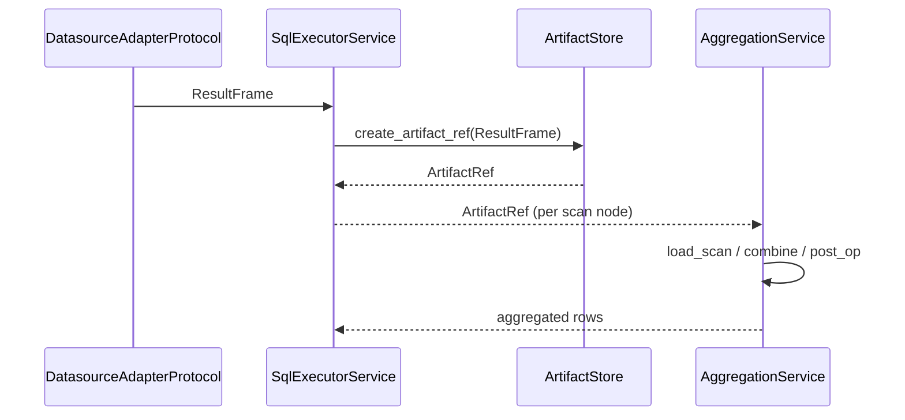

# Result Frame + Data Flow

Adapters return a `ResultFrame`, which is persisted by the artifact store as a Parquet file and referenced via an `ArtifactRef`. The aggregation layer consumes `ArtifactRef` objects to assemble final results based on `ExecutionDAG`.

## End-to-end flow

## Contracts

- `ResultFrame` (`nl2sql_adapter_sdk.contracts.ResultFrame`) is the adapter response contract.
- `ArtifactRef` (`nl2sql.execution.contracts.ArtifactRef`) is the persisted reference.
- `ExecutorResponse` (`nl2sql.execution.contracts.ExecutorResponse`) carries artifact and metrics.

## Aggregation

`AggregationService` loads scan artifacts via its engine, joins and combines them in DAG order, and returns terminal node outputs for the final answer synthesis.

## Source references

- Adapter contracts: `packages/adapter-sdk/src/nl2sql_adapter_sdk/contracts.py`
- Executor contracts: `packages/core/src/nl2sql/execution/contracts.py`
- Aggregation service: `packages/core/src/nl2sql/aggregation/aggregator.py`
