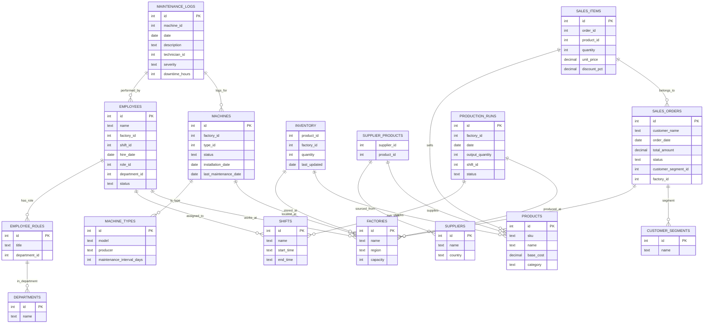

# Demo Data (CLI-first)

Use the CLI to generate deterministic demo data and configs, then query them from
the CLI. This keeps data generation out of the API runtime and gives you a realistic
multi-database scenario with cross-database relationships.

## 1. Install the CLI

```bash
# Install from PyPI
pip install nl2sql-cli

# Or install from source (dev)
pip install -e packages/cli
```

## 2. Generate demo data with the CLI

```bash
nl2sql setup --demo
```

This writes:

- SQLite databases in `data/demo_lite/`
- `configs/datasources.demo.yaml`
- `configs/llm.demo.yaml`
- `configs/policies.demo.json`
- `configs/sample_questions.demo.yaml`
- `.env.demo`

For the lite demo, setup also runs schema indexing once automatically.

## 3. Use demo data with the CLI

```bash
# Run a query against demo data
ENV=demo nl2sql run "Show me broken machines in Austin"

# Index schemas if you need to re-index after regenerating demo data
ENV=demo nl2sql index
```

Note: the demo datasource config uses relative database paths (e.g. `data/demo_lite/*.db`),
so run the CLI from the repo root.

## Demo data architecture

The demo models a manufacturing organization with multiple databases and vendors:

- `manufacturing_ref` (Postgres/SQLite): shared reference data (factories, roles, shifts)
- `manufacturing_ops` (Postgres/SQLite): operational data (employees, machines, maintenance)
- `manufacturing_supply` (MySQL/SQLite): supply chain data (products, suppliers, inventory)
- `manufacturing_history` (MSSQL/SQLite): historical data (sales orders, production runs)

Cross-database relationships are logical (not enforced by DB constraints), so they
mirror real-world enterprise setups where data is distributed across systems.

### Entity relationships



## Data scenarios and volumes

- Employees: ~500 across five factories, with roles, departments, and hire dates
- Machines: ~150 with maintenance intervals and last maintenance dates
- Maintenance logs: ~250 with severity and downtime hours
- Inventory: all products across factories with last updated timestamps
- Sales orders: ~5,000 with seasonal spikes in Q4
- Production runs: daily runs per factory over the last year

Embedded scenarios:
- Low-stock alerts for specific products and factories
- Maintenance backlogs for older machines
- Seasonal sales spikes and production variability
- Data skew across factories to mimic regional load

## Sample queries

Single-database examples:
- "Which machines are overdue for maintenance based on last_maintenance_date?"
- "Show sales orders by status for the last 30 days"
- "List products with low inventory across all factories"

Cross-database examples (requires multi-datasource querying):
- "Which factories have the highest sales for EV Battery Pack Long Range in Q4?"
- "Show inventory levels for products with pending orders this month"
- "Compare production output vs sales orders by factory for the last quarter"
- "List maintenance technicians assigned to machines with recent error logs"

## Relationship guide

Common join paths:
- `manufacturing_ops.employees.factory_id` -> `manufacturing_ref.factories.id`
- `manufacturing_ops.machines.type_id` -> `manufacturing_ref.machine_types.id`
- `manufacturing_supply.inventory.product_id` -> `manufacturing_supply.products.id`
- `manufacturing_history.sales_items.product_id` -> `manufacturing_supply.products.id`
- `manufacturing_history.sales_orders.factory_id` -> `manufacturing_ref.factories.id`

## Refreshing demo data

Regenerate data at any time with:

```bash
nl2sql setup --demo
```

This overwrites all demo databases and regenerates sample questions and configs.
