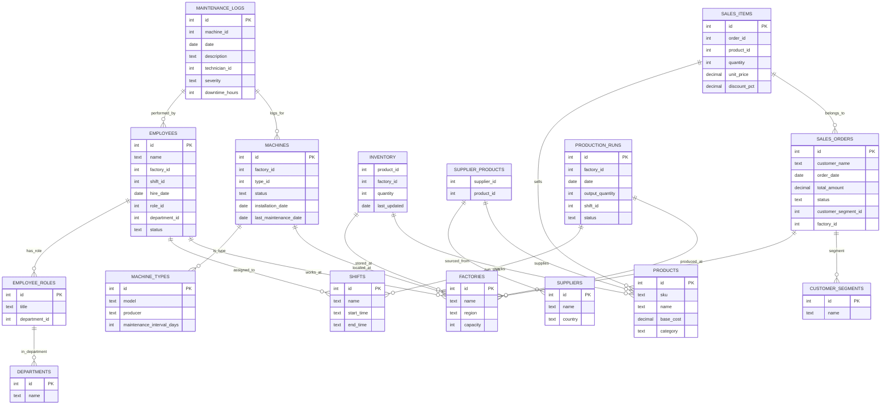

# Demo Data (CLI-first)

Use the CLI to generate deterministic demo data and configs, then query them from
the CLI. This keeps data generation out of the API runtime and gives you a realistic
multi-database scenario with cross-database relationships.

## 1. Install the CLI

```bash
# Install from PyPI
pip install nl2sql-engine

# Or install from source (dev)
pip install -e "packages/nl2sql[all]"
```

## 2. Generate demo data with the CLI

```bash
# SQLite files, no containers (default)
nl2sql setup --demo --lite

# Or full fidelity: Postgres/MySQL/MSSQL in Docker
nl2sql setup --demo --docker
```

`--lite` and `--docker` are mutually exclusive; lite is the default when neither
is given.

`--docker` writes a `demo_docker/` directory and builds the application image
from this repository, so run it from a clone of the repo.

This writes the following, relative to the directory you run the command in:

- SQLite databases in `data/demo_lite/`
- `configs/datasources.demo.yaml`
- `configs/llm.demo.yaml`
- `configs/policies.demo.json`
- `configs/sample_questions.demo.yaml`
- `.env.demo`

For the lite demo, setup also runs schema indexing once automatically.

### API keys in the demo

`.env.demo` is generated with `EMBEDDING_PROVIDER=local`, so schema chunks are
embedded with the key-free ONNX `all-MiniLM-L6-v2` model bundled with chromadb
instead of the OpenAI embeddings API. The first indexing run downloads roughly
79 MB of model files into a local cache, which can take a few minutes.

This covers the embedding step only. The demo is **not** key-free end to end:

- `nl2sql --env demo run "..."` calls a chat model, so it needs a working LLM key
  (`OPENAI_API_KEY`, or an OpenRouter key with `configs/llm.demo.yaml` pointed at
  `provider: openrouter`).
- Indexing also runs an optional LLM enrichment pass over the schema. Enrichment
  is best-effort: without a usable chat key it is skipped with an `INFO` line
  naming the agent, the provider and the variable to set, and the chunks are
  still indexed - just with no LLM-generated descriptions. An enrichment failure
  never fails indexing.
- So `nl2sql setup --demo` and `nl2sql --env demo index` complete with no chat
  key at all, and `nl2sql index` exits `0`. It exits `1` if any datasource
  actually fails to index, which is safe to rely on in a script. A missing key
  surfaces when a chat model is first called. Fill in `OPENAI_API_KEY` in
  `.env.demo` before running a query.
- Pointing `configs/llm.demo.yaml` at `provider: ollama` removes the chat key
  requirement, but a local model's ability to satisfy the pipeline's structured
  output is model-dependent - see
  [LLM configuration → Ollama](../configuration/llm.md#ollama).

Because the demo indexes with `local` and the default environment indexes with
`openai`, the two use different vector dimensions. `.env.demo` keeps its own
`VECTOR_STORE=data/vector_store_demo` directory, so they do not collide. If you
change `EMBEDDING_PROVIDER` for an existing store, re-run `nl2sql index` — the
store otherwise raises `EmbeddingDimensionMismatchError`.

## The Docker demo stack

`nl2sql setup --demo --docker` writes `demo_docker/docker-compose.demo.yml`. The
default stack is the two Postgres databases, MySQL, and an `app` container that
serves the REST API:

```bash
cd demo_docker
docker compose -f docker-compose.demo.yml up -d
```

| Service | Image | Host port |
| --- | --- | --- |
| `manufacturing_ref` | `postgres:15` | 5433 |
| `manufacturing_ops` | `postgres:15` | 5434 |
| `manufacturing_supply` | `mysql:8` | 3307 |
| `app` | built from `packages/api/Dockerfile` | 8000 |
| `manufacturing_history` | `mcr.microsoft.com/mssql/server:2022-latest` | 1434 (profile `mssql`) |

The `app` service builds from the repo root, reads the same `.env.demo` the lite
path writes, mounts `configs/` and `data/` from the repo, and waits for each
database to report healthy (`depends_on: condition: service_healthy`) before it
starts. The API is then on <http://localhost:8000>.

### One config, two addresses

`configs/datasources.demo.yaml` resolves each database's host and port from the
environment (`${env:DEMO_REF_HOST}`, `${env:DEMO_REF_PORT}`, and so on) so the
same file works from both sides of the container boundary:

| Caller | Host | Port | Comes from |
| --- | --- | --- | --- |
| `nl2sql --env demo index` / `run` on your machine | `localhost` | the host port above | `.env.demo` |
| the `app` container | the Compose service name | the database's internal port (5432 / 3306 / 1433) | `environment:` on the `app` service, which overrides `.env.demo` |

Point the demo at databases somewhere else by editing the `DEMO_*_HOST` and
`DEMO_*_PORT` values in `.env.demo`.

### MSSQL is opt-in

`manufacturing_history` sits behind the `mssql` Compose profile because the SQL
Server image is a ~1.6 GB pull. Nothing outside the profile depends on it, so the
default `up` never touches it. Opt in with:

```bash
docker compose -f docker-compose.demo.yml --profile mssql up -d
```

Check what a profile resolves to without pulling anything:

```bash
docker compose -f docker-compose.demo.yml config --services
docker compose -f docker-compose.demo.yml --profile mssql config --services
```

## 3. Use demo data with the CLI

```bash
# Run a query against demo data
nl2sql --env demo run "Show me broken machines in Austin"

# Index schemas if you need to re-index after regenerating demo data
nl2sql --env demo index
```

`--env <name>` loads `.env.<name>`. To point at an exact file instead, use
`--env-file <path>`, which takes precedence over `--env`. The equivalent
environment variables (`ENV` and `ENV_FILE_PATH`) still work.

Note: the demo datasource config uses relative database paths (e.g. `data/demo_lite/*.db`),
so run the CLI from the repo root.

## Demo data architecture

The demo models a manufacturing organization with multiple databases and vendors:

- `manufacturing_ref` (Postgres/SQLite): shared reference data (factories, roles, shifts)
- `manufacturing_ops` (Postgres/SQLite): operational data (employees, machines, maintenance)
- `manufacturing_supply` (MySQL/SQLite): supply chain data (products, suppliers, inventory)
- `manufacturing_history` (MSSQL/SQLite): historical data (sales orders, production runs)

Cross-database relationships are logical (not enforced by DB constraints), so they
mirror real-world enterprise setups where data is distributed across systems.

### Entity relationships


```mermaid
erDiagram
    FACTORIES {
        int id PK
        text name
        text region
        int capacity
    }
    MACHINE_TYPES {
        int id PK
        text model
        text producer
        int maintenance_interval_days
    }
    SHIFTS {
        int id PK
        text name
        text start_time
        text end_time
    }
    DEPARTMENTS {
        int id PK
        text name
    }
    EMPLOYEE_ROLES {
        int id PK
        text title
        int department_id
    }
    CUSTOMER_SEGMENTS {
        int id PK
        text name
    }
    EMPLOYEES {
        int id PK
        text name
        int factory_id
        int shift_id
        date hire_date
        int role_id
        int department_id
        text status
    }
    MACHINES {
        int id PK
        int factory_id
        int type_id
        text status
        date installation_date
        date last_maintenance_date
    }
    MAINTENANCE_LOGS {
        int id PK
        int machine_id
        date date
        text description
        int technician_id
        text severity
        int downtime_hours
    }
    PRODUCTS {
        int id PK
        text sku
        text name
        decimal base_cost
        text category
    }
    SUPPLIERS {
        int id PK
        text name
        text country
    }
    INVENTORY {
        int product_id
        int factory_id
        int quantity
        date last_updated
    }
    SUPPLIER_PRODUCTS {
        int supplier_id
        int product_id
    }
    SALES_ORDERS {
        int id PK
        text customer_name
        date order_date
        decimal total_amount
        text status
        int customer_segment_id
        int factory_id
    }
    SALES_ITEMS {
        int id PK
        int order_id
        int product_id
        int quantity
        decimal unit_price
        decimal discount_pct
    }
    PRODUCTION_RUNS {
        int id PK
        int factory_id
        date date
        int output_quantity
        int shift_id
        text status
    }

    EMPLOYEES ||--o{ FACTORIES : "works_at"
    EMPLOYEES ||--o{ SHIFTS : "assigned_to"
    EMPLOYEES ||--o{ EMPLOYEE_ROLES : "has_role"
    EMPLOYEE_ROLES ||--o{ DEPARTMENTS : "in_department"
    MACHINES ||--o{ FACTORIES : "located_at"
    MACHINES ||--o{ MACHINE_TYPES : "is_type"
    MAINTENANCE_LOGS ||--o{ MACHINES : "logs_for"
    MAINTENANCE_LOGS ||--o{ EMPLOYEES : "performed_by"
    INVENTORY ||--o{ PRODUCTS : "tracks"
    INVENTORY ||--o{ FACTORIES : "stored_at"
    SUPPLIER_PRODUCTS ||--o{ PRODUCTS : "supplies"
    SUPPLIER_PRODUCTS ||--o{ SUPPLIERS : "sourced_from"
    SALES_ITEMS ||--o{ SALES_ORDERS : "belongs_to"
    SALES_ITEMS ||--o{ PRODUCTS : "sells"
    SALES_ORDERS ||--o{ CUSTOMER_SEGMENTS : "segment"
    SALES_ORDERS ||--o{ FACTORIES : "fulfilled_by"
    PRODUCTION_RUNS ||--o{ FACTORIES : "produced_at"
    PRODUCTION_RUNS ||--o{ SHIFTS : "run_shift"
```

## Data scenarios and volumes

- Employees: ~500 across five factories, with roles, departments, and hire dates
- Machines: ~150 with maintenance intervals and last maintenance dates
- Maintenance logs: ~250 with severity and downtime hours
- Inventory: all products across factories with last updated timestamps
- Sales orders: ~5,000 with seasonal spikes in Q4
- Production runs: daily runs per factory over the last year

Embedded scenarios:
- Low-stock alerts for specific products and factories
- Maintenance backlogs for older machines
- Seasonal sales spikes and production variability
- Data skew across factories to mimic regional load

## Sample queries

Single-database examples:
- "Which machines are overdue for maintenance based on last_maintenance_date?"
- "Show sales orders by status for the last 30 days"
- "List products with low inventory across all factories"

Cross-database examples (requires multi-datasource querying):
- "Which factories have the highest sales for EV Battery Pack Long Range in Q4?"
- "Show inventory levels for products with pending orders this month"
- "Compare production output vs sales orders by factory for the last quarter"
- "List maintenance technicians assigned to machines with recent error logs"

## Relationship guide

Common join paths:
- `manufacturing_ops.employees.factory_id` -> `manufacturing_ref.factories.id`
- `manufacturing_ops.machines.type_id` -> `manufacturing_ref.machine_types.id`
- `manufacturing_supply.inventory.product_id` -> `manufacturing_supply.products.id`
- `manufacturing_history.sales_items.product_id` -> `manufacturing_supply.products.id`
- `manufacturing_history.sales_orders.factory_id` -> `manufacturing_ref.factories.id`

## Refreshing demo data

Regenerate data at any time with:

```bash
nl2sql setup --demo --lite
```

This overwrites all demo databases and regenerates sample questions and configs.
