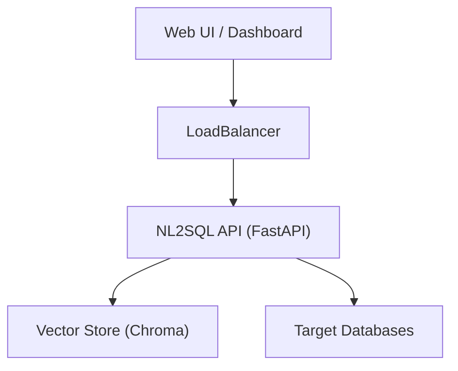

# Deployment Guide

This guide covers deploying the NL2SQL platform in a production environment using Docker.

## Architecture

In production, the system typically runs as a backend API service.



## Docker Compose

We provide a production-ready `docker-compose.yml`.

```yaml
version: '3.8'
services:
  api:
    build: .
    ports:
      - "8000:8000"
    environment:
      - OPENAI_API_KEY=${OPENAI_API_KEY}
      - CONFIG_PATH=/app/configs/datasources.yaml
    volumes:
      - ./configs:/app/configs
```

## Production Checklist

1. [ ] **Security**: Ensure `users.json` is mapped to your identity provider (e.g. OAuth) to dynamically enforce `allowed_tables`.
2. [ ] **Read-Only**: Configure the database users in `datasources.yaml` to have READ-ONLY permissions at the database level.
    > The PhysicalValidator provides a safety net, but deep defense requires DB-level grants.
3. [ ] **Monitoring**: Enable the `PipelineMonitorCallback` to log all traces to your observability stack (e.g. LangSmith).
