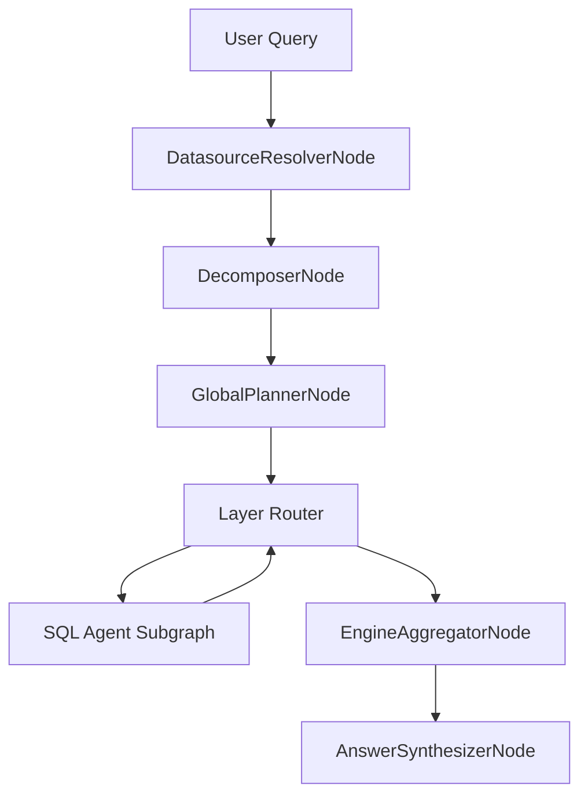

# NL2SQL Engineering Documentation

This documentation describes the **current runtime behavior** of NL2SQL as implemented in code. It is architecture-driven and intended for engineers who operate, extend, or audit the system.

## What NL2SQL does

- Orchestrates a LangGraph pipeline built in `build_graph()` and executed via `run_with_graph()` for every user query.
- Splits multi-part questions into sub-queries and executes them across datasources via subgraphs.
- Generates SQL with agent nodes, validates the plan, executes via adapters, and aggregates results into a final answer.

## High-level flow

## Core entry points

- Pipeline runtime: `nl2sql.pipeline.runtime.run_with_graph`
- Graph builder: `nl2sql.pipeline.graph.build_graph`
- Application context: `nl2sql.context.NL2SQLContext`

## Where to start

- `getting-started.md` for bootstrapping.
- `architecture/high-level.md` for system architecture.
- `agents/architecture.md` for the SQL agent subgraph.
- `orchestration/dag.md` for DAG orchestration and routing.
