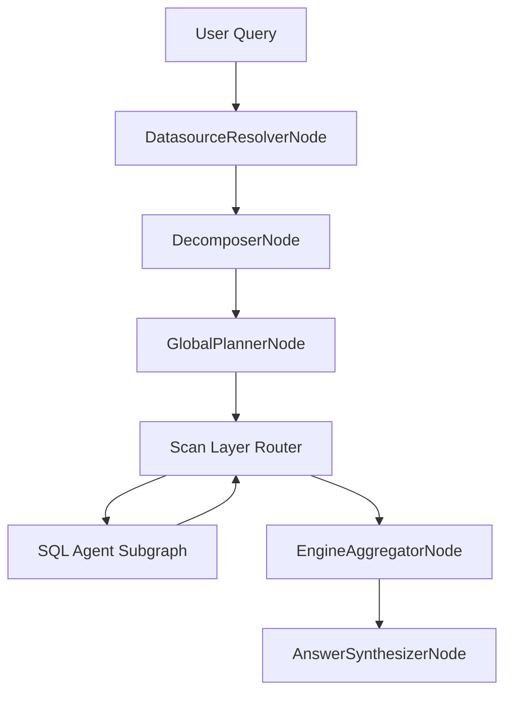

# NL2SQL Platform Documentation

This documentation describes the **current, production-grade runtime behavior** of NL2SQL as implemented in code. It is engineered for platform engineers, system architects, and contributors who need a precise mental model of the architecture, contracts, and operational behavior.

## Problem this system solves

NL2SQL converts natural language requests into **deterministic, validated SQL** across one or more datasources. It enforces schema-grounded planning, policy constraints, and reproducible execution. The system is built for multi-datasource enterprise environments where correctness, safety, and observability matter more than conversational flexibility.

## Design philosophy

- **Determinism first**: stable IDs, deterministic DAG layering, and structured ASTs ensure the same input yields the same orchestration structure.
- **Schema grounding**: planning is constrained by a schema snapshot retrieved via structured chunks.
- **Explicit validation gates**: logical validation enforces schema and RBAC constraints before execution.
- **Modularity**: adapters, subgraphs, and executors are capability-driven and replaceable.
- **Isolation**: execution and indexing can be offloaded to sandboxed process pools.
- **Observability**: structured logging, metrics, and audit events are first-class.

## Non-functional goals

- Reliability under partial failures (circuit breakers, retry semantics, safe failure).
- Extensibility via plugins and registries (datasources, subgraphs, executors).
- Cost awareness (row limits, byte limits, optional dry run/cost estimate).
- Security by default (RBAC, policy-based table access, audit logging).

## High-level flow

## Core entry points

- Pipeline runtime: `nl2sql.pipeline.runtime.run_with_graph`
- Graph builder: `nl2sql.pipeline.graph.build_graph`
- Application context: `nl2sql.context.NL2SQLContext`

## Navigate the docs

- `architecture/high-level.md` for end-to-end system architecture and subsystem boundaries.
- `architecture/pipeline.md` for LangGraph pipeline flow, routing, and subgraph lifecycle.
- `schema/store.md` and `architecture/indexing.md` for schema contracts, chunking, and retrieval.
- `execution/sandbox.md` for execution isolation and concurrency details.
- `adapters/architecture.md` for plugin discovery and capability-based routing.
- `observability/stack.md` and `observability/error-handling.md` for metrics, logging, and failure modes.
