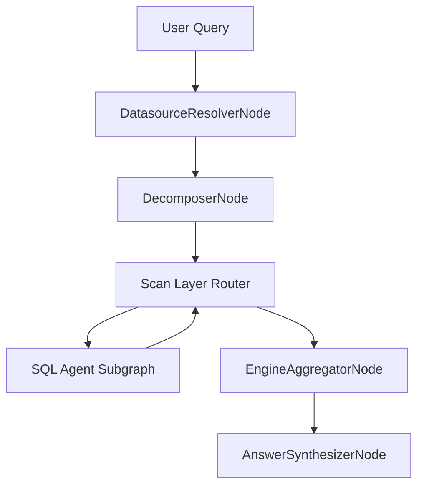

# NL2SQL Platform Documentation

This documentation describes the **current runtime behavior** of NL2SQL as implemented in code, including the parts that are not implemented yet. It is written for engineers and contributors who need a precise mental model of the architecture, contracts, and operational behavior. Where a page states a limitation, the limitation is the fact; nothing here describes intent.

## Problem this system solves

NL2SQL converts natural language requests into **validated SQL** across one or more datasources. The model emits a typed AST, never SQL text; the AST is checked against the retrieved schema and the caller's RBAC policy before any SQL is generated. The system is built for multi-datasource environments where correctness and inspectable failure matter more than conversational flexibility.

Model output itself is not reproducible; see [Determinism](architecture/determinism.md) for exactly which parts of a run are stable and which are not.

## Design philosophy

- **Determinism where it is achievable**: stable content-hashed IDs, sorted DAG layering, and a fixed graph topology. The LLM's output is not part of that guarantee.
- **Schema grounding**: planning is constrained by a schema snapshot retrieved via structured chunks.
- **Explicit validation gates**: logical validation enforces schema and RBAC constraints before execution.
- **Modularity**: adapters, subgraphs, and executors are capability-driven and replaceable.
- **Bounded waiting**: a global timeout bounds how long the caller waits for a run, not how long the work runs (on expiry the caller gets `PIPELINE_TIMEOUT` and the worker thread winds down in the background); each run carries a per-run cancellation token, and the graph itself runs in-process on a thread pool.
- **Observability**: structured logging always; OpenTelemetry metrics and audit events when a caller attaches the pipeline callback (today, only the CLI does). See [Observability Stack](observability/stack.md).

## Non-functional goals

- Reliability under partial failures (a circuit breaker on vector retrieval, SQL-agent retry semantics, errors returned as state rather than raised).
- Extensibility via plugins and registries (datasources, subgraphs, executors).
- Cost awareness (a row limit is baked into every generated statement; `max_bytes` is reported, not enforced).
- Authorization at planning time (RBAC policy-based table access). The role is supplied by the caller, so the deployer owns authentication; see [Security Model](security/model.md).

## High-level flow

```mermaid
flowchart TD
    User[User Query] --> Resolver[DatasourceResolverNode]
    Resolver --> Decomposer[DecomposerNode]
    Decomposer --> Router[Scan Layer Router]
    Router --> Subgraph[SQL Agent Subgraph]
    Subgraph --> Router
    Router --> Aggregator[EngineAggregatorNode]
    Aggregator --> Synthesizer[AnswerSynthesizerNode]
```

## Core entry points

- Pipeline runtime: `nl2sql.pipeline.runtime.run_with_graph`
- Graph builder: `nl2sql.pipeline.graph.build_graph`
- Application context: `nl2sql.context.NL2SQLContext`

## Navigate the docs

- `architecture/overview.md` for end-to-end system architecture and subsystem boundaries.
- `architecture/pipeline.md` for LangGraph pipeline flow, routing, and execution DAG behavior.
- `architecture/graph_state.md`, `architecture/determinism.md`, and `architecture/invariants.md` for state, determinism, and enforced rules.
- `architecture/failure_recovery.md` for failure domains and retry scope.
- `schema/store.md` and `architecture/indexing.md` for schema contracts, chunking, and retrieval.
- `execution/isolation.md` for what the runtime bounds, and what it does not.
- `adapters/architecture.md` for plugin discovery and capability-based routing.
- `observability/stack.md` and `observability/error-handling.md` for metrics, logging, and error contracts.
