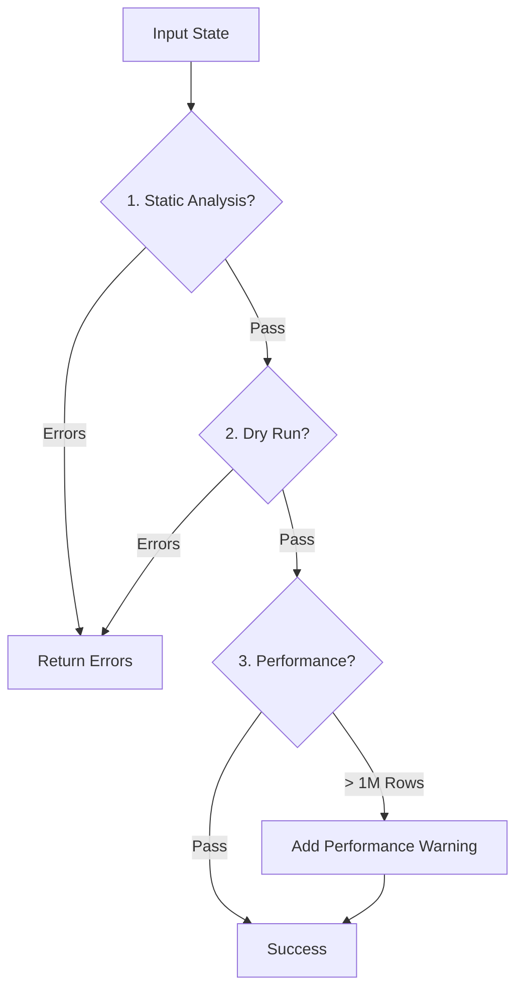

# ValidatorNode

## Purpose

The `ValidatorNode` acts as an automated "Quality Assurance" engine. It validates the proposed SQL plan through three progressively deeper layers of checks:

1. **Static Analysis**: Syntax, Schema existence, Type safety.
2. **Semantic Verification**: "Dry Run" against the real database.
3. **Performance Auditing**: Cost estimation and Query Plan analysis.

This ensures that the Executor only receives queries that are Valid, Safe, and Optimized.

## Logic Flow

1. **Static Analysis**: Verifies schemas and logical consistency (e.g. aliasing rules).
2. **Semantic Verification**: Sends SQL to the database (transaction rollback) to catch deep errors.
3. **Performance Auditing**: Estimates rows; if high, analyzes the Explain Plan and warns.

## Validation Layers

### 1. Static Analysis & Policy Check

* **Method**: `_validate_static_analysis(plan)`
* **Visitor Pattern**: Implements a `ValidatorVisitor` to recursively check the AST.
* **Checks**:
  * **Access**: Checks `user_context` before visitation.
  * **Schema**: `visit_column` validates existence in `state.relevant_tables`.
  * **Types**: `visit_binary` checks operation compatibility (e.g. `date` vs `string`).
  * **Recursion**: deeply validates `plan.where` and `plan.having` trees.
* **Outcome**: `CRITICAL` or `ERROR` (Hard Fail).

### 2. Semantic Verification (Dry Run)

* **Outcome**: `ERROR` (Hard Fail).

### 3. Performance Auditing

* **Method**: `_validate_performance(sql)`
* **Checks**:
  * `adapter.cost_estimate(sql)`: Checks `estimated_rows`.
  * `adapter.explain(sql)`: Analyzes execution plan.
* **Outcome**: `WARNING` (Soft Fail).
  * If `estimated_rows > 1,000,000`, generates a Performance Warning.
  * The Planner receives this feedback and decides whether to Optimize (add filter/limit) or Proceed.

## Components

* **`DatasourceRegistry`**: To fetch the active adapter for Dry Run/Explain.
* **`state.relevant_tables`**: Source of truth for static checks.

## Key Errors & Warnings

* **`TABLE_NOT_FOUND`**: Static check failed.
* **`EXECUTION_ERROR`**: Dry Run failed (e.g. invalid object name).
* **`PERFORMANCE_WARNING`**: Query is expensive (`> 1M rows`).
