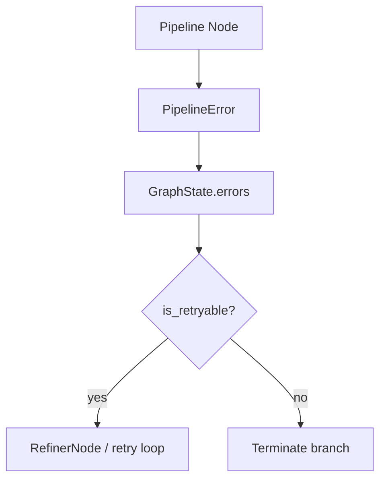

# Error Handling + Circuit Breakers

NL2SQL represents failures as structured `PipelineError` objects and propagates them through state. Retries are managed at the subgraph level, and circuit breakers provide fast-fail safety for external dependencies.

## Error contract

`PipelineError` includes:

- `node`, `message`, `severity`, `error_code`
- `is_retryable` derived from severity and error code

Common error codes include `MISSING_SQL`, `EXECUTION_FAILED`, `PIPELINE_TIMEOUT`, `SECURITY_VIOLATION`.

## Circuit breakers

`create_breaker()` configures `pybreaker.CircuitBreaker` instances with observability hooks:

- `LLM_BREAKER`
- `VECTOR_BREAKER`
- `DB_BREAKER`

Retrieval calls in `VectorStore` are wrapped with `VECTOR_BREAKER`. Other breakers are available but not uniformly wired across all execution paths.

## Failure flow

See `../architecture/failure_recovery.md` for failure domains, retry scope, and recovery limitations.

## Cancellation and timeouts

- `run_with_graph()` enforces a global timeout (`Settings.global_timeout_sec`).
- Cancellation is honored through `nl2sql.common.cancellation` checks.

## Source references

- Error contracts: `packages/core/src/nl2sql/common/errors.py`
- Circuit breakers: `packages/core/src/nl2sql/common/resilience.py`
- Retry logic: `packages/core/src/nl2sql/pipeline/subgraphs/sql_agent.py`
