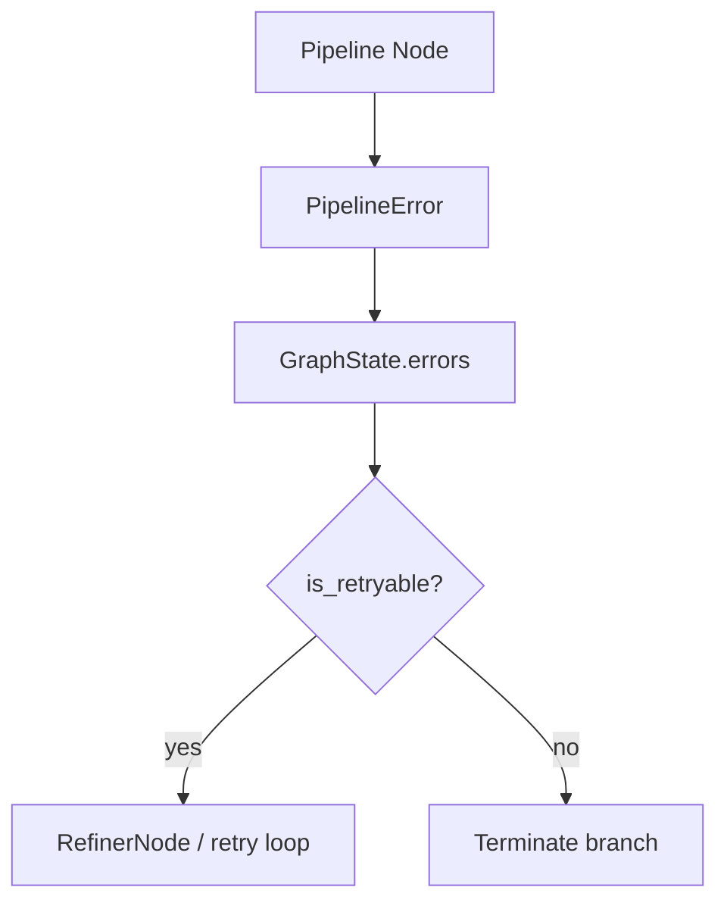

# Error Handling + Circuit Breakers

Errors are represented as `PipelineError` objects and propagated through `GraphState.errors`. Circuit breakers are used to fail fast when downstream dependencies are unavailable.

## Error contract

`PipelineError` contains:

- `node`, `message`, `severity`, `error_code`
- `is_retryable` property based on severity and error code

`ErrorCode` enumerates pipeline error types such as `MISSING_SQL`, `EXECUTION_FAILED`, and `PIPELINE_TIMEOUT`.

## Circuit breakers

`create_breaker()` returns a `pybreaker.CircuitBreaker` configured with an `ObservabilityListener` that logs state changes.

Global breakers:

- `LLM_BREAKER`
- `VECTOR_BREAKER`
- `DB_BREAKER`

## Failure flow

## Source references

- Error contracts: `packages/core/src/nl2sql/common/errors.py`
- Circuit breakers: `packages/core/src/nl2sql/common/resilience.py`
- SQL agent retry logic: `packages/core/src/nl2sql/pipeline/subgraphs/sql_agent.py`
