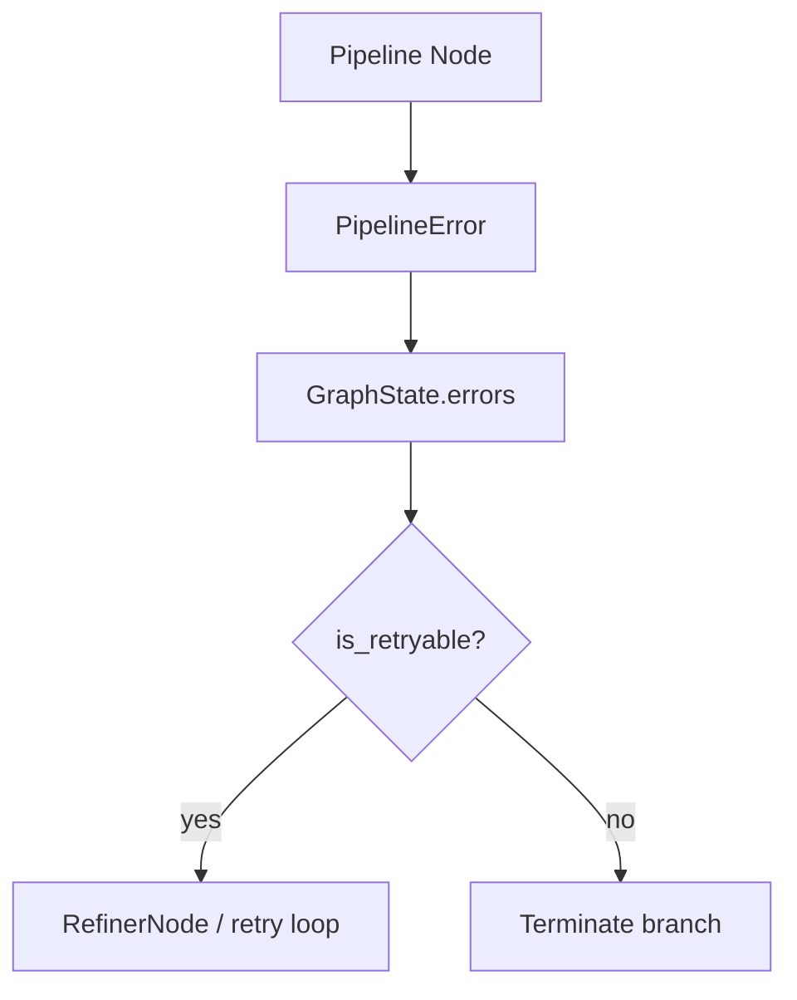

# Error Handling + Circuit Breaker

NL2SQL represents failures as structured `PipelineError` objects and propagates them through state. Retries are managed at the subgraph level, and a single circuit breaker provides fast-fail safety for vector retrieval.

One case cannot use state: LangGraph conditional-edge routers may only return routing decisions, so `route_scan_layers()` reports "no compatible subgraph found" by raising `PipelineExecutionError` (`nl2sql.common.exceptions`), an `NL2SQLError` carrying the `PipelineError` payload on `.error`. This propagates out of the router and is caught by `run_with_graph()`'s crash handler, which folds it into `GraphState.errors` as an `UNKNOWN_ERROR` `PipelineError`.

## Error contract

`PipelineError` includes:

- `node`, `message`, `severity`, `error_code`
- `is_retryable` derived from severity and error code

Common error codes include `MISSING_SQL`, `EXECUTION_FAILED`, `PIPELINE_TIMEOUT`, `SECURITY_VIOLATION`.

## Circuit breaker

`create_breaker()` configures `pybreaker.CircuitBreaker` instances with observability hooks. The system defines exactly one:

- `VECTOR_BREAKER` (`fail_max=5`, `reset_timeout=30`)

Retrieval calls in `VectorStore` are wrapped with `VECTOR_BREAKER`. It is the only breaker instance the system defines: LLM calls and SQL execution are **not** breaker-guarded, and their failures surface as `PipelineError` values in state.

## Failure flow

```mermaid
flowchart TD
    Node[Pipeline Node] --> Error[PipelineError]
    Error --> State[GraphState.errors]
    State --> Retry{is_retryable?}
    Retry -->|yes| Refine[RefinerNode / retry loop]
    Retry -->|no| Stop[Terminate branch]
```

See `../architecture/failure_recovery.md` for failure domains, retry scope, and recovery limitations.

## Cancellation and timeouts

- `run_with_graph()` enforces a global timeout (`Settings.global_timeout_sec`).
- Cancellation is honored through a per-run `nl2sql.common.cancellation.CancellationToken`, passed to the graph via `config["configurable"]["cancellation_token"]`, so cancelling one run never affects another.

## Source references

- Error contracts: `packages/nl2sql/src/nl2sql/common/errors.py`
- Circuit breaker: `packages/nl2sql/src/nl2sql/common/resilience.py`
- Retry logic: `packages/nl2sql/src/nl2sql/pipeline/subgraphs/sql_agent.py`
- Cancellation: `packages/nl2sql/src/nl2sql/common/cancellation.py`
