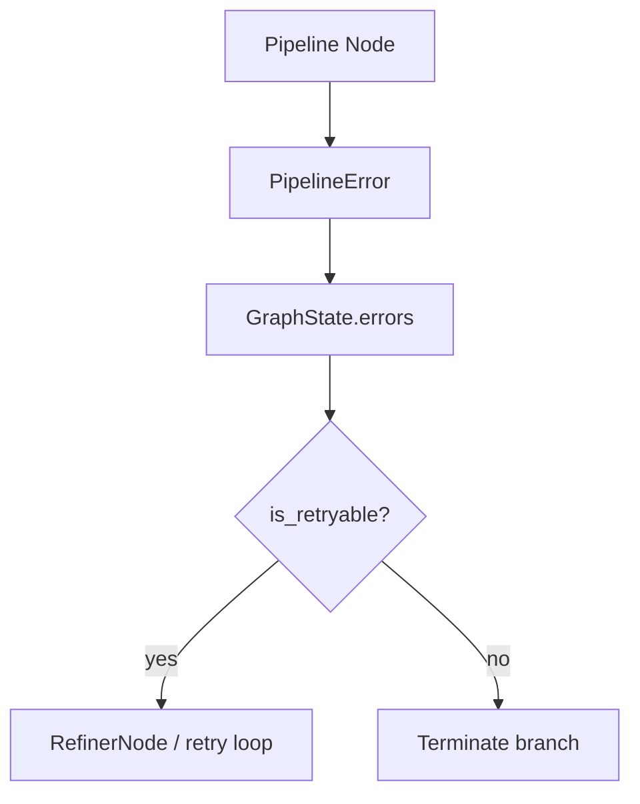

# Error Handling + Circuit Breaker

NL2SQL represents failures as structured `PipelineError` objects and propagates them through state. Retries are managed at the subgraph level, and a single circuit breaker provides fast-fail safety for vector retrieval.

One case cannot use state: LangGraph conditional-edge routers may only return routing decisions, so `route_scan_layers()` reports "no compatible subgraph found" by raising `PipelineExecutionError` (`nl2sql.common.exceptions`), an `NL2SQLError` carrying the `PipelineError` payload on `.error`. This propagates out of the router and is caught by `run_with_graph()`, which unwraps it and returns its `PipelineError` payload unchanged in `GraphState.errors` — preserving `error_code` (`INVALID_STATE`), `severity`, `node` and `is_retryable`; only unrecognised exceptions become `UNKNOWN_ERROR`.

## Error contract

`PipelineError` includes:

- `node`, `message`, `severity`, `error_code`
- `is_retryable` derived from severity and error code

Common error codes include `MISSING_SQL`, `EXECUTION_FAILED`, `PIPELINE_TIMEOUT`, `SECURITY_VIOLATION`, `QUESTION_NOT_ANSWERABLE`.

`ErrorCode` carries only codes something can produce. Eleven members that no
code path raised were removed (`MISSING_GROUP_BY`, `INVALID_ALIAS_USAGE`,
`JOIN_MISSING_ON_CLAUSE`, `INVALID_DATE_FORMAT`, `INVALID_NUMERIC_VALUE`,
`EXECUTION_ERROR`, `PERFORMANCE_WARNING`, `SERVICE_UNAVAILABLE`,
`PHYSICAL_VALIDATOR_FAILED`, `EXECUTION_TIMEOUT`, `INTENT_VIOLATION`); a code
nobody can emit is a promise to a caller the engine never keeps. `DB_EXECUTION_ERROR`
and `SAFEGUARD_VIOLATION` are kept although nothing raises them yet: each has a
caller-facing message in `SAFE_ERROR_MESSAGES`, so each is a declared refusal
path. `test_boundary_tidy_ups.py` asserts the rule.

A run that hits the global timeout returns `PIPELINE_TIMEOUT` **and** an
answer: the apology is written where the answer synthesizer writes its own, so
`QueryResult.final_answer` carries it. It used to be written to a top-level
state key that `result_from_state` never read, so every caller through the SDK
and the REST route saw `final_answer: null` with only the error code.

`QUESTION_NOT_ANSWERABLE` (severity `ERROR`) comes from the datasource resolver when its answerability check finds that no datasource the role may read can answer the question, such as "what is the weather in Paris?". The run ends before the decomposer: no decomposer, planner, refiner or synthesizer call is made, `QueryResult.status` is `error`, and the message tells the user the question can't be answered from the connected data. The check is told to answer "answerable" when unsure. See [DatasourceResolverNode](../architecture/nodes/datasource_resolver_node.md#answerability-check).

## Circuit breaker

`create_breaker()` configures `pybreaker.CircuitBreaker` instances with observability hooks. The system defines exactly one:

- `VECTOR_BREAKER` (`fail_max=5`, `reset_timeout=30`)

Retrieval calls in `VectorStore` are wrapped with `VECTOR_BREAKER`. It is the only breaker instance the system defines: LLM calls and SQL execution are **not** breaker-guarded, and their failures surface as `PipelineError` values in state.

## Failure flow

```mermaid
flowchart TD
    Node[Pipeline Node] --> Error[PipelineError]
    Error --> State[GraphState.errors]
    State --> Retry{is_retryable?}
    Retry -->|yes| Refine[RefinerNode / retry loop]
    Retry -->|no| Stop[Terminate branch]
```

See `../architecture/failure_recovery.md` for failure domains, retry scope, and recovery limitations.

## Cancellation and timeouts

- `run_with_graph()` enforces a global timeout (`Settings.global_timeout_sec`).
- Cancellation is honored through a per-run `nl2sql.common.cancellation.CancellationToken`, passed to the graph via `config["configurable"]["cancellation_token"]`, so cancelling one run never affects another.
- `run_with_graph()` never raises: cancellation, timeout, routing failures and unexpected crashes all
  come back as `PipelineError` values in state. A `PipelineExecutionError` is unwrapped so its
  original `error_code` survives; only genuinely unrecognised exceptions become `UNKNOWN_ERROR`.

## Source references

- Error contracts: `packages/nl2sql/src/nl2sql/common/errors.py`
- Circuit breaker: `packages/nl2sql/src/nl2sql/common/resilience.py`
- Retry logic: `packages/nl2sql/src/nl2sql/pipeline/subgraphs/sql_agent.py`
- Cancellation: `packages/nl2sql/src/nl2sql/common/cancellation.py`
