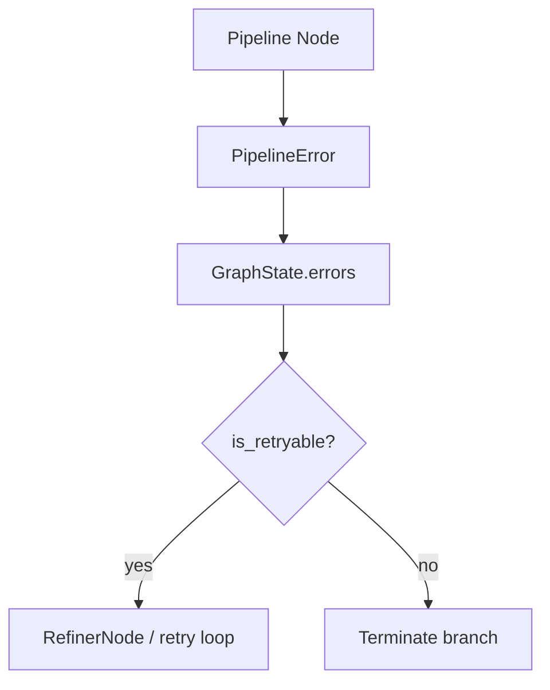

# Error Handling + Circuit Breaker

NL2SQL represents failures as structured `PipelineError` objects and propagates them through state. Retries are managed at the subgraph level, and a single circuit breaker provides fast-fail safety for vector retrieval.

One case cannot use state: LangGraph conditional-edge routers may only return routing decisions, so `route_scan_layers()` reports "no compatible subgraph found" by raising `PipelineExecutionError` (`nl2sql.common.exceptions`), an `NL2SQLError` carrying the `PipelineError` payload on `.error`. This propagates out of the router and is caught by `run_with_graph()`, which unwraps it and returns its `PipelineError` payload unchanged in `GraphState.errors` — preserving `error_code` (`INVALID_STATE`), `severity`, `node` and `is_retryable`; only unrecognised exceptions become `UNKNOWN_ERROR`.

## Error contract

`PipelineError` includes:

- `node`, `message`, `severity`, `error_code`
- `provider` and `provider_response`, set on a `PROVIDER_*` error (below), otherwise `None`
- `is_retryable` derived from severity and error code

Common error codes include `MISSING_SQL`, `EXECUTION_FAILED`, `PIPELINE_TIMEOUT`, `SECURITY_VIOLATION`, `QUESTION_NOT_ANSWERABLE`.

`ErrorCode` carries only codes something can produce. Eleven members that no
code path raised were removed (`MISSING_GROUP_BY`, `INVALID_ALIAS_USAGE`,
`JOIN_MISSING_ON_CLAUSE`, `INVALID_DATE_FORMAT`, `INVALID_NUMERIC_VALUE`,
`EXECUTION_ERROR`, `PERFORMANCE_WARNING`, `SERVICE_UNAVAILABLE`,
`PHYSICAL_VALIDATOR_FAILED`, `EXECUTION_TIMEOUT`, `INTENT_VIOLATION`); a code
nobody can emit is a promise to a caller the engine never keeps. `DB_EXECUTION_ERROR`
and `SAFEGUARD_VIOLATION` are kept although nothing raises them yet: each has a
caller-facing message in `SAFE_ERROR_MESSAGES`, so each is a declared refusal
path. `test_boundary_tidy_ups.py` asserts the rule.

A run that hits the global timeout returns `PIPELINE_TIMEOUT` **and** an
answer: the apology is written where the answer synthesizer writes its own, so
`QueryResult.final_answer` carries it. It used to be written to a top-level
state key that `result_from_state` never read, so every caller through the SDK
and the REST route saw `final_answer: null` with only the error code.

`QUESTION_NOT_ANSWERABLE` (severity `ERROR`) comes from the datasource resolver when its answerability check finds that no datasource the role may read can answer the question, such as "what is the weather in Paris?". The run ends before the decomposer: no decomposer, planner, refiner or synthesizer call is made, `QueryResult.status` is `error`, and the message tells the user the question can't be answered from the connected data. The check is told to answer "answerable" when unsure. See [DatasourceResolverNode](../architecture/nodes/datasource_resolver_node.md#answerability-check).

## Provider failures

When the model provider refuses or fails a call, the LLM node that made it
(datasource resolver, decomposer, AST planner, refiner, answer synthesizer)
reports it through `nl2sql.llm.failures.provider_error` instead of its own
failure code, so every caller (SDK, REST API, playground) gets the same entry.
`classify_provider_error` reads the OpenAI and Anthropic SDK exceptions by
shape (the anthropic SDK is an optional extra, so it is never imported), looking
through what the exception was raised from:

| `error_code` | when | `message` (for OpenAI) |
| --- | --- | --- |
| `PROVIDER_AUTH_FAILED` | HTTP 401, or 403 | "OpenAI rejected the API key." |
| `PROVIDER_RATE_LIMITED` | HTTP 429 | "OpenAI rate limited the request." |
| `PROVIDER_QUOTA_EXCEEDED` | HTTP 429 with `insufficient_quota` | "OpenAI says this API key has no quota left." |
| `PROVIDER_TIMEOUT` | the SDK's timeout, or HTTP 408 | "OpenAI did not answer in time." |
| `PROVIDER_UNAVAILABLE` | a connection error, or HTTP 5xx | "OpenAI could not be reached." / "OpenAI had a server error and could not answer." |
| `PROVIDER_MODEL_UNAVAILABLE` | HTTP 404, or `model_not_found` | "OpenAI does not offer the configured model to this API key." |

- `message` is one sentence naming the provider. It never carries the key
  (masked or not), a Python repr, or the node's own label.
- `provider` is the provider as a person names it (`PROVIDER_LABELS` in
  `llm/providers.py`): Anthropic for the Anthropic SDK, otherwise the preset
  whose endpoint the call went to. A `base_url` no preset names is
  "The model provider".
- `provider_response` is the provider's own words, such as
  `HTTP 401 (invalid_api_key): Incorrect API key provided: [redacted key]. ...`,
  for a "provider response" disclosure. `redact_keys` replaces anything
  key-like (a bearer token, an `sk-`/`pk-`/`rk-` key whole or masked, any
  unbroken run of 32 or more letters, digits, `-` or `_`) with `[redacted key]`.
  The `error` of a failed call in `usage.calls` is redacted the same way.
- Every `PROVIDER_*` code is fatal (`is_retryable` is false): a refinement
  retry would make the same call to the same provider with the same key.
- An HTTP 400 is not classified. It is a request the engine built wrongly, or
  a model refusing a parameter, and the node's own error explains it better.

`run_with_graph()`'s fallback applies the same classification, so a provider
failure that escapes its node is not `UNKNOWN_ERROR`.

## Circuit breaker

`create_breaker()` configures `pybreaker.CircuitBreaker` instances with observability hooks. The system defines exactly one:

- `VECTOR_BREAKER` (`fail_max=5`, `reset_timeout=30`)

Retrieval calls in `VectorStore` are wrapped with `VECTOR_BREAKER`. It is the only breaker instance the system defines: LLM calls and SQL execution are **not** breaker-guarded, and their failures surface as `PipelineError` values in state.

## Failure flow

```mermaid
flowchart TD
    Node[Pipeline Node] --> Error[PipelineError]
    Error --> State[GraphState.errors]
    State --> Retry{is_retryable?}
    Retry -->|yes| Refine[RefinerNode / retry loop]
    Retry -->|no| Stop[Terminate branch]
```

See `../architecture/failure_recovery.md` for failure domains, retry scope, and recovery limitations.

## Cancellation and timeouts

- `run_with_graph()` enforces a global timeout (`Settings.global_timeout_sec`).
- Cancellation is honored through a per-run `nl2sql.common.cancellation.CancellationToken`, passed to the graph via `config["configurable"]["cancellation_token"]`, so cancelling one run never affects another.
- `run_with_graph()` never raises: cancellation, timeout, routing failures and unexpected crashes all
  come back as `PipelineError` values in state. A `PipelineExecutionError` is unwrapped so its
  original `error_code` survives; only genuinely unrecognised exceptions become `UNKNOWN_ERROR`.

## Source references

- Error contracts: `packages/nl2sql/src/nl2sql/common/errors.py`
- Circuit breaker: `packages/nl2sql/src/nl2sql/common/resilience.py`
- Retry logic: `packages/nl2sql/src/nl2sql/pipeline/subgraphs/sql_agent.py`
- Cancellation: `packages/nl2sql/src/nl2sql/common/cancellation.py`
