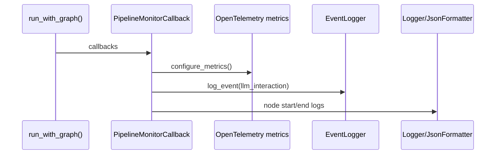

# Observability Stack

Observability is implemented via **logging**, **OpenTelemetry metrics**, and **audit events**. The pipeline emits metrics and audit logs through callback handlers while the root logger uses contextual trace and tenant metadata.

## Telemetry flow

## Metrics

`configure_metrics()` sets an OpenTelemetry meter provider and exports:

- `nl2sql.node.duration` (histogram)
- `nl2sql.token.usage` (counter)

Token and latency logs are additionally appended to `TOKEN_LOG` and `LATENCY_LOG`.

## Audit logging

`EventLogger` writes JSON events to a rotating log file defined by `Settings.audit_log_path`. Payloads are redacted for sensitive keys.

## Source references

- Metrics: `packages/core/src/nl2sql/common/metrics.py`
- Audit logging: `packages/core/src/nl2sql/common/event_logger.py`
- Pipeline callbacks: `packages/core/src/nl2sql/services/callbacks/monitor.py`
- Logging: `packages/core/src/nl2sql/common/logger.py`
