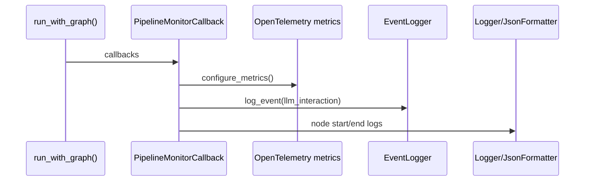

# Observability Stack

NL2SQL provides observability through **structured logging**, **OpenTelemetry metrics**, and **audit events**. The system is designed to be callback-driven, so telemetry is only emitted when callbacks are supplied to `run_with_graph()`.

## Telemetry flow

## Metrics

`configure_metrics()` installs an OpenTelemetry meter provider. Exported metrics include:

- `nl2sql.node.duration` (histogram)
- `nl2sql.token.usage` (counter)

Legacy token and latency events are recorded in `TOKEN_LOG` and `LATENCY_LOG`.

## Audit logging

`EventLogger` writes JSON events to a rotating log file configured by `Settings.audit_log_path`. Payloads are sanitized to redact sensitive keys.

## Structured logging

The core logger uses JSON formatting when OTLP is enabled and propagates trace/tenant context for correlation.

## Source references

- Metrics: `packages/core/src/nl2sql/common/metrics.py`
- Audit logging: `packages/core/src/nl2sql/common/event_logger.py`
- Pipeline callbacks: `packages/core/src/nl2sql/services/callbacks/monitor.py`
- Logging: `packages/core/src/nl2sql/common/logger.py`
