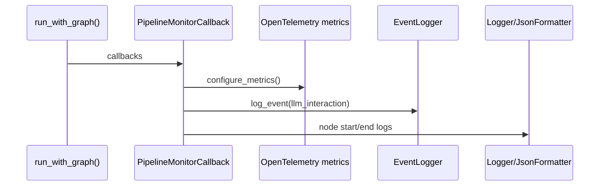

# Observability Stack

NL2SQL provides **structured logging** always, plus **OpenTelemetry metrics**
and **audit events** that are callback-driven: they are emitted only when a
caller passes `callbacks=[PipelineMonitorCallback(...)]` to `run_with_graph()`.

Read that literally, because the scope is narrow:

- **Only the CLI attaches that callback** (`cli/commands/run.py`). `QueryAPI.run_query`
  passes no callbacks, so the **Python API and the REST API emit no metrics and
  no audit events at all**. A graph-level emitter that serves every caller is
  not implemented; it is a Phase 2 item.
- **Metrics are off by default.** `OBSERVABILITY_EXPORTER` defaults to `none`,
  which installs no meter provider, so every recording is discarded. The
  supported values are `none`, `console` and `otlp`.
- **There is no tracing.** No span is ever started anywhere in the codebase, and
  there is no Jaeger exporter and no Prometheus exporter. `opentelemetry-exporter-otlp`
  is the only exporter dependency, and it is used for metrics over gRPC.
- **The audit log records exactly one event type**, `llm_interaction`, written
  from the callback's `on_llm_end`. It is not a record of queries executed,
  roles, validation decisions or row counts.

## Telemetry flow

```mermaid
sequenceDiagram
    participant Pipeline as run_with_graph()
    participant Callback as PipelineMonitorCallback
    participant Metrics as OpenTelemetry metrics
    participant Audit as EventLogger
    participant Logs as Logger/JsonFormatter

    Pipeline->>Callback: callbacks
    Callback->>Metrics: configure_metrics()
    Callback->>Audit: log_event(llm_interaction)
    Callback->>Logs: node start/end logs
```

## Metrics

`configure_metrics()` installs an OpenTelemetry meter provider. Exported metrics include:

- `nl2sql.node.duration` (histogram)
- `nl2sql.token.usage` (counter)

Legacy token and latency events are recorded in `TOKEN_LOG` and `LATENCY_LOG`.

## Audit logging

`EventLogger` writes JSON events to a rotating log file at `logs/audit_events.log`
(relative to the working directory, 10 MB × 5). Payloads are sanitized to redact
sensitive keys.

The only event written anywhere in the codebase is `llm_interaction`, from
`PipelineMonitorCallback.on_llm_end`. Its payload is the agent name, the model
name, the first 1000 characters of the model's output, and token usage. Treat
this as a debugging trace of model calls made through the CLI, not as a
compliance audit trail.

## Structured logging

Logging is configured at import time; JSON formatting is enabled when `Settings.observability_exporter == "otlp"`. Trace and tenant context helpers exist (`trace_context`, `tenant_context`), but the pipeline does not set them; callers must establish context if they want trace/tenant IDs in logs.

## Source references

- Metrics: `packages/nl2sql/src/nl2sql/common/metrics.py`
- Audit logging: `packages/nl2sql/src/nl2sql/common/event_logger.py`
- Pipeline callbacks: `packages/nl2sql/src/nl2sql/services/callbacks/monitor.py`
- Logging: `packages/nl2sql/src/nl2sql/common/logger.py`
