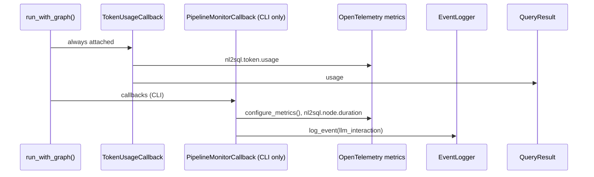

# Observability Stack

NL2SQL provides **structured logging** always, **per-question token and time
telemetry** on every run, plus **OpenTelemetry metrics** and **audit events**.

Read the scope literally, because it is narrow:

- **Every run reports its cost and timings in the result.** `run_with_graph()`
  always attaches `NodeTimingCallback` (wall-clock seconds per node, into
  `QueryResult.timings`) and `TokenUsageCallback` (LLM calls, input / cached /
  output / reasoning tokens and model seconds per node and per question, into
  `QueryResult.usage`). That covers the Python API, the REST API, the CLI and
  the demo playground. See [the query API](../api/core/query.md#usage-tokens-calls-and-model-time).
- **The token counter is recorded on every run; the node-duration histogram and
  the audit log are CLI-only.** `TokenUsageCallback` records
  `nl2sql.token.usage` for every caller. `nl2sql.node.duration` and the
  `llm_interaction` audit event come from `PipelineMonitorCallback`, which only
  `cli/commands/run.py` attaches.
- **Metrics are off by default.** `OBSERVABILITY_EXPORTER` defaults to `none`,
  which installs no meter provider, so every recording is discarded. The
  supported values are `none`, `console` and `otlp`.
- **There is no tracing.** No span is ever started anywhere in the codebase, and
  there is no Jaeger exporter and no Prometheus exporter. `opentelemetry-exporter-otlp`
  is the only exporter dependency, and it is used for metrics over gRPC.
- **The audit log records exactly one event type**, `llm_interaction`, written
  from the callback's `on_llm_end`. It is not a record of queries executed,
  roles, validation decisions or row counts.

## Telemetry flow

```mermaid
sequenceDiagram
    participant Pipeline as run_with_graph()
    participant Usage as TokenUsageCallback
    participant Callback as PipelineMonitorCallback (CLI only)
    participant Metrics as OpenTelemetry metrics
    participant Audit as EventLogger
    participant Result as QueryResult

    Pipeline->>Usage: always attached
    Usage->>Metrics: nl2sql.token.usage
    Usage->>Result: usage
    Pipeline->>Callback: callbacks (CLI)
    Callback->>Metrics: configure_metrics(), nl2sql.node.duration
    Callback->>Audit: log_event(llm_interaction)
```

## Metrics

`configure_metrics()` installs an OpenTelemetry meter provider. Exported metrics include:

- `nl2sql.node.duration` (histogram), attributes `node` and `datasource_id`. CLI only.
- `nl2sql.token.usage` (counter), attributes `node`, `model`, `datasource_id`
  and `type`: one point per LLM call for each of `input`, `cached_input`,
  `cache_write_input`, `output`, `reasoning` and `total`. Every run.
- `nl2sql.plan_cache.lookups` (counter), attributes `result` (`hit` or `miss`)
  and `datasource_id`: one point per plan cache lookup by the AST planner.
  Every run with `PLAN_CACHE_ENABLED` on. The per-question view is
  `QueryResult.usage.plan_cache_hits` and `sub_queries[].plan_source`; see
  [Determinism → The plan cache](../architecture/determinism.md#the-plan-cache-determinism-from-the-architecture).

`configure_metrics()` is called by `PipelineMonitorCallback`, so outside the CLI
no meter provider is installed unless the embedding application installs one;
the counter is then recorded against OpenTelemetry's no-op provider and
discarded. Per-node latency events are also appended to the in-process
`LATENCY_LOG` list. Token usage is no longer kept in a process-wide list
(`TOKEN_LOG` was removed); read it from `QueryResult.usage`.

## Audit logging

`EventLogger` writes JSON events to a rotating log file at `logs/audit_events.log`
(relative to the working directory, 10 MB × 5). Payloads are sanitized to redact
sensitive keys.

The only event written anywhere in the codebase is `llm_interaction`, from
`PipelineMonitorCallback.on_llm_end`. Its payload is the agent name, the model
name, the first 1000 characters of the model's output, and token usage (the
same normalised counts as `QueryResult.usage`). Treat
this as a debugging trace of model calls made through the CLI, not as a
compliance audit trail.

## Structured logging

Logging is configured at import time; JSON formatting is enabled when `Settings.observability_exporter == "otlp"`. Trace and tenant context helpers exist (`trace_context`, `tenant_context`), but the pipeline does not set them; callers must establish context if they want trace/tenant IDs in logs.

## Source references

- Metrics: `packages/nl2sql/src/nl2sql/common/metrics.py`
- Audit logging: `packages/nl2sql/src/nl2sql/common/event_logger.py`
- Pipeline callbacks: `packages/nl2sql/src/nl2sql/services/callbacks/monitor.py`
- Token usage: `packages/nl2sql/src/nl2sql/services/callbacks/token_handler.py`
- Logging: `packages/nl2sql/src/nl2sql/common/logger.py`
