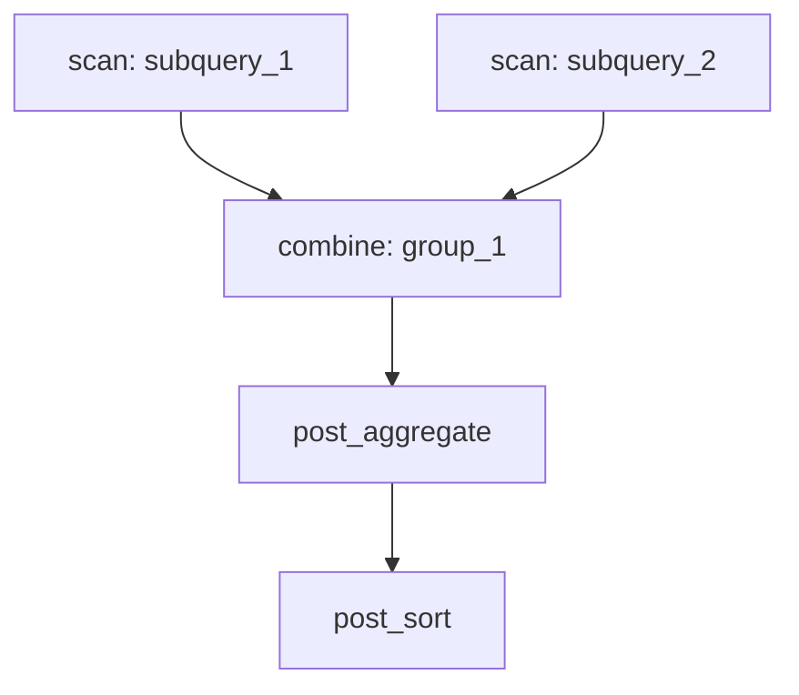
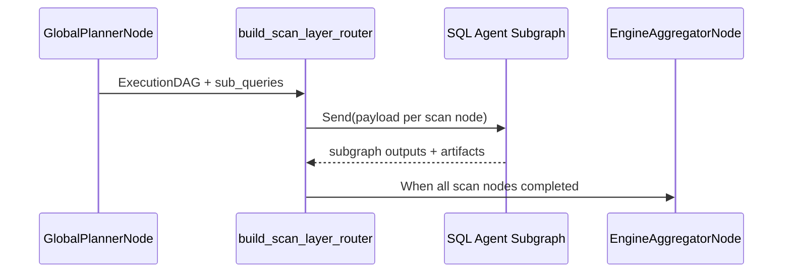

# DAG / Graph Orchestration Architecture

Orchestration is expressed as a LangGraph `StateGraph` built by `build_graph()` and a logical `ExecutionDAG` built by `GlobalPlannerNode`. Routing across subgraphs is handled by `build_scan_layer_router()`.

## Orchestration layers

- **Control graph**: the LangGraph pipeline in `nl2sql.pipeline.graph`.
- **Logical DAG**: a deterministic `ExecutionDAG` representing scans, combines, and post-combine operations.

## ExecutionDAG structure

`ExecutionDAG` consists of `LogicalNode` and `LogicalEdge` instances. `ExecutionDAG._layered_toposort()` computes `layers` for deterministic scheduling.

## Routing logic

`build_scan_layer_router()` selects the next scan layer, resolves the compatible subgraph based on datasource capabilities, and dispatches parallel subgraph executions via LangGraph `Send` objects.

## Source references

- Graph builder: `packages/core/src/nl2sql/pipeline/graph.py`
- Routing logic: `packages/core/src/nl2sql/pipeline/routes.py`
- Execution DAG models: `packages/core/src/nl2sql/pipeline/nodes/global_planner/schemas.py`
- Global planner: `packages/core/src/nl2sql/pipeline/nodes/global_planner/node.py`
