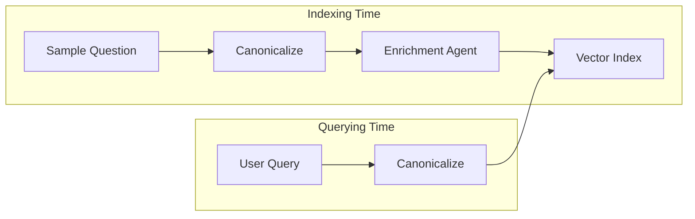

# Intelligent Query Routing & Decomposition Strategy

> **Core Philosophy**: "Align the vector space of the user's query with the vector space of the system's knowledge *before* they meet."

This document details the architecture used to direct natural language queries to the correct database. It relies on a "mirror" strategy where both the **stored data** (at index time) and the **incoming query** (at run time) are processed to maximize semantic overlap.

---

## 1. Semantic-Driven Architecture

The pipeline now employs a dedicated **Semantic Analysis Node** at the entrance.

1. **Refinement**:
    * **Canonicalization**: Rewrites the query to be explicit and entity-centric.
    * **Enrichment**: Extracts keywords and generates synonyms for improved retrieval.

2. **Context Retrieval (Routing)**:
    * The `DecomposerNode` utilizes the **Expanded Query** (Canonical + Synonyms) from the Semantic Node.
    * It queries the `OrchestratorVectorStore` to identify relevant tables across datasources.

---

## 2. Vector Search Layers (The "Efficiency Funnel")

Within the `DecomposerNode`, we employ a layered approach to context retrieval:

### Layer 1: Augmented Vector Search

* **Mechanism**: Canonicalized Query + Enriched Terms vs. Enriched Index.
* **Trigger**: Always runs first.
* **Why**: By "fixing" the query (Canonicalization) and "expanding" the index (Enrichment), we force most queries to hit this layer accurately.

### Layer 2: LLM Reasoning (Decomposition)

* **Mechanism**: Full LLM call analyzing available datasources + Layer 1 Context.
* **Why**: If vector search finds candidates, the LLM uses that context to formulate precise sub-queries. If vector search is ambiguous, the LLM uses general datasource descriptions.

---

## 2. Workflows: The "Semantic Mirror"

To make Layer 1 effective, we manipulate both sides of the equation.

### A. Indexing Workflow (Offline)

We don't just index raw questions. We expand them to cover the "semantic neighborhood".

### A. Indexing Workflow (Offline)

1. **Input**: *"List all machines"* (from `sample_questions.yaml`).
2. **Semantic Analysis**: The Node canonicalizes the query and generates 5 domain variations (keywords/synonyms).
    * *"Show all equipment"*
    * *"List active machinery"*
3. **Store**: We embed ALL of these variants to maximize retrieval coverage.

### B. Querying Workflow (Online)

1. **Input**: *"How many guys are working on the floor?"* (Slang/Noise).
2. **Semantic Analysis**: The Node rewrites it to:
    * *"Count operators on active shift"* (Canonical).
3. **Search**: This clean query + generated synonyms matches the index efficiently.

---

## 3. Metrics & Performance Impact

The "Canonicalization + Enrichment" strategy has fundamentally shifted our performance profile.

### The "Before" State (Raw Search)

* **Setup**: Raw User Query <-> Raw Sample Questions.
* **Result**:
  * Direct matches (e.g., "List machines") worked.
  * Slang/Typos (e.g., "Show me the bots") failed L1 (> 0.4 distance).
* **Metric**: Only **~3 out of 20** golden set queries hit Layer 1. Most fell through to L2 or L3 (slow).

### The "After" State (Current Architecture)

* **Setup**: Canonical Query <-> Enriched Index.
* **Result**:
  * "Show me the bots" -> Canonicalizes to "List machines" -> Matches "List active machinery" (Enriched).
  * Distance is optimized to be extremely low (< 0.2).
* **Metric**: **Nearly 100% (20/20)** of the golden set now hits **Layer 1**.
* **Impact**:
  * **Latency**: Reduced by ~90% (skipping L2/L3).
  * **Cost**: Reduced by ~90% (fewer LLM calls).
  * **Accuracy**: Maintained or improved due to cleaner signal.

---

## Configuration

* **`ROUTER_L1_THRESHOLD`** (`0.4`): strict.
* **`ROUTER_L2_THRESHOLD`** (`0.6`): relaxed for voting.

---

## 4. Technical Details

### Semantic Similarity Implementation

The system relies on **Semantic Similarity** via vector embeddings as the primary mechanism for Layer 1 and Layer 2.

* **Technology**: We use `ChromaDB` as the vector store.
* **Embeddings**: Queries and descriptions are converted into dense vectors (using models like OpenAI `text-embedding-3-small` or `huggingface/all-MiniLM-L6-v2`).
* **Measurement**: Similarity is measured using **Cosine Similarity** or **Euclidean Distance** in the embedding space.
  * **Low Distance (< 0.4)** implies high semantic similarity (direct match).
  * **High Distance (> 0.6)** implies weak semantic similarity (ambiguity).

### Voting Logic (Why k=1?)

In **Layer 2 (Multi-Query Retrieval)**, we use a specific voting strategy:

1. **Variations**: We use the original query + 3 LLM-generated variations (4 total "voters").
2. **Strict Voting (`k=1`)**: For *each* variation, we retrieve only the **single best match** (`k=1`).
3. **Rationale**: We treat each variation as an independent "voter". We want to know its absolute best guess, not its 2nd or 3rd vague guess. If we allowed `k=5` for each variation, the "long tail" of weak matches from 5 variations would dilute the signal.
4. **Consensus**: The datasource that receives the most "first place" votes wins. This ensures that the chosen datasource is the consistently top-ranked choice across multiple phrasings of the intent.
