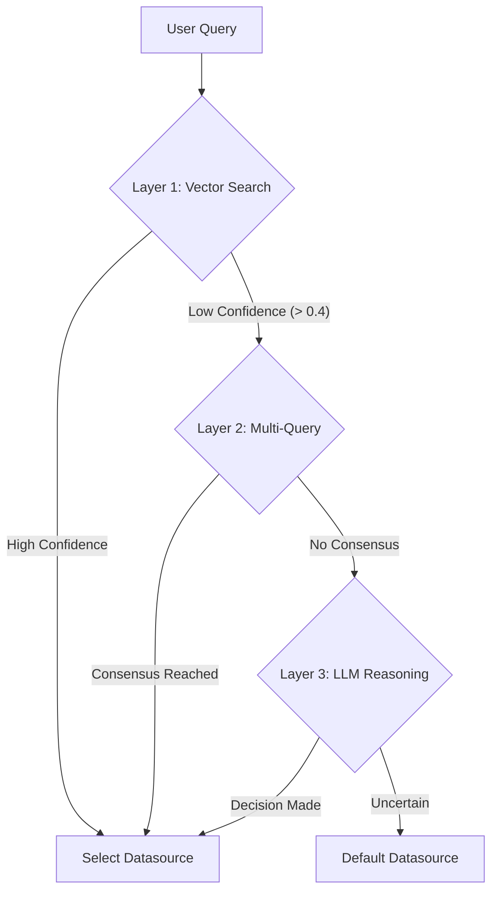

# Intelligent Query Routing Strategy

This document details the multi-layered routing architecture used to direct natural language queries to the correct database in a multi-database environment.

## Overview

The system employs a "Waterfall" approach to routing, prioritizing speed and cost-efficiency (Layer 1) while falling back to more robust, computationally expensive methods (Layer 2 & 3) only when necessary.



---

## Layer 1: Augmented Vector Routing (Fast)

**Goal**: Instant retrieval for clear, unambiguous queries.

### Mechanism

This layer uses semantic vector search (embeddings) to match the user's query against:

1. **Datasource Descriptions**: High-level summaries of what each database contains (e.g., "Manufacturing operations, machines, and maintenance logs").
2. **Sample Questions**: A curated list of 50+ representative questions for each datasource (e.g., "List all offline machines").

### Configuration

- **File**: `configs/sample_questions.yaml`
- **Method**: `DatasourceRouterStore.retrieve_with_score(query)`
- **Metric**: Cosine distance (lower is better).

### When it works

- Exact or near-exact matches to known patterns.
- Distinct domain vocabulary (e.g., "payroll" vs. "sensor readings").

---

## Layer 2: Multi-Query Retrieval (Robust)

**Goal**: Handle ambiguity and vocabulary mismatch.

### Trigger

Activated when Layer 1 confidence is low (Distance > **0.4**).

### Mechanism

1. **Generation**: An LLM (Planner Agent) generates 3 distinct variations of the user's query to capture different perspectives.
    - *Original*: "How many bots are broken?"
    - *Var 1*: "Count of robots with status 'maintenance'."
    - *Var 2*: "List malfunctioning automated units."
    - *Var 3*: "Show machine downtime statistics."
2. **Retrieval**: Each variation is routed individually using Layer 1.
3. **Voting**: The system aggregates the results. The datasource with the most "votes" wins.
    - *Note*: Votes are only counted if the variation's own confidence score is reasonable (< 0.5).

### Why it helps

It bridges the gap between user slang ("broken bots") and system terminology ("maintenance status").

---

## Layer 3: LLM Reasoning (Fallback)

**Goal**: Solve complex routing logic that requires reasoning, not just similarity.

### Trigger

Activated when Layer 2 fails to find a winner (e.g., split vote or all variations have low confidence).

### Mechanism

The system constructs a prompt containing:

- The user's original query.
- The full descriptions of all available datasources.

A dedicated **Routing Agent** (LLM) is asked to analyze the query and explicitly select the best database ID, or return "None" if uncertain.

### Example
>
> **Query**: "Compare the cost of raw materials vs. final product sales."
> **Reasoning**: "Raw materials are in `manufacturing_supply`, but sales are in `manufacturing_history`. This is a cross-database query, but the primary entity 'sales' suggests starting with History."

---

## Configuration Guide

### 1. Define Datasources

In `configs/datasources.yaml`, ensure every datasource has a clear, distinct `description`.

```yaml
manufacturing_ops:
  engine: postgres
  description: "Real-time operational data: machines, maintenance logs, and employee shifts."
```

### 2. Add Sample Questions

In `configs/sample_questions.yaml`, add at least 10-20 diverse examples per datasource.

```yaml
manufacturing_ops:
  - "Which machines are currently offline?"
  - "List all maintenance tickets for last week."
```

### 3. Tuning Thresholds

The confidence threshold is defined in `src/nl2sql/cli.py`.

- **Current Default**: `0.4` (Distance).
- **Tuning**:
  - Decrease (e.g., 0.3) to trigger Layer 2 *more* often (safer, slower).
  - Increase (e.g., 0.5) to trust Layer 1 *more* often (faster, riskier).
