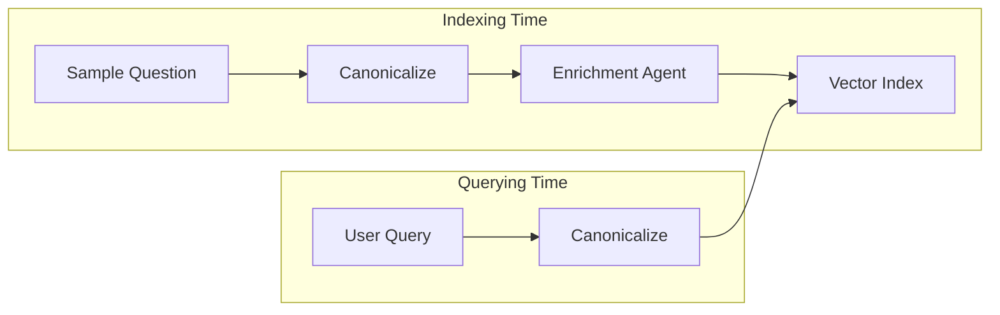

# Intelligent Query Routing Strategy

> **Core Philosophy**: "Align the vector space of the user's query with the vector space of the system's knowledge *before* they meet."

This document details the multi-layered routing architecture used to direct natural language queries to the correct database. It relies on a "mirror" strategy where both the **stored data** (at index time) and the **incoming query** (at run time) are processed to maximize semantic overlap.

---

## 1. The 3-Layer Setup (The "Efficiency Funnel")

We employ a "Waterfall" approach. We want to solve 90% of queries with the fastest, cheapest method (Layer 1), reserved strictly for when clarity is high. We fallback to more expensive methods only when ambiguity rises.

### Layer 1: Augmented Vector Search (The "Fast Path")

* **Mechanism**: Canonicalized Query vs. Enriched Index.
* **Cost**: Low (Simple Embedding).
* **Latency**: < 100ms.
* **Trigger**: Always runs first.
* **Success Condition**: Top match distance < `ROUTER_L1_THRESHOLD` (0.4).
* **Why**: Vector search is incredibly fast. By "fixing" the query (Canonicalization) and "expanding" the index (Enrichment), we force most queries to hit this layer.

### Layer 2: Multi-Query Retrieval (The "Ambiguity Solver")

* **Mechanism**: LLM generates 3 variations + Original Query (Total 4) -> Retrieval -> Voting.
* **Cost**: Medium (1 LLM Call + 3 Embeddings).
* **Latency**: ~1-2s.
* **Trigger**: When L1 confidence is low.
* **Success Condition**: Consensus (majority vote) from variations with distance < `ROUTER_L2_THRESHOLD` (0.6).
* **Why**: Users often use slang or vague terms. Generating variations "triangulates" the true intent.

> **Technical Note on Thresholds**: The **L2 threshold (0.6)** is deliberately set higher (more relaxed) than **L1 (0.4)**. This is because generated variations (e.g., hypothetical questions) may drift slightly in vector space compared to precise canonical examples. Relaxing the threshold ensures these valid semantic signals are counted in the voting process rather than being filtered out purely for distance reasons. The "consensus" mechanism (voting) acts as the filter for noise.

### Layer 3: LLM Reasoning (The "Smart Fallback")

* **Mechanism**: Full "Reasoning Agent" analyzing descriptions + query.
* **Cost**: High (Full Context LLM Call).
* **Latency**: ~3-5s.
* **Trigger**: When L2 fails to reach consensus.
* **Why**: Some queries require logical deduction (e.g., "Compare X and Y"), which vector search cannot handle.
* **Optimization (Candidate Filtering)**:
  * Instead of scanning the entire registry (which could be 100+ datasources), L3 **only** considers the top candidates returned by L1 (typically the top 5).
  * **Rationale**: L1 is excellent at finding the "right neighborhood" (High Recall) even if it misses the exact winner (Precision). By restricting L3 to L1's top findings, we get the reasoning power of an LLM without the latency/cost of scanning the full database list.

---

## 2. Workflows: The "Semantic Mirror"

To make Layer 1 effective, we manipulate both sides of the equation.

### A. Indexing Workflow (Offline)

We don't just index raw questions. We expand them to cover the "semantic neighborhood".

1. **Input**: *"List all machines"* (from `sample_questions.yaml`).
2. **Canonicalize**: *"List all machines"* (Standardize).
3. **Enrich (The Magic)**: The Enricher Agent generates 5 variations using **domain knowledge**:
    * *"Show all equipment"*
    * *"List active machinery"*
    * *"Enumerate manufacturing assets"*
    * *"View production units - CNC"*
4. **Store**: We embed ALL of these.

### B. Querying Workflow (Online)

We don't trust the raw user query. We clean it up.

1. **Input**: *"How many guys are working on the floor?"* (Slang/Noise).
2. **Canonicalize**: The Canonicalizer Agent rewrites it:
    * *"Count operators on active shift"* (Standardized Entities).
3. **Search**: This clean query now easily matches the "operators/shifts" vectors we created during enrichment.

---

## 3. Metrics & Performance Impact

The "Canonicalization + Enrichment" strategy has fundamentally shifted our performance profile.

### The "Before" State (Raw Search)

* **Setup**: Raw User Query <-> Raw Sample Questions.
* **Result**:
  * Direct matches (e.g., "List machines") worked.
  * Slang/Typos (e.g., "Show me the bots") failed L1 (> 0.4 distance).
* **Metric**: Only **~3 out of 20** golden set queries hit Layer 1. Most fell through to L2 or L3 (slow).

### The "After" State (Current Architecture)

* **Setup**: Canonical Query <-> Enriched Index.
* **Result**:
  * "Show me the bots" -> Canonicalizes to "List machines" -> Matches "List active machinery" (Enriched).
  * Distance is optimized to be extremely low (< 0.2).
* **Metric**: **Nearly 100% (20/20)** of the golden set now hits **Layer 1**.
* **Impact**:
  * **Latency**: Reduced by ~90% (skipping L2/L3).
  * **Cost**: Reduced by ~90% (fewer LLM calls).
  * **Accuracy**: Maintained or improved due to cleaner signal.

---

## Configuration

* **`ROUTER_L1_THRESHOLD`** (`0.4`): strict.
* **`ROUTER_L2_THRESHOLD`** (`0.6`): relaxed for voting.

---

## 4. Technical Details

### Semantic Similarity Implementation

The system relies on **Semantic Similarity** via vector embeddings as the primary mechanism for Layer 1 and Layer 2.

* **Technology**: We use `ChromaDB` as the vector store.
* **Embeddings**: Queries and descriptions are converted into dense vectors (using models like OpenAI `text-embedding-3-small` or `huggingface/all-MiniLM-L6-v2`).
* **Measurement**: Similarity is measured using **Cosine Similarity** or **Euclidean Distance** in the embedding space.
  * **Low Distance (< 0.4)** implies high semantic similarity (direct match).
  * **High Distance (> 0.6)** implies weak semantic similarity (ambiguity).

### Voting Logic (Why k=1?)

In **Layer 2 (Multi-Query Retrieval)**, we use a specific voting strategy:

1. **Variations**: We use the original query + 3 LLM-generated variations (4 total "voters").
2. **Strict Voting (`k=1`)**: For *each* variation, we retrieve only the **single best match** (`k=1`).
3. **Rationale**: We treat each variation as an independent "voter". We want to know its absolute best guess, not its 2nd or 3rd vague guess. If we allowed `k=5` for each variation, the "long tail" of weak matches from 5 variations would dilute the signal.
4. **Consensus**: The datasource that receives the most "first place" votes wins. This ensures that the chosen datasource is the consistently top-ranked choice across multiple phrasings of the intent.
