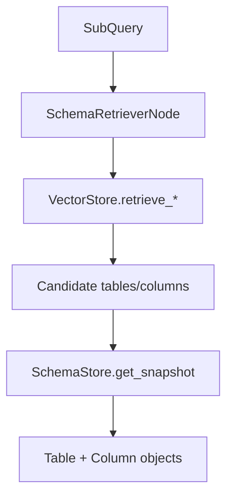

# Schema Store + Retrieval Architecture

Schema management combines **persistent snapshots** (`SchemaStore`) and **retrieval indexing** (`VectorStore`). The SQL agent subgraph uses `SchemaRetrieverNode` to retrieve relevant tables and columns for a sub-query.

## Storage backends

`build_schema_store()` constructs one of:

- `InMemorySchemaStore` (memory-only, versioned)
- `SqliteSchemaStore` (persistent SQLite store)

## Retrieval flow

## Vector indexing

`VectorStore` persists schema chunks in Chroma and supports staged retrieval:

- `retrieve_datasource_candidates()`
- `retrieve_schema_context()`
- `retrieve_column_candidates()`
- `retrieve_planning_context()`

These methods are wrapped with `VECTOR_BREAKER` for resilience.

## Source references

- Schema store protocol: `packages/core/src/nl2sql/schema/protocol.py`
- Schema store factory: `packages/core/src/nl2sql/schema/store.py`
- In-memory store: `packages/core/src/nl2sql/schema/in_memory_store.py`
- Schema retriever: `packages/core/src/nl2sql/pipeline/nodes/schema_retriever/node.py`
- Vector store: `packages/core/src/nl2sql/indexing/vector_store.py`
