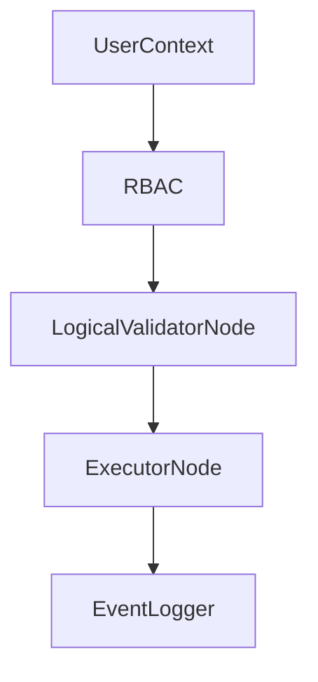

# Security Model

Security is enforced at **planning time** and **execution time** through RBAC, schema validation, and audit logging. The system is designed to fail closed when authorization cannot be verified.

## Security controls

- **RBAC policies** loaded from `configs/policies.json` and evaluated by `RBAC`.
- **Logical validation** enforces schema constraints and policy-based table access.
- **Audit logging** records LLM interactions and security-relevant events.
- **Execution isolation** can be provided via sandboxed process pools (available, not required by default).

## RBAC enforcement details

`LogicalValidatorNode` enforces **strict namespacing**:

- Allowed tables must match `datasource.table` or `datasource.*`.
- If no datasource ID is present, validation fails closed.
- Wildcard access is supported via `*` in policy lists.

## Validation gates

Validation rules are enforced by `LogicalValidatorNode` and documented in `../architecture/invariants.md` and `../architecture/nodes/logical_validator_node.md`.

## Source references

- RBAC: `packages/core/src/nl2sql/auth/rbac.py`
- Validator node: `packages/core/src/nl2sql/pipeline/nodes/validator/node.py`
- Audit logger: `packages/core/src/nl2sql/common/event_logger.py`
