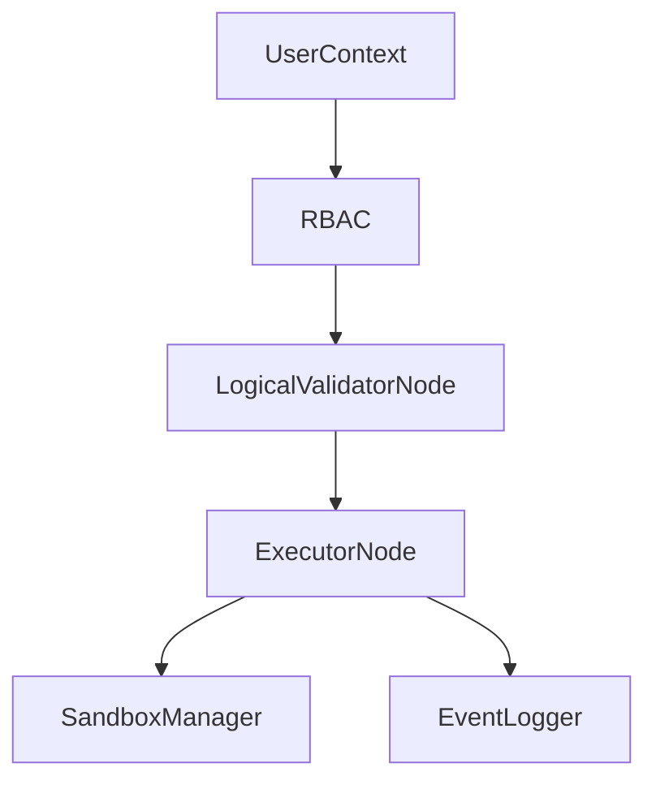

# Security Model

NL2SQL enforces security through **policy-driven authorization**, **schema-aware validation**, and **sandboxed execution**.

## Security controls

- **RBAC policies** are loaded from `configs/policies.json` and evaluated via `RBAC`.
- **Logical validation** enforces plan correctness before execution.
- **Execution isolation** is provided by `SandboxManager` process pools.
- **Audit logging** records LLM interactions and high-value events.

## Source references

- RBAC: `packages/core/src/nl2sql/auth/rbac.py`
- User context: `packages/core/src/nl2sql/auth/models.py`
- Validator node: `packages/core/src/nl2sql/pipeline/nodes/validator/node.py`
- Sandbox: `packages/core/src/nl2sql/common/sandbox.py`
- Audit logger: `packages/core/src/nl2sql/common/event_logger.py`
