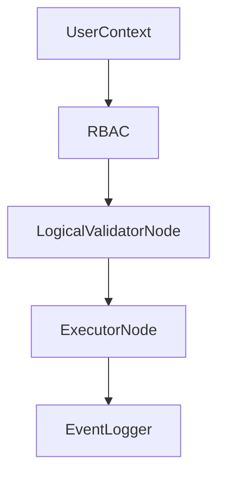

# Security Model

Authorization is enforced at **planning time**, by the logical validator, before
any SQL exists. That is the one security property this engine provides. It is
not authentication, it is not containment, and it is not row- or column-level
security.

## The role is supplied by the caller

There is **no authentication anywhere in this project**. The role is whatever
the caller says it is:

- CLI: `nl2sql run --role <id>`, defaulting to `admin`.
- Python API and REST API: `UserContext(roles=[...])`. The REST layer reads it
  straight out of the request body (`packages/api/src/nl2sql_api/services/query.py`)
  and no route declares an auth dependency.

So any client that can reach the REST API can assert `{"roles": ["admin"]}`.
**If you expose this service, you must put your own authentication in front of
it and derive the role from that**, never from user input. An empty `roles` list
denies everything, which is the correct default for an unauthenticated caller.

A role name that is not present in the policy file is a misconfiguration and is
**not** handled gracefully today: `RBAC.get_allowed_tables` raises, the
validator turns that into a `VALIDATOR_CRASH` error, and the run stops. It stops
rather than leaking, but it stops with a crash rather than a denial, and one
unknown name in a list alongside a known one fails the same way.

## Security controls

- **RBAC policies** loaded from `configs/policies.json` and evaluated by `RBAC`.
  A policy is a per-role allowlist of datasources and of `datasource.table`
  strings — nothing finer. There is no column masking and no row-level security.
- **Logical validation** enforces schema constraints and policy-based table access.
- **Audit logging** records `llm_interaction` events only, and only when the CLI
  attaches its monitor callback. The Python and REST APIs emit none. See
  `../observability/stack.md`.
- **Bounded execution**: a global timeout and a per-run cancellation token cap each run. There is **no process sandbox** — the engine runs in-process (see `../execution/isolation.md`).

## What keeps the SQL read-only

The model never writes SQL. It emits a typed plan whose `query_type` is
`Literal["READ"]`, and the generator renders that plan with `sqlglot` starting
from `exp.select()`. A statement that is not a SELECT therefore cannot be
produced, and free text from the model is never executed.

What is **not** in place: database connections are **not** opened read-only on
any dialect, and the executor has no statement-kind or statement-count gate of
its own. The read-only property is structural, not defended in depth. **Grant
the engine a read-only database user.**

```mermaid
flowchart TD
    User[UserContext] --> RBAC[RBAC]
    RBAC --> Validator[LogicalValidatorNode]
    Validator --> Executor[ExecutorNode]
    Executor --> Audit[EventLogger]
```

## RBAC enforcement details

`LogicalValidatorNode` enforces **strict namespacing**:

- Allowed tables must match `datasource.table` or `datasource.*`.
- If no datasource ID is present, validation fails closed.
- Wildcard access is supported via `*` in policy lists.

## Validation gates

Validation rules are enforced by `LogicalValidatorNode` and documented in `../architecture/invariants.md` and `../architecture/nodes/logical_validator_node.md`.

## Source references

- RBAC: `packages/nl2sql/src/nl2sql/auth/rbac.py`
- Validator node: `packages/nl2sql/src/nl2sql/pipeline/nodes/validator/node.py`
- Audit logger: `packages/nl2sql/src/nl2sql/common/event_logger.py`
