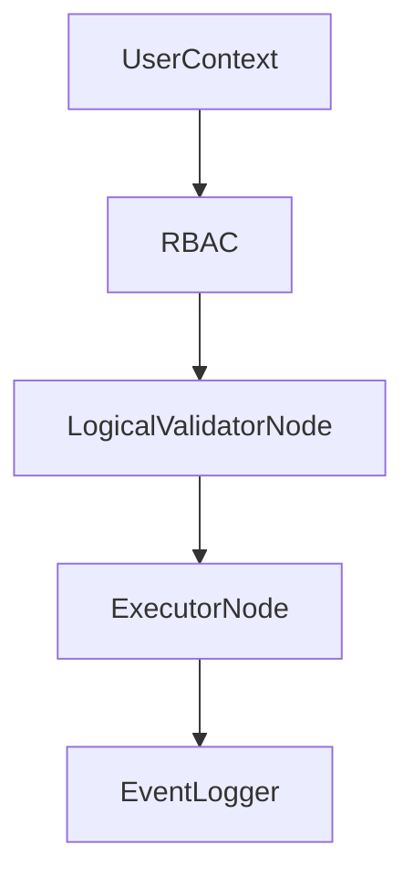

# Security Model

Authorization is enforced at **planning time**, by the logical validator, before
any SQL exists. That is the one security property this engine provides. It is
not authentication, it is not containment, and it is not row- or column-level
security.

## The role is supplied by the caller

There is **no authentication anywhere in this project**. Where the role comes
from depends on the client:

- CLI: `nl2sql run --role <id>`, defaulting to `admin`.
- Python API: `UserContext(roles=[...])`, whatever the calling code passes.
- REST API: the `get_user_context` dependency
  (`packages/api/src/nl2sql_api/auth.py`). It reads a header set by a trusted
  proxy (`NL2SQL_API_ROLE_HEADER`) or a static role (`NL2SQL_API_ROLE`), and
  answers `HTTP 401` when neither gives one. The body's `user_context` counts
  only with the dev flag `NL2SQL_API_TRUST_BODY_ROLE=true`, which logs a
  warning at startup. See [Caller role](../api/rest/index.md#caller-role).

The REST API still does not verify who the caller is. **If you expose this
service, put your own authentication in a proxy in front of it, derive the role
from that, and have the proxy overwrite the role header on every request**;
otherwise any client can send the header itself. An empty `roles` list
denies everything, which is the correct default for an unauthenticated caller.

A role name that is not present in the policy file grants nothing, exactly like
an empty `roles` list. `RBAC` skips it, so the caller is refused with a normal
`SECURITY_VIOLATION`, not a crash: through the pipeline the datasource resolver
refuses first (no datasource is allowed), and the validator on its own refuses
every table with its `policy` check failed. An unknown name listed beside a
known one is ignored, and the known role's permissions still apply.

## Strict refusal

If a question needs a table the caller's role cannot read, the run is
**refused**. Tables are never hidden from the planner, because a planner that
cannot see a table quietly answers a *different* question from the tables it
can see, and a confident wrong answer is worse than a refusal. The validator
refuses the plan before any SQL exists, and the run ends there.

- **Structure yes, data no.** The planner and the refiner still see every
  table's name, columns, types, primary key and relationships, so a plan can
  name the forbidden table and be refused. For a table the role cannot read,
  the **column statistics are stripped**: `sample_values`, `min_value`,
  `max_value`, `distinct_count` and `null_percentage` never reach the prompt,
  the LLM provider or the run trace. The schema retriever decides this with the
  same rule the validator enforces (`table_allowed` in `auth/rbac.py`), on both
  the full-snapshot path and the vector-retrieval path. Column and table
  descriptions are kept: they are structure. (For tables the role can read,
  the prompt carries only `sample_values`; the other statistics stay in the
  snapshot.) If you let an enrichment step
  write descriptions from real values, those descriptions are not stripped.
- **A generic message for the user.** The refusal the caller sees is
  "You do not have permission to see the data this question requires." It names
  no table, because naming one tells an unauthorised user that it exists. The
  table and the role are logged as a warning and recorded in the error's
  `details` (`datasource_id`, `table`, `roles`), which the run trace keeps and
  the `QueryResult` error summary does not carry. The validator's `policy` check
  is still present with `passed: false`, so a UI can show the gate firing.
- **Naming tables is an opt-in.** Set `RBAC_REFUSAL_NAMES_TABLES=true` to put
  the role and table in the user-facing message ("Role 'viewer' denied access
  to 'chinook.Customer'. ..."). The generated demo's `.env.demo` sets it,
  because showing the refusal is the demo's point.
- **The decision is deterministic code.** Only the validator decides, from the
  policy and the plan's table list. Nothing the model writes (its reasoning, a
  claim that the role is allowed) is read by the policy check, so a crafted
  prompt cannot turn a refusal into an allow.

This is a **table-level allowlist with data stripping**. It is not column
masking and not row-level security: a role that may read a table reads every
column and every row of it. A downloaded trace of a *permitted* run holds real
rows, and the playground serves any trace by id with no login, so restricting a
trace to the user who produced it is left to a multi-user deployment.

## Security controls

- **RBAC policies** loaded from `configs/policies.json` and evaluated by `RBAC`.
  A policy is a per-role allowlist of datasources and of `datasource.table`
  strings — nothing finer. There is no column masking and no row-level security.
- **Logical validation** enforces schema constraints and policy-based table access.
- **Audit logging** records `llm_interaction` events only, and only when the CLI
  attaches its monitor callback. The Python and REST APIs emit none. See
  `../observability/stack.md`.
- **Bounded execution**: a global timeout and a per-run cancellation token cap each run. There is **no process sandbox** — the engine runs in-process (see `../execution/isolation.md`).

## What keeps the SQL read-only

The model never writes SQL. It emits a typed plan whose `query_type` is
`Literal["READ"]` — pydantic rejects anything else before a node sees the plan,
which is the whole enforcement — and the generator renders that plan with
`sqlglot` starting from `exp.select()`. A statement that is not a SELECT therefore cannot be
produced, and free text from the model is never executed.

What is **not** in place: database connections are **not** opened read-only on
any dialect, and the executor has no statement-kind or statement-count gate of
its own. The read-only property is structural, not defended in depth. **Grant
the engine a read-only database user.**

```mermaid
flowchart TD
    User[UserContext] --> RBAC[RBAC]
    RBAC --> Validator[LogicalValidatorNode]
    Validator --> Executor[ExecutorNode]
    Executor --> Audit[EventLogger]
```

## RBAC enforcement details

`LogicalValidatorNode` enforces **strict namespacing**:

- Allowed tables must match `datasource.table` or `datasource.*`.
- If no datasource ID is present, validation fails closed.
- Wildcard access is supported via `*` in policy lists.
- An unknown role, or no role, allows nothing and is refused like any denial.
- One `SECURITY_VIOLATION` per forbidden table, with the generic message unless
  `RBAC_REFUSAL_NAMES_TABLES` is set, and `details` naming the table and roles.

## Validation gates

Validation rules are enforced by `LogicalValidatorNode` and documented in `../architecture/invariants.md` and `../architecture/nodes/logical_validator_node.md`.

## Source references

- RBAC: `packages/nl2sql/src/nl2sql/auth/rbac.py`
- Validator node: `packages/nl2sql/src/nl2sql/pipeline/nodes/validator/node.py`
- Statistics stripping: `packages/nl2sql/src/nl2sql/pipeline/nodes/schema_retriever/node.py`
- Audit logger: `packages/nl2sql/src/nl2sql/common/event_logger.py`
