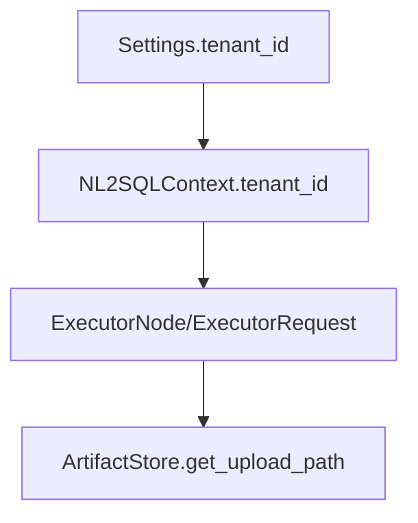

# Multi-Tenant Isolation Model

Multi-tenancy is enforced through **context propagation**, **artifact partitioning**, and **policy filtering**. Tenant identity originates from `Settings.tenant_id` and is passed through execution requests and artifact paths.

## Tenant context propagation



## Storage isolation

The local artifact backend persists data under:

```
<result_artifact_base_uri>/<tenant_id>/<request_id>.parquet
```

This ensures per-tenant isolation for artifacts, and downstream aggregation only reads referenced artifacts from the current request.

Tenant isolation is **not** applied to indexing; the vector store and schema store are global in the current implementation (see `../architecture/indexing.md`).

## Authorization model

RBAC evaluates `UserContext.roles` against policies defined in `configs/policies.json`. The validator enforces datasource/table scope at planning time.

## Source references

- Tenant settings: `packages/core/src/nl2sql/common/settings.py`
- Context initialization: `packages/core/src/nl2sql/context.py`
- Artifact paths: `packages/core/src/nl2sql/execution/artifacts/local_store.py`
- RBAC: `packages/core/src/nl2sql/auth/rbac.py`
