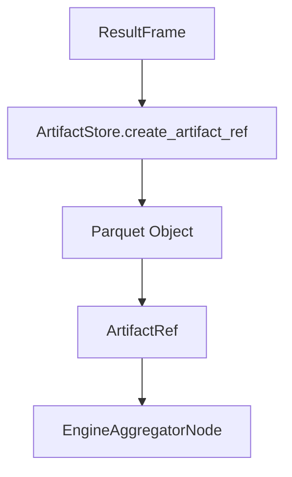

# Artifact Store Architecture

Execution results are persisted as **artifacts** that can be referenced by downstream aggregation and API responses. `ArtifactStore` abstracts storage backends (local, S3, ADLS).

## Storage lifecycle



## Backends

- `LocalArtifactStore`: writes Parquet to `result_artifact_base_uri` using a tenant/request based path.
- `S3ArtifactStore`: writes artifacts to S3 (configured by settings).
- `AdlsArtifactStore`: writes artifacts to Azure Data Lake Storage.

`build_artifact_store()` resolves the backend using `Settings.result_artifact_backend`.

## Tenant-aware paths

`ArtifactStore.get_upload_path()` is tenant-aware. The local backend persists artifacts in:

```
<result_artifact_base_uri>/<tenant_id>/<request_id>.parquet
```

## Source references

- Artifact store base: `packages/core/src/nl2sql/execution/artifacts/base.py`
- Local store: `packages/core/src/nl2sql/execution/artifacts/local_store.py`
- Artifact contracts: `packages/core/src/nl2sql/execution/contracts.py`
