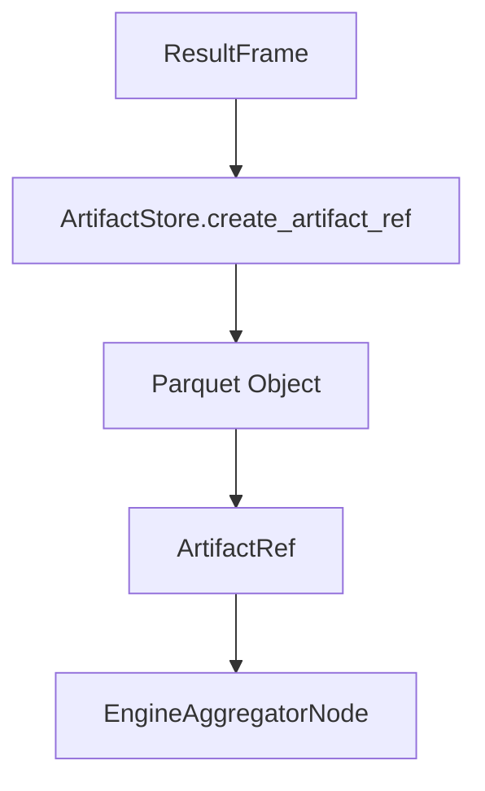

# Artifact Store Architecture

Execution results are persisted as **artifacts**. The artifact store abstracts storage backends (local, S3, ADLS) and emits `ArtifactRef` metadata used by aggregation and downstream consumers.

## Storage lifecycle



## ArtifactRef fields

`ArtifactRef` contains:

- `uri`, `backend`, `format`
- `row_count`, `columns`, `bytes`
- `content_hash`, `created_at`
- optional `schema_version`
- `path_template`

## Backends

- **Local**: writes Parquet to `result_artifact_base_uri`.
- **S3**: writes artifacts to S3 (settings-backed).
- **ADLS**: writes artifacts to Azure Data Lake Storage.

Backend selection is controlled by `Settings.result_artifact_backend`.

## Path templating

`Settings.result_artifact_path_template` defines the intended path layout for object-store backends:

```
<tenant_id>/<request_id>/<subgraph_name>/<dag_node_id>/<schema_version>/part-00000.parquet
```

S3/ADLS backends call `_render_path(metadata)` to apply this template, but that helper is not implemented in this repository. As written, S3/ADLS artifact stores will raise at runtime when they attempt to render a path. Local storage does not use the template.

## Tenant-aware paths (local backend)

The local backend ignores `result_artifact_path_template` and uses:

```
<result_artifact_base_uri>/<tenant_id>/<request_id>.parquet
```

## Source references

- Artifact store base: `packages/core/src/nl2sql/execution/artifacts/base.py`
- Local store: `packages/core/src/nl2sql/execution/artifacts/local_store.py`
- Artifact contracts: `packages/core/src/nl2sql/execution/contracts.py`
