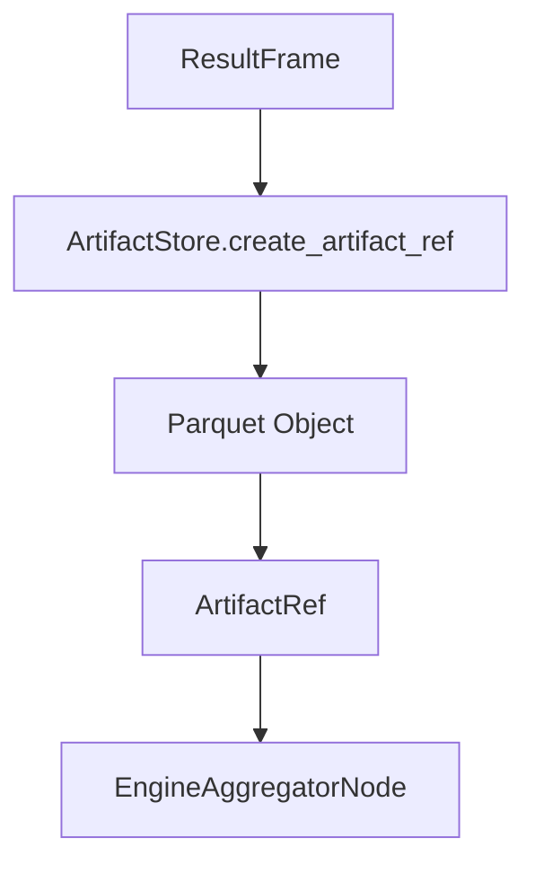

# Artifact Store Architecture

Execution results are persisted as **artifacts**. A single `ArtifactStore` writes Parquet to the configured backend (local, S3, ADLS) and emits `ArtifactRef` metadata used by aggregation and downstream consumers.

## Storage lifecycle


```mermaid
flowchart TD
    ResultFrame[ResultFrame] --> Store[ArtifactStore.create_artifact_ref]
    Store --> Parquet[Parquet Object]
    Parquet --> Ref[ArtifactRef]
    Ref --> Aggregation[EngineAggregatorNode]
```

## One store, three URI schemes

There is no per-backend subclass. `ArtifactStore` builds a backend-specific URI, then uses the same polars read/write path for all backends, since polars addresses `s3://` and `abfs://` natively.

| Backend | URI built from settings |
| --- | --- |
| `local` | `<result_artifact_base_uri>/<rendered path>` (parent directories are created) |
| `s3` | `s3://<s3_bucket>/<s3_prefix>/<rendered path>` |
| `adls` | `abfs://<adls_container>@<adls_account>.dfs.core.windows.net/<rendered path>` |

Missing required configuration raises a `ValueError` naming the environment variable to set — `RESULT_ARTIFACT_S3_BUCKET`, `RESULT_ARTIFACT_ADLS_CONTAINER`, or `RESULT_ARTIFACT_ADLS_ACCOUNT`. An unrecognised `RESULT_ARTIFACT_BACKEND` also raises rather than silently falling back to local.

For ADLS, `RESULT_ARTIFACT_ADLS_CONNECTION_STRING` is forwarded to polars as `storage_options={"connection_string": ...}`. No Azure SDK client is constructed. S3 credentials are resolved by the underlying object-store layer from the usual environment.

## Verification status

- **Local** is exercised by real read/write round-trip tests (`packages/nl2sql/tests/unit/test_artifact_store.py`).
- **S3 and ADLS** are implemented and unit-tested at the URI and `storage_options` level, with the actual object-store IO mocked. They have **not** been verified against a real S3 bucket or ADLS account. Treat them as unproven until someone runs them against live storage.

## ArtifactRef fields

`ArtifactRef` contains:

- `uri`, `backend`, `format`
- `row_count`, `columns`, `bytes`
- `content_hash`, `created_at`
- optional `schema_version`
- optional `sub_query_id`, the sub-query whose result this is
- `path_template`, the template actually rendered (see *One artifact per sub-query*)

## Path templating

`Settings.result_artifact_path_template` defines the artifact path relative to the backend root, for every backend. It defaults to:

```
<tenant_id>/<request_id>/<sub_query_id>.parquet
```

Each `<key>` placeholder is substituted from the metadata the executor passes to `create_artifact_ref`. The SQL executor supplies these keys:

- `tenant_id`
- `request_id` (the trace ID, shared by every sub-query of a run)
- `sub_query_id` (the sub-query's id, which is also its scan node's id)
- `dag_node_id` (the same value as `sub_query_id`)
- `subgraph_name`
- `schema_version`

A template referencing any other placeholder raises a `ValueError` naming the placeholder that could not be filled. A path is never written with an unrendered placeholder in it. Adding placeholders therefore requires threading the corresponding metadata through the executor first.

### One artifact per sub-query

A question that decomposes into several sub-queries runs them under one trace ID, often side by side, and each must write its own file. When they shared `<tenant_id>/<request_id>.parquet`, concurrent writes produced one corrupt Parquet file (`AGGREGATOR_FAILED: parquet: File out of specification`), and sequential writes kept only the last sub-query's rows, so a join combined a result with itself and returned a wrong answer with no error.

A template that names neither `<sub_query_id>` nor `<dag_node_id>` is therefore made unique rather than rejected: the store adds `-<sub_query_id>` to the end of the file name, before its extension, so `<tenant_id>/<request_id>.parquet` writes `<tenant_id>/<request_id>-<sub_query_id>.parquet`. The `ArtifactRef` records the template actually rendered in `path_template` and the sub-query in `sub_query_id`. A store used directly, with no `sub_query_id` in its metadata, renders the template as written.

## Tenant-aware paths

Because the default template starts with `<tenant_id>`, every backend partitions artifacts per tenant:

```
<backend root>/<tenant_id>/<request_id>/<sub_query_id>.parquet
```

## Source references

- Artifact store: `packages/nl2sql/src/nl2sql/execution/artifacts/store.py`
- Parquet helpers: `packages/nl2sql/src/nl2sql/execution/artifacts/parquet.py`
- Artifact contracts: `packages/nl2sql/src/nl2sql/execution/contracts.py`
