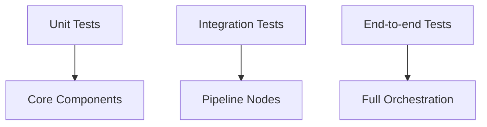

# Testing Architecture

Tests are organized by scope and live under `packages/**/tests`. The core engine has unit, integration, and end-to-end tests.

## Test layout

```text
packages/core/tests/
  unit/          # Node-level tests, registries, stores
  integration/   # Pipeline components with real data
  e2e/           # End-to-end flows
```

`pytest.ini` defines test paths and markers.



## Runtime coverage targets

- Pipeline nodes (`test_node_*.py`)
- Subgraph orchestration (`test_sql_agent_subgraph.py`)
- DAG layering (`test_graph_layers.py`)
- Registry and store behavior (`test_*_registry.py`, `test_schema_store.py`)

## Deterministic validation

Tests enforce deterministic behavior by:

- using structured output schemas for planner/decomposer
- validating stable IDs and DAG layering
- running logical validator checks for expected schema alignment

## Adapter compliance testing

Adapter SDK includes testing utilities to validate schema introspection and result contracts for new adapters.

## Source references

- Test configuration: `pytest.ini`
- Core tests: `packages/core/tests/`
