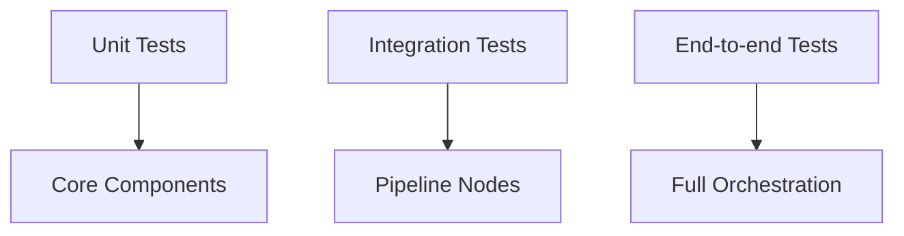

# Testing Architecture

Tests are organized by scope and live under `packages/**/tests`. The core engine has unit, integration, and end-to-end tests.

## Test layout

```text
packages/core/tests/
  unit/          # Node-level tests, registries, stores
  integration/   # Pipeline components with real data
  e2e/           # End-to-end flows
packages/api/tests/  # FastAPI route and service tests (stubbed engine)
packages/cli/tests/  # CLI command tests
```

`pytest.ini` is the single source of truth for pytest configuration - test
paths, markers, and `addopts`. Do not add a `[tool.pytest.ini_options]` table
to `pyproject.toml`: pytest reads only one config file, and `pytest.ini` wins,
so such a table is silently ignored. Dev/test tooling lives in the root
`pyproject.toml` under `[dependency-groups] dev` (`pip install --group dev`).

## Markers and what CI runs

Two independent things can make a test unrunnable in CI, so they are two
markers. A test may carry both.

| Marker | Means | Provided by |
| --- | --- | --- |
| `integration` | Needs external resources: the generated demo SQLite databases, or the downloaded ONNX embedding model. | `nl2sql setup --demo --lite` |
| `llm` | Needs a real `OPENAI_API_KEY`. Costs money per run. | Nothing in CI - never selected. |

Everything under `packages/core/tests/integration/` is marked `integration`
automatically by `packages/core/tests/conftest.py`. The `llm` marker is
declared per module, next to a comment saying which call needs the key.

`.github/workflows/test.yml` has two test jobs:

- **`test`** runs `pytest -m "not integration"` across Python 3.10-3.13. This
  is the fast job and must stay fast.
- **`integration`** runs `pytest -m "integration and not llm"` on one Python
  version, after generating demo data with `nl2sql setup --demo --lite` and
  with `EMBEDDING_PROVIDER=local`. The ONNX model is cached across runs.

Nothing selects `llm`. Those tests are run by hand with a key:

```bash
nl2sql setup --demo --lite
EMBEDDING_PROVIDER=local OPENAI_API_KEY=sk-... pytest -m integration
```

Collection is not enough to keep these honest. Every test in the directory
imports cleanly even when it calls a method that no longer exists, so rot shows
up only at call time - which is the point of running the key-free subset in CI
rather than gating on `--collect-only`.

## Randomised test order

`pytest-randomly` shuffles the order of tests on every run, which turns
order-dependent tests - shared class-level caches, leaked globals, fixtures that
do not unwind - into loud local failures rather than intermittent CI ones. Each
run prints the seed it used; reproduce a failure with
`pytest -p randomly --randomly-seed=<seed>`.


```mermaid
flowchart TD
    Unit[Unit Tests] --> Core[Core Components]
    Integration[Integration Tests] --> Pipeline[Pipeline Nodes]
    E2E[End-to-end Tests] --> Orchestration[Full Orchestration]
```

## Runtime coverage targets

- Pipeline nodes (`test_node_*.py`)
- Subgraph orchestration (`test_sql_agent_subgraph.py`)
- DAG layering (`test_graph_layers.py`)
- Registry and store behavior (`test_*_registry.py`, `test_schema_store.py`)
- REST contract (`packages/api/tests/`) via FastAPI `TestClient` with the
  `get_engine` dependency overridden, so no datasource, LLM or network is needed

## Deterministic validation

Tests enforce deterministic behavior by:

- using structured output schemas for planner/decomposer
- validating stable IDs and DAG layering
- running logical validator checks for expected schema alignment

## Adapter compliance testing

Adapter SDK includes testing utilities to validate schema introspection and result contracts for new adapters.

## Source references

- Test configuration: `pytest.ini`
- Core tests: `packages/core/tests/`
- API tests: `packages/api/tests/`
