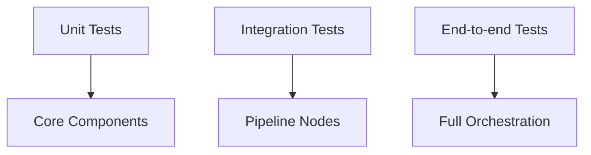

# Testing Architecture

Tests are organized by scope and live under `packages/**/tests`. The core engine has unit, integration, and end-to-end tests.

## Test layout

```text
packages/core/tests/
  unit/          # Node-level tests, registries, stores
  integration/   # Pipeline components with real data
  e2e/           # End-to-end flows
packages/api/tests/  # FastAPI route and service tests (stubbed engine)
packages/cli/tests/  # CLI command tests
```

`pytest.ini` defines test paths and markers. Dev/test tooling lives in the root
`pyproject.toml` under `[dependency-groups] dev` (`pip install --group dev`).

## Randomised test order

`pytest-randomly` shuffles the order of tests on every run, which turns
order-dependent tests - shared class-level caches, leaked globals, fixtures that
do not unwind - into loud local failures rather than intermittent CI ones. Each
run prints the seed it used; reproduce a failure with
`pytest -p randomly --randomly-seed=<seed>`.


```mermaid
flowchart TD
    Unit[Unit Tests] --> Core[Core Components]
    Integration[Integration Tests] --> Pipeline[Pipeline Nodes]
    E2E[End-to-end Tests] --> Orchestration[Full Orchestration]
```

## Runtime coverage targets

- Pipeline nodes (`test_node_*.py`)
- Subgraph orchestration (`test_sql_agent_subgraph.py`)
- DAG layering (`test_graph_layers.py`)
- Registry and store behavior (`test_*_registry.py`, `test_schema_store.py`)
- REST contract (`packages/api/tests/`) via FastAPI `TestClient` with the
  `get_engine` dependency overridden, so no datasource, LLM or network is needed

## Deterministic validation

Tests enforce deterministic behavior by:

- using structured output schemas for planner/decomposer
- validating stable IDs and DAG layering
- running logical validator checks for expected schema alignment

## Adapter compliance testing

Adapter SDK includes testing utilities to validate schema introspection and result contracts for new adapters.

## Source references

- Test configuration: `pytest.ini`
- Core tests: `packages/core/tests/`
- API tests: `packages/api/tests/`
